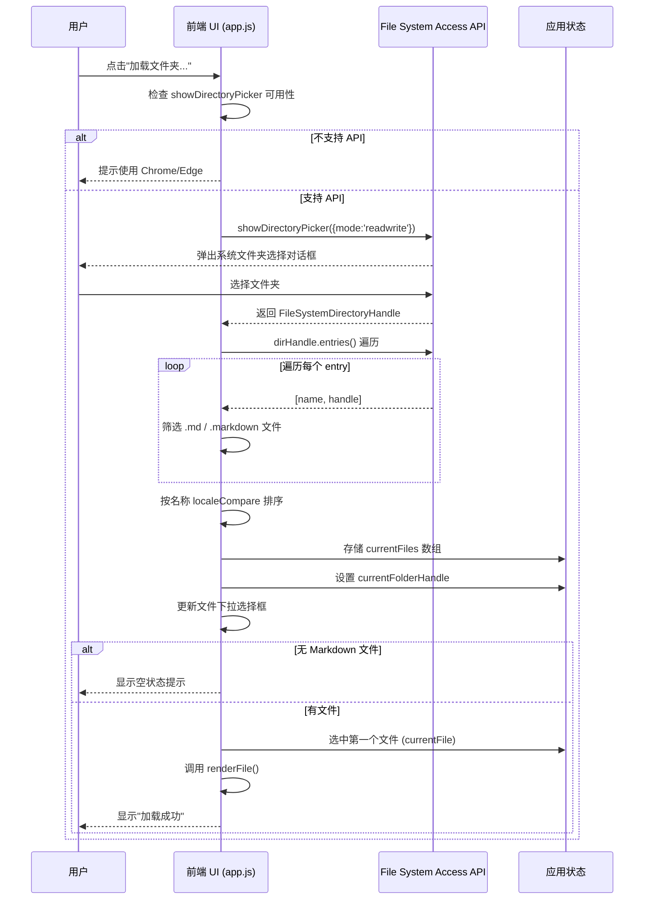
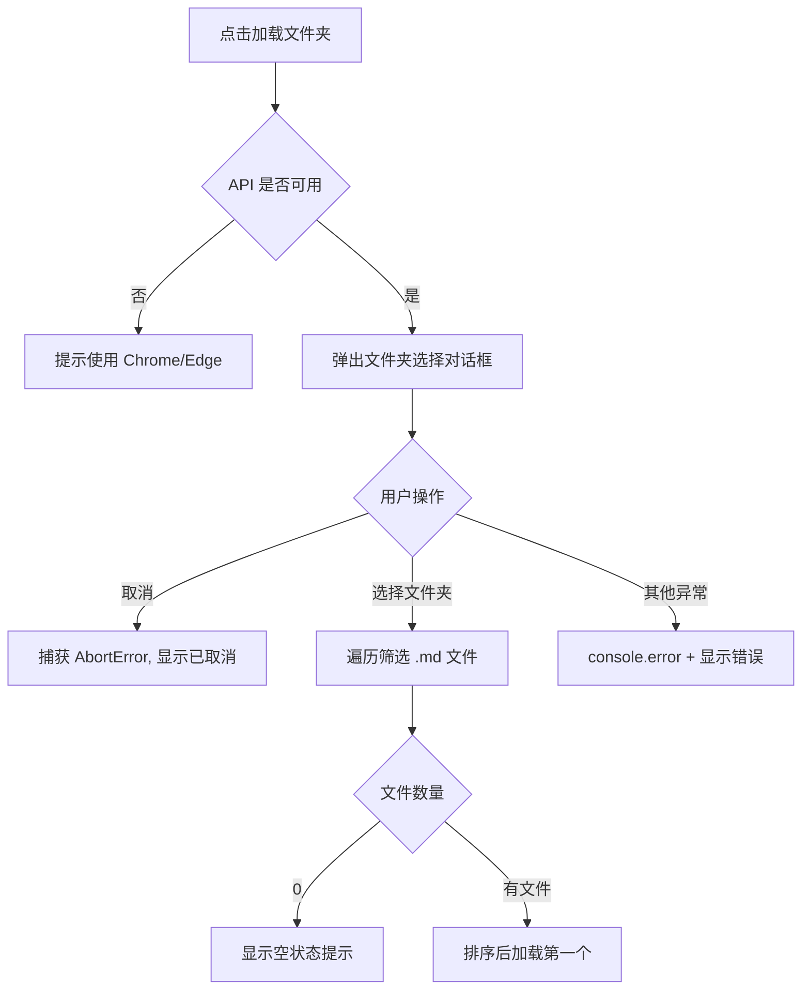
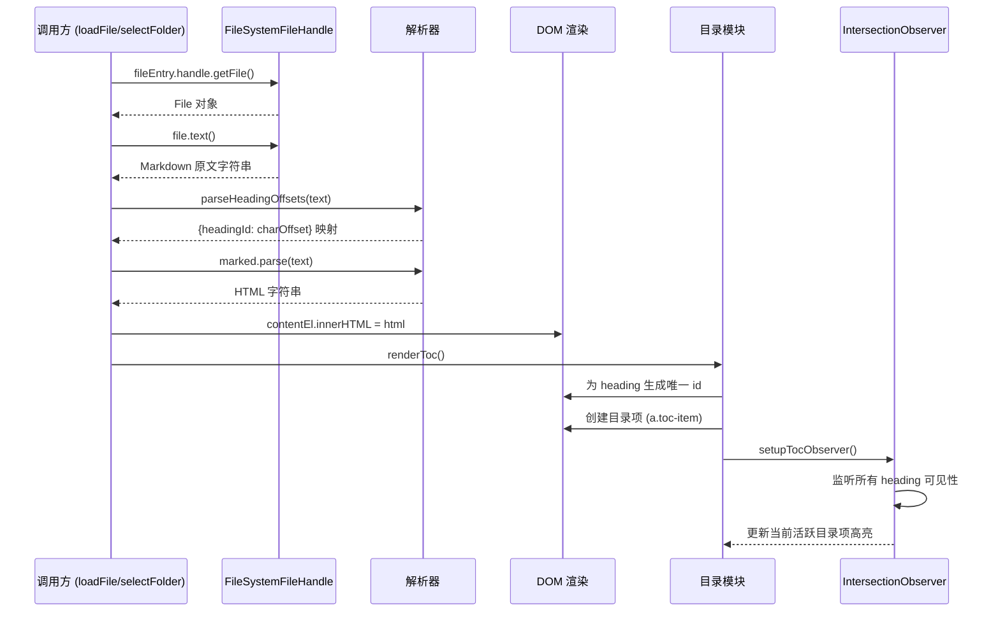
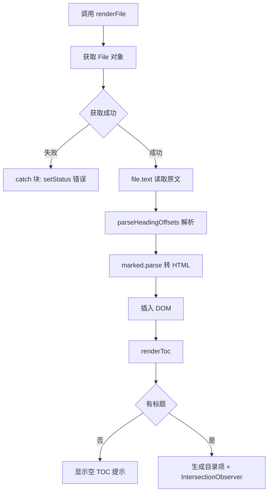
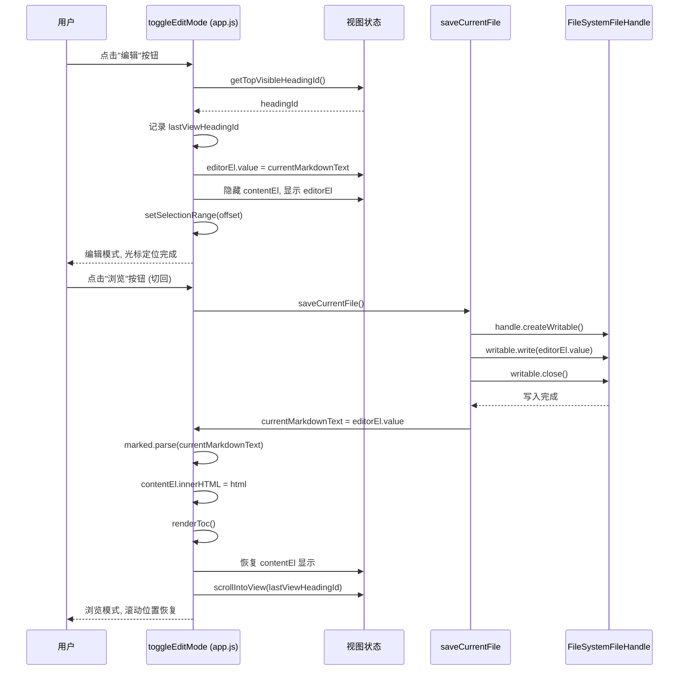
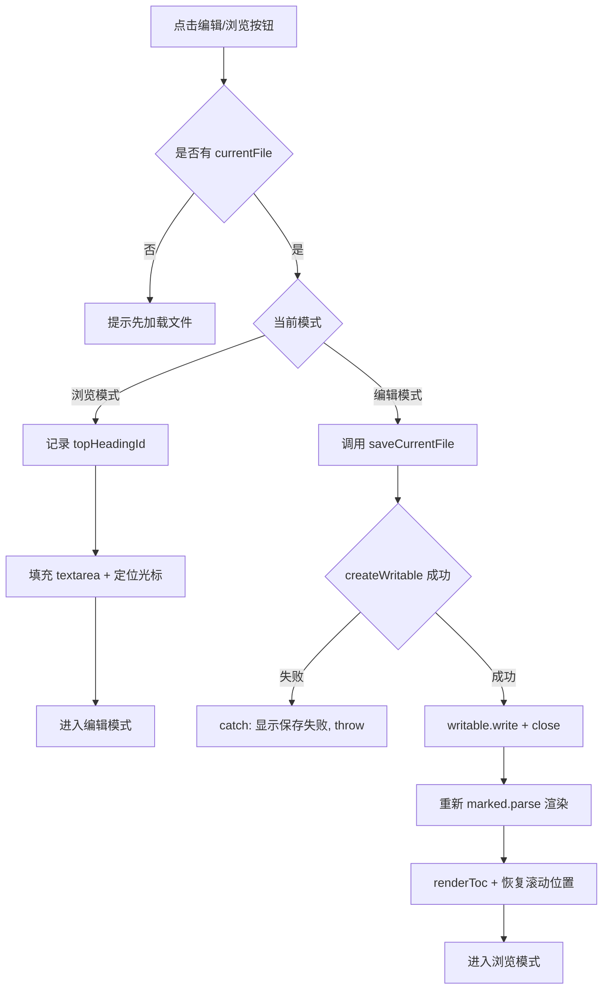
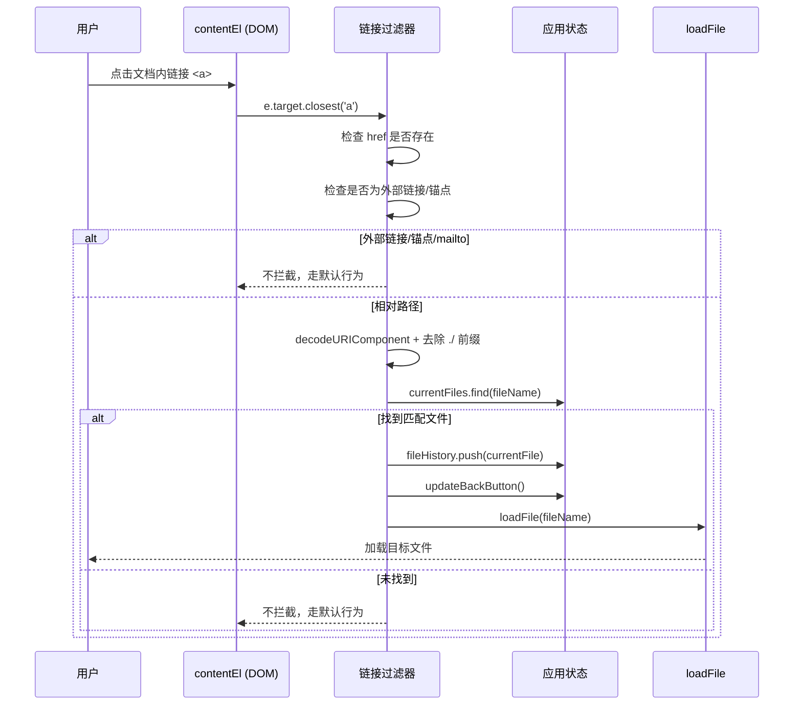
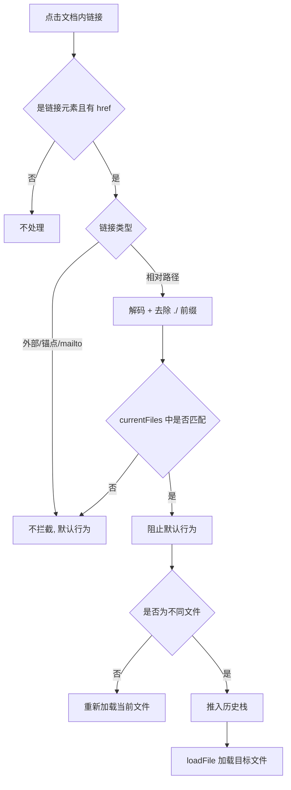
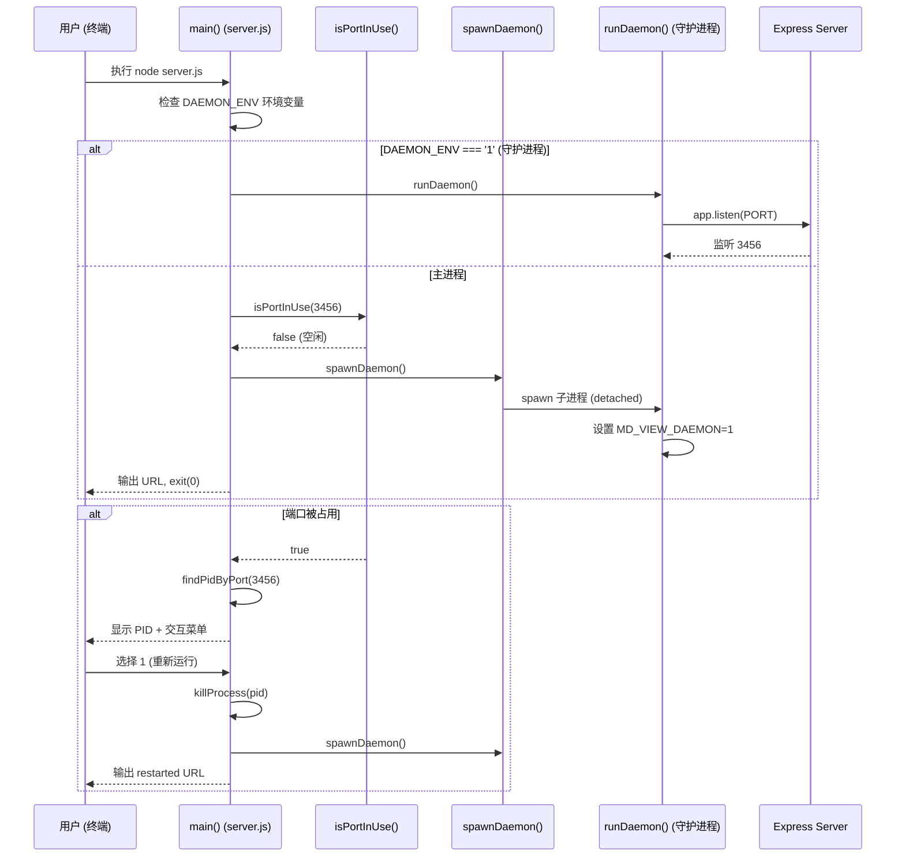
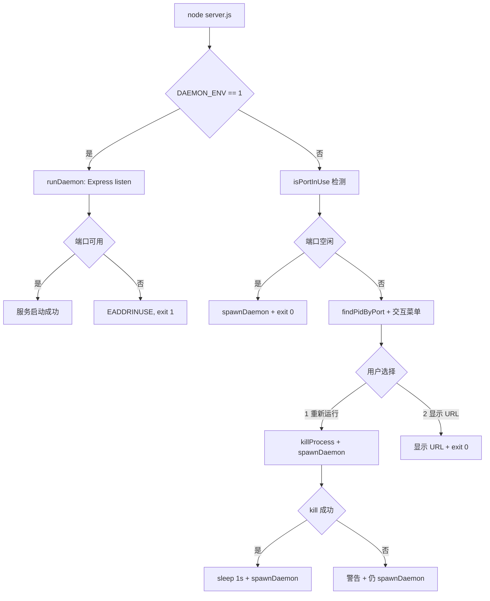

# 业务流程详解

> 本文档深度分析 **5 个核心业务流程**，提供完整的时序图、代码追踪和数据流转分析。
>
> 所有代码路径引用均相对于项目根目录 `md-view`。
>
> 查看所有业务流程概述：请参考 [业务流程索引](./业务流程索引.md)

---

## 1. 文件夹加载流程

### 1.1 流程概述

用户通过前端 UI 选择本地文件夹，系统扫描其中的 Markdown 文件并按名称排序，自动加载第一个文件。该流程依赖浏览器原生 File System Access API（`showDirectoryPicker`），仅在 Chrome/Edge 等现代浏览器中可用。

### 1.2 流程时序图



### 1.3 代码执行路径

**Step 1: 触发入口** (`md-view/public/app.js:208`)

```javascript
async function selectFolder() {
  if (!window.showDirectoryPicker) {
    setStatus('浏览器不支持文件夹选择，请使用 Chrome 或 Edge', 'error');
    updateFileSelect();
    return;
  }
```

浏览器兼容性检查，若不原生支持 File System Access API 则立即返回错误提示。

**Step 2: 弹出文件夹选择对话框** (`md-view/public/app.js:216`)

```javascript
const dirHandle = await window.showDirectoryPicker({ mode: 'readwrite' });
currentFolderHandle = dirHandle;
folderLabel.textContent = dirHandle.name;
```

调用 `showDirectoryPicker` 获取 `FileSystemDirectoryHandle`，保存为 `currentFolderHandle` 供后续刷新使用。`mode: 'readwrite'` 授予读写权限，支持后续编辑保存功能。

**Step 3: 遍历目录条目并筛选** (`md-view/public/app.js:223-230`)

```javascript
const files = [];
for await (const [name, handle] of dirHandle.entries()) {
  if (handle.kind === 'file') {
    const ext = name.split('.').pop().toLowerCase();
    if (ext === 'md' || ext === 'markdown') {
      files.push({ name, handle });
    }
  }
}
```

使用 `for await...of` 异步迭代目录条目，仅保留文件类型且扩展名为 `.md` 或 `.markdown` 的条目。

**Step 4: 排序与状态更新** (`md-view/public/app.js:231-235`)

```javascript
files.sort((a, b) => a.name.localeCompare(b.name));
currentFiles = files;
currentFile = null;
updateFileSelect();
```

按文件名本地化排序后存入 `currentFiles` 状态数组，调用 `updateFileSelect()` 刷新下拉选择框的 DOM。

**Step 5: 自动加载第一个文件** (`md-view/public/app.js:243-246`)

```javascript
currentFile = files[0].name;
updateFileSelect();
await renderFile(files[0]);
setStatus('加载成功', 'success');
```

设置当前选中文件并调用 `renderFile()` 完成渲染。

### 1.4 关键决策点

| 决策点 | 条件 | 结果 | 代码位置 |
|-------|------|------|---------|
| API 兼容性检查 | `window.showDirectoryPicker` 不存在 | 提示使用 Chrome/Edge | `md-view/public/app.js:209-212` |
| 用户取消选择 | 捕获 `AbortError` | 显示"已取消" | `md-view/public/app.js:248-249` |
| 空目录检查 | `files.length === 0` | 显示空状态 | `md-view/public/app.js:237-240` |
| 异常处理 | catch 块捕获非 AbortError | 显示错误信息 | `md-view/public/app.js:250-253` |

### 1.5 异常处理流程



### 1.6 数据流转

```
用户点击"加载文件夹"
  ↓ API 兼容性检查
{浏览器是否支持 File System Access API}
  ↓ showDirectoryPicker
FileSystemDirectoryHandle (dirHandle)
  ↓ entries() 异步迭代 + 筛选 .md/.markdown
[{name, handle}, ...] 按名称排序
  ↓ 写入 currentFiles 和 currentFolderHandle 状态
更新 DOM 下拉选择框 + 自动加载第一个文件
  ↓ renderFile()
Markdown 原文 → marked.parse() → HTML 插入 contentEl
  ↓ 渲染 TOC + 设置 IntersectionObserver
页面展示完成
```

---

## 2. 文件渲染流程

### 2.1 流程概述

读取已选中 Markdown 文件的原始文本，通过 `marked.parse()` 将其转换为 HTML，同时解析标题偏移量生成目录（TOC），并设置滚动监听实现自动高亮。

### 2.2 流程时序图



### 2.3 代码执行路径

**Step 1: 获取文件并读取文本** (`md-view/public/app.js:198-201`)

```javascript
async function renderFile(fileEntry) {
  const file = await fileEntry.handle.getFile();
  const text = await file.text();
  currentMarkdownText = text;
```

通过 FileSystemFileHandle 获取 File 对象，读取其文本内容存入 `currentMarkdownText` 全局状态。

**Step 2: 解析标题偏移量** (`md-view/public/app.js:73-88`, `md-view/public/app.js:202`)

```javascript
function parseHeadingOffsets(text) {
  const offsets = {};
  const lines = text.split('\n');
  let charOffset = 0;
  const usedIds = new Set();
  lines.forEach(line => {
    const match = line.match(/^(#{1,6})\s+(.*)$/);
    if (match) {
      const title = match[2].trim();
      const id = generateHeadingId(title, usedIds);
      offsets[id] = charOffset;
    }
    charOffset += line.length + 1;
  });
  return offsets;
}
```

逐行扫描 Markdown 原文，匹配 `#` 到 `######` 标题行，为每个标题生成唯一 slug ID 并记录其在原文中的字符偏移量。该偏移量用于编辑模式下从 TOC 点击定位到对应位置。

**Step 3: 渲染 HTML** (`md-view/public/app.js:203-204`)

```javascript
const html = marked.parse(text);
contentEl.innerHTML = html;
```

使用 marked 库将 Markdown 文本解析为 HTML 字符串并插入 DOM。

**Step 4: 渲染目录** (`md-view/public/app.js:111-151`)

```javascript
function renderToc() {
  tocEl.innerHTML = '';
  const headings = contentEl.querySelectorAll('h1, h2, h3, h4, h5, h6');
  if (headings.length === 0) {
    tocEl.innerHTML = '<p class="toc-empty">当前文件没有标题目录</p>';
    return;
  }
  // 为 heading 生成唯一 id，创建目录项...
```

从已渲染的 HTML 中提取所有标题元素，生成唯一 ID（自动去重），为每个标题创建可点击的目录项。

**Step 5: 设置滚动监听** (`md-view/public/app.js:493-506`)

```javascript
function setupTocObserver() {
  observer = new IntersectionObserver((entries) => {
    const visible = entries.filter(e => e.isIntersecting)
      .sort((a, b) => a.boundingClientRect.top - b.boundingClientRect.top);
    if (visible.length > 0) updateActiveTocItem(visible[0].target.id);
  }, {
    root: document.querySelector('.content-wrapper'),
    rootMargin: '-56px 0px -70% 0px',
    threshold: 0
  });
  headings.forEach(h => observer.observe(h));
}
```

使用 `IntersectionObserver` 监听标题可见性，`rootMargin` 配置使仅顶部约 30% 区域内的标题被视为"可见"，自动高亮对应目录项。

### 2.4 关键决策点

| 决策点 | 条件 | 结果 | 代码位置 |
|-------|------|------|---------|
| 文件不存在于列表 | `currentFiles.find()` 返回 undefined | 静默返回 | `md-view/public/app.js:259-260` |
| 无标题 | `headings.length === 0` | 显示空 TOC 提示 | `md-view/public/app.js:114-116` |
| 标题 ID 重复 | `usedIds.has(id)` 为 true | 追加 `-1`, `-2` 序号去重 | `md-view/public/app.js:65-68` |
| 编辑模式下 TOC 点击 | `isEditMode === true` | 在编辑器中定位光标 | `md-view/public/app.js:137-143` |
| 浏览模式下 TOC 点击 | `isEditMode === false` | 平滑滚动到标题 | `md-view/public/app.js:144-147` |

### 2.5 异常处理流程



### 2.6 数据流转

```
FileSystemFileHandle
  ↓ getFile() + text()
Markdown 原文字符串 (currentMarkdownText)
  ↓ parseHeadingOffsets()
{headingId: charOffset} 映射 (headingOffsets)
  ↓ marked.parse()
HTML 字符串 → contentEl.innerHTML
  ↓ renderToc()
TOC 目录项 DOM + heading 唯一 ID
  ↓ setupTocObserver()
IntersectionObserver 监听滚动 → 自动高亮当前目录项
```

---

## 3. 编辑模式切换与保存流程

### 3.1 流程概述

用户在浏览模式和编辑模式之间切换。编辑模式显示 textarea 并填充 Markdown 原文，可定位光标到当前可视区域标题对应位置；切换回浏览模式时自动保存文件并重新渲染 HTML。

### 3.2 流程时序图



### 3.3 代码执行路径

**Step 1: 进入编辑模式** (`md-view/public/app.js:410-432`)

```javascript
// 记录当前视口最上方的 heading
const topHeadingId = getTopVisibleHeadingId();
lastViewHeadingId = topHeadingId;

editorEl.value = currentMarkdownText;
contentEl.style.display = 'none';
editorEl.style.display = '';
btnEdit.textContent = '浏览';
isEditMode = true;
```

先获取当前视口最上方可见标题的 ID（用于后续恢复滚动位置），然后将 Markdown 原文填充到 textarea，隐藏 HTML 内容区域。

**Step 2: 光标定位** (`md-view/public/app.js:423-430`)

```javascript
if (topHeadingId && headingOffsets[topHeadingId] !== undefined) {
  const offset = headingOffsets[topHeadingId];
  editorEl.setSelectionRange(offset, offset);
  scrollEditorToOffset(offset);
} else {
  editorEl.setSelectionRange(0, 0);
  editorEl.scrollTop = 0;
}
```

利用 `headingOffsets` 映射将标题 ID 对应到原文字符偏移量，将光标定位到该位置并滚动编辑器，使用户编辑时直接看到当前阅读区域的内容。

**Step 3: 保存文件** (`md-view/public/app.js:371-386`)

```javascript
async function saveCurrentFile() {
  if (!currentFile) return;
  const entry = currentFiles.find(f => f.name === currentFile);
  if (!entry) return;
  try {
    const writable = await entry.handle.createWritable();
    await writable.write(editorEl.value);
    await writable.close();
    currentMarkdownText = editorEl.value;
    setStatus('已保存', 'success');
  } catch (e) {
    setStatus('保存失败: ' + e.message, 'error');
    throw e;
  }
}
```

通过 File System Access API 的 `createWritable()` 创建可写流，将 textarea 的内容直接写入磁盘文件。

**Step 4: 切回浏览模式** (`md-view/public/app.js:393-409`)

```javascript
await saveCurrentFile();
contentEl.innerHTML = marked.parse(currentMarkdownText);
renderToc();
contentEl.style.display = '';
editorEl.style.display = 'none';
isEditMode = false;
// 恢复之前记录的滚动位置
if (lastViewHeadingId) {
  const target = document.getElementById(lastViewHeadingId);
  if (target) {
    target.scrollIntoView({ block: 'start' });
  }
}
```

保存后重新渲染 HTML，更新 TOC，并通过 `lastViewHeadingId` 恢复滚动位置，保证模式切换前后的视觉连续性。

### 3.4 关键决策点

| 决策点 | 条件 | 结果 | 代码位置 |
|-------|------|------|---------|
| 未加载文件 | `!currentFile` | 提示"请先加载文件" | `md-view/public/app.js:389-391` |
| 切换到编辑模式 | `isEditMode === false` | 记录 heading、填充 textarea、定位光标 | `md-view/public/app.js:410-432` |
| 切换到浏览模式 | `isEditMode === true` | 保存文件、重新渲染、恢复滚动位置 | `md-view/public/app.js:393-409` |
| 切换文件时处于编辑模式 | `isEditMode === true && loadFile()` | 自动退出编辑模式，恢复浏览视图 | `md-view/public/app.js:264-271` |

### 3.5 异常处理流程



### 3.6 数据流转

```
用户点击"编辑"
  ↓ getTopVisibleHeadingId()
{lastViewHeadingId: "heading-slug"}
  ↓ editorEl.value = currentMarkdownText
textarea 显示 Markdown 原文
  ↓ setSelectionRange + scrollEditorToOffset
光标定位到对应字符位置
  ↓ 用户修改内容后点击"浏览"
saveCurrentFile() → createWritable().write()
  ↓ 磁盘文件更新
currentMarkdownText = editorEl.value
  ↓ marked.parse(currentMarkdownText)
HTML 重新渲染 → renderToc 更新目录
  ↓ scrollIntoView(lastViewHeadingId)
滚动位置恢复到切换前
```

---

## 4. 文档内链接跳转流程

### 4.1 流程概述

拦截文档内容区中指向相对路径 Markdown 文件的链接点击事件，在 `currentFiles` 列表中查找匹配项，将当前文件推入历史栈后加载目标文件，实现文档间的内联导航。同时提供"返回上一文档"功能。

### 4.2 流程时序图



### 4.3 代码执行路径

**Step 1: 事件委托与链接提取** (`md-view/public/app.js:340-344`)

```javascript
contentEl.addEventListener('click', async (e) => {
  const link = e.target.closest('a');
  if (!link) return;
  const href = link.getAttribute('href');
  if (!href) return;
```

使用事件委托在 `contentEl` 上监听点击，通过 `closest('a')` 提取被点击的链接元素。

**Step 2: 链接类型过滤** (`md-view/public/app.js:346`)

```javascript
if (/^(https?:|mailto:|#|\/\/)/i.test(href)) return;
```

跳过外部链接（http/https/协议相对链接）、锚点（#）、mailto 链接，仅处理相对路径的内部链接。

**Step 3: 文件名解析与匹配** (`md-view/public/app.js:348-349`)

```javascript
const fileName = decodeURIComponent(href.replace(/^\.\//, ''));
const entry = currentFiles.find(f => f.name === fileName);
```

解码 URL 编码，去除 `./` 前缀，在已加载的文件列表中精确匹配文件名。

**Step 4: 历史栈管理与加载** (`md-view/public/app.js:350-357`)

```javascript
if (entry) {
  e.preventDefault();
  if (currentFile && currentFile !== fileName) {
    fileHistory.push(currentFile);
    updateBackButton();
  }
  await loadFile(fileName);
}
```

匹配成功时阻止默认链接行为，将当前文件名推入 `fileHistory` 栈，然后加载目标文件。

**Step 5: 返回上一文档** (`md-view/public/app.js:364-369`)

```javascript
btnBack.addEventListener('click', async () => {
  if (fileHistory.length === 0) return;
  const prevFile = fileHistory.pop();
  updateBackButton();
  await loadFile(prevFile);
});
```

从历史栈弹出上一个文件名并加载，更新返回按钮的 disabled 状态。

### 4.4 关键决策点

| 决策点 | 条件 | 结果 | 代码位置 |
|-------|------|------|---------|
| 非链接元素点击 | `!link` 或 `!href` | 不拦截 | `md-view/public/app.js:341-344` |
| 外部链接/锚点 | 正则匹配 `https?|mailto|#|//` | 不拦截，走默认行为 | `md-view/public/app.js:346` |
| 目标文件不在列表中 | `currentFiles.find()` 返回 undefined | 不拦截，走默认行为 | `md-view/public/app.js:349-357` |
| 跳转回当前文件 | `currentFile === fileName` | 不推入历史栈 | `md-view/public/app.js:352` |
| 历史栈为空时点击返回 | `fileHistory.length === 0` | 直接返回，无操作 | `md-view/public/app.js:365` |

### 4.5 异常处理流程



### 4.6 数据流转

```
用户点击文档内链接 [href="./target.md"]
  ↓ closest('a') + getAttribute('href')
{href: "./target.md"}
  ↓ 正则过滤: 非外部链接, 非锚点
{fileName: "target.md"} (decodeURIComponent + 去除 ./)
  ↓ currentFiles.find(f => f.name === "target.md")
{entry: {name: "target.md", handle: FileSystemFileHandle}}
  ↓ e.preventDefault() + fileHistory.push(currentFile)
{fileHistory: ["previous.md"], currentFile: "target.md"}
  ↓ loadFile("target.md") → renderFile()
目标文件 Markdown → HTML → 页面展示
```

---

## 5. 后端服务启动与管理流程

### 5.1 流程概述

通过主进程 `main()` 函数启动 Express 服务。采用守护进程模式：父进程检查端口 3456 是否被占用，空闲时 spawn 子进程后退出；若端口占用则提供重新运行或显示 URL 的交互选项。

### 5.2 流程时序图



### 5.3 代码执行路径

**Step 1: 环境变量检查** (`md-view/server.js:308-312`)

```javascript
async function main() {
  if (process.env[DAEMON_ENV] === '1') {
    runDaemon();
    return;
  }
```

`DAEMON_ENV` 设为 `'MD_VIEW_DAEMON'`。当子进程携带此环境变量时被识别为守护进程，直接进入 `runDaemon()` 启动 Express 服务。

**Step 2: 端口检测** (`md-view/server.js:268-280`, `md-view/server.js:314`)

```javascript
function isPortInUse(port) {
  return new Promise((resolve) => {
    const tester = net.createServer()
      .once('error', (err) => resolve(err.code === 'EADDRINUSE'))
      .once('listening', () => {
        tester.once('close', () => resolve(false));
        tester.close();
      })
      .listen(port);
  });
}
```

创建一个临时 TCP 服务器尝试监听目标端口。若 `EADDRINUSE` 错误则端口被占用，若成功监听后立即关闭并返回 false。

**Step 3: 端口空闲时启动守护进程** (`md-view/server.js:282-290`, `md-view/server.js:316-319`)

```javascript
function spawnDaemon() {
  const child = spawn(process.execPath, [__filename], {
    detached: true,
    stdio: 'ignore',
    windowsHide: true,
    env: { ...process.env, [DAEMON_ENV]: '1' }
  });
  child.unref();
}
```

使用 `child_process.spawn` 创建分离的守护进程，设置 `detached: true` 使其脱离父进程会话，`stdio: 'ignore'` 断开标准 I/O，`child.unref()` 允许父进程独立退出。注入 `MD_VIEW_DAEMON=1` 环境变量标识守护进程。

**Step 4: 守护进程启动 Express** (`md-view/server.js:292-306`)

```javascript
function runDaemon() {
  const server = app.listen(PORT, () => {
    // 服务已在后台运行
  });
  server.on('error', (err) => {
    if (err.code === 'EADDRINUSE') {
      console.error(`Port ${PORT} is already in use.`);
      process.exit(1);
    }
  });
}
```

Express 服务监听端口 3456。若端口冲突（竞态条件），输出错误并退出。

**Step 5: 端口占用时的交互处理** (`md-view/server.js:322-346`)

```javascript
const pid = await findPidByPort(PORT);
const answer = await askQuestion('\n请选择：\n1. 重新运行...\n2. 显示访问 URL\n...');
if (choice === '1') {
  if (pid) {
    const killed = await killProcess(pid);
    await sleep(1000);
  }
  spawnDaemon();
  console.log(`md-view restarted at ${url}`);
  process.exit(0);
} else {
  console.log(`\nmd-view is already running at ${url}`);
  process.exit(0);
}
```

查找占用 PID，提供两个选项：(1) 杀掉旧进程并重新启动，(2) 仅显示 URL。

**Step 6: PID 查找与杀死** (`md-view/server.js:234-262`)

```javascript
// Windows: netstat -ano | findstr :3456
// Unix: lsof -t -i:3456
function findPidByPort(port) { ... }

// Windows: taskkill /PID {pid} /F
// Unix: kill -9 {pid}
function killProcess(pid) { ... }
```

跨平台兼容：Windows 使用 `netstat` + `taskkill`，Unix 使用 `lsof` + `kill -9`。

### 5.4 关键决策点

| 决策点 | 条件 | 结果 | 代码位置 |
|-------|------|------|---------|
| 守护进程标识 | `process.env[DAEMON_ENV] === '1'` | 直接启动 Express | `md-view/server.js:309-311` |
| 端口空闲 | `isPortInUse(PORT)` 返回 false | spawn 守护进程后退出 | `md-view/server.js:316-319` |
| 端口占用 + 选择 1 | 用户输入 '1' | kill 旧进程 + 重新启动 | `md-view/server.js:331-342` |
| 端口占用 + 选择 2 | 用户输入其他 | 显示 URL 后退出 | `md-view/server.js:343-346` |
| kill 失败 | `!killed` | 显示警告但仍尝试启动 | `md-view/server.js:335-337` |
| 守护进程端口冲突 | `server.on('error', EADDRINUSE)` | 输出错误并 exit(1) | `md-view/server.js:297-305` |

### 5.5 异常处理流程



### 5.6 数据流转

```
用户执行 node server.js
  ↓ 检查 MD_VIEW_DAEMON 环境变量
{isDaemon: false} (首次执行)
  ↓ isPortInUse(3456)
{portBusy: true/false}
  ↓ portBusy === false
spawn({detached: true, stdio: 'ignore', env: {MD_VIEW_DAEMON: '1'}})
  ↓ 子进程继承环境变量
{isDaemon: true} → runDaemon()
  ↓ app.listen(3456)
Express 服务监听 http://localhost:3456
  ↓ 父进程 exit(0)
子进程独立运行，父进程退出
```

### 5.7 后端 API 接口说明

后端 Express 服务提供以下 REST API 供前端调用：

| 方法 | 路径 | 功能 | 代码位置 |
|------|------|------|---------|
| POST | `/api/select-folder` | 弹出系统文件夹选择对话框 (Windows PowerShell) | `md-view/server.js:19-94` |
| POST | `/api/load` | 加载文件夹并扫描 Markdown 文件 | `md-view/server.js:97-168` |
| GET | `/api/file` | 读取指定文件内容并转为 HTML | `md-view/server.js:171-196` |
| POST | `/api/refresh` | 刷新指定文件内容 | `md-view/server.js:199-224` |

---

## 流程复杂度对比

| 流程名称 | 复杂度 | 涉及层 | 主要步骤数 |
|---------|-------|--------|----------|
| 文件夹加载流程 | 中等 | 前端 UI + File System Access API | 5 |
| 文件渲染流程 | 中等 | 前端 UI + marked 解析 + IntersectionObserver | 5 |
| 编辑模式切换与保存流程 | 复杂 | 前端 UI + File System Access API (可写流) | 4 |
| 文档内链接跳转流程 | 简单 | 前端 UI + 事件委托 + 历史栈 | 5 |
| 后端服务启动与管理流程 | 复杂 | Node.js 进程管理 + Express + 跨平台兼容 | 6 |

---

> 本文档通过实际代码追踪生成，展示了各核心业务的完整执行路径。
> 代码路径引用格式：`md-view/public/app.js:行号` 或 `md-view/server.js:行号`。
