# 业务流程详解

> 本文档深度分析 **8 个核心业务流程**，提供完整的时序图、代码追踪、数据流转与异常分支分析。
>
> 💡 **查看所有业务流程概述**：请参考 [业务流程索引](./业务流程索引.md)
>
> **文档版本信息**
>
> | 项 | 值 |
> |----|----|
> | 项目名 | LightMDKit |
> | 当前 commit | `3bbca34` |
> | 分支 | `main` |
> | 生成日期 | 2026-09-11 |
>
> 所有代码路径引用均相对于项目根目录 `LightMDKit`，格式为 `LightMDKit/相对路径:行号`。

---

## 阅读前：系统边界与关键前提

理解本文档的流程前，需要先明确三条决定性的前提 —— 7 个流程中 6 个的行为都由它们推导而来。

**前提 1：业务流程几乎全部发生在前端。**
`LightMDKit/public/app.js` 是一个单文件 IIFE（1465 行），承载了加载、浏览、编辑、保存、模式切换、拖放、刷新的全部逻辑。服务端 `LightMDKit/server.js` 只做三件事：托管 `public/` 静态资源、启动/复用本地服务进程、对外暴露 4 个 HTTP 接口（当前无前端调用方）。后两者见 [服务端 API 渲染链路](#服务端-api-渲染链路)；至于这 4 个接口本身的定义与调用方式，见 [API 索引](../技术知识库/API索引.md)。

**前提 2：文件的读写走浏览器 File System Access API，不走 HTTP。**
经检索确认，`LightMDKit/public/app.js` 与 `LightMDKit/public/index.html` 中**没有任何 `fetch(` / `XMLHttpRequest` / `/api/` 调用**。`LightMDKit/server.js` 中定义的 4 个接口（`POST /api/select-folder`、`POST /api/load`、`GET /api/file`、`POST /api/refresh`，分别位于 `LightMDKit/server.js:19`、`:97`、`:171`、`:199`）**当前界面不会触发它们**，属于为外部集成保留的通道。因此：

- 目录选择 = `window.showDirectoryPicker()`（浏览器原生对话框），不是服务端的 PowerShell 对话框；
- 文件读取 = `FileSystemFileHandle.getFile()`；
- 文件保存 = `FileSystemFileHandle.createWritable()`。

**前提 3：目录、文件都通过「句柄（handle）」而非「路径字符串」访问磁盘。**
句柄由浏览器授权持有，所以应用内存里同时维护着两套标识：

| 标识 | 形态 | 用途 |
|------|------|------|
| `handle` | `FileSystemDirectoryHandle` / `FileSystemFileHandle` | 真正读写磁盘 |
| `path` | 相对目录根的 `/` 分隔字符串，如 `业务知识库/核心业务领域.md` | 列表高亮、链接匹配、历史栈、IndexedDB 传递 |

`name` 只是文件名（`核心业务领域.md`），**在递归扫描后不再唯一** —— 不同子目录可以有同名文件，所以凡是「定位一个文件」的代码必须用 `path`。这条约束在流程 2、3、6、7 里反复出现，是本项目最容易写错的地方。

**核心状态变量清单**（均定义在 `LightMDKit/public/app.js` 顶部）：

| 变量 | 行号 | 含义 |
|------|------|------|
| `currentFiles` | `:28` | 扫描结果数组 `[{ name, path, handle }]`，已按目录铺平排序 |
| `currentFile` | `:30` | 当前文件的相对路径（即 entry.path） |
| `currentMarkdownText` | `:32` | 当前文件的 Markdown 原文，编辑时随 `change` 事件实时更新 |
| `headingOffsets` | `:34` | 标题 id → 原文字符偏移，供编辑态目录跳转使用 |
| `isEditMode` | `:40` | 是否处于编辑态（现代模式恒为 true） |
| `currentMode` | `:43` | `'traditional'` / `'modern'`，启动时从 localStorage 恢复 |
| `currentFolderHandle` | `:99` | 当前目录句柄，为 null 表示只打开了单个文件 |
| `fileHistory` | `:97` | 返回栈，存的是 `path` 字符串 |
| `imageUrlCache` | `:101` | 图片相对路径 → objectURL |

---

## 加载文件夹并浏览文档

这是产品的入口流程：用户点击「📁 加载文件夹...」，系统递归扫描目录、把结果按目录铺平、渲染文件列表，并自动打开第一个文件。

### 加载时序图

```mermaid
sequenceDiagram
    autonumber
    participant U as 用户
    participant BTN as btn-load-folder
    participant SF as selectFolder
    participant API as showDirectoryPicker
    participant LF as loadFolderHandle
    participant CM as collectMarkdownFiles
    participant FB as flattenByDirectory
    participant RL as renderFileList
    participant RF as renderFile
    participant DOM as contentEl

    U->>BTN: 点击「加载文件夹...」
    BTN->>SF: click 事件
    SF->>SF: 检查 window.showDirectoryPicker 是否存在
    alt 浏览器不支持
        SF-->>U: 状态栏「浏览器不支持文件夹选择，请使用 Chrome 或 Edge」
    else 浏览器支持
        SF->>U: 状态栏「等待选择文件夹...」
        SF->>API: showDirectoryPicker({ mode: 'readwrite' })
        API-->>U: 弹出系统文件夹选择框
        alt 用户取消
            API-->>SF: 抛出 AbortError
            SF-->>U: 状态栏「已取消」
        else 用户选定目录
            API-->>SF: FileSystemDirectoryHandle
            SF->>LF: loadFolderHandle(dirHandle)
            LF->>LF: clearImageCache() 释放旧的 objectURL
            LF->>LF: currentFolderHandle = dirHandle
            LF->>LF: folderLabel.textContent = dirHandle.name
            LF->>CM: collectMarkdownFiles(dirHandle)
            loop 递归每一层目录，最多 6 层
                CM->>CM: entries() 取全部条目并排序
                CM->>CM: 跳过 node_modules / .git / dist 等目录
                CM->>CM: 命中 .md / .markdown 则记录 { name, path, handle }
            end
            CM->>FB: flattenByDirectory(结果)
            FB-->>CM: 按「目录聚合」的扁平数组
            CM-->>LF: files
            LF->>LF: currentFiles = files; currentFile = null
            LF->>RL: renderFileList()
            alt files.length === 0
                LF->>DOM: showEmptyState('该目录下没有找到 Markdown 文件')
                LF-->>U: 状态栏「目录下无 Markdown 文件」
            else 有 Markdown 文件
                LF->>LF: target = findEntryByPath(preferred) || files[0]
                LF->>RF: renderFile(target)
                RF->>DOM: innerHTML = 渲染后的 HTML
                RF->>RF: resolveImages() 解析相对图片
                RF->>RF: applySurface() / renderToc() / renderMermaid()
                LF->>LF: updateActiveFileItem()
                SF-->>U: 状态栏「加载成功」
            end
        end
    end
```

### 加载执行路径

**Step 1：入口与浏览器能力检查** (`LightMDKit/public/app.js:759`)

```javascript
async function selectFolder() {
  if (!window.showDirectoryPicker) {
    setStatus('浏览器不支持文件夹选择，请使用 Chrome 或 Edge', 'error');
    return;
  }
```

按钮绑定在同一文件的 `LightMDKit/public/app.js:1439`：

```javascript
if (btnLoadFolder) {
  btnLoadFolder.addEventListener('click', selectFolder);
}
```

Firefox / Safari 没有 `showDirectoryPicker`，此处直接短路并提示，**不进入任何降级路径** —— 这是有意的：整个应用的读写模型建立在文件句柄上，没有可用的替代实现。

**Step 2：申请读写权限并拿到目录句柄** (`LightMDKit/public/app.js:764`)

```javascript
try {
  setStatus('等待选择文件夹...');
  const dirHandle = await window.showDirectoryPicker({ mode: 'readwrite' });
  await loadFolderHandle(dirHandle);
  if (currentFile) setStatus('加载成功', 'success');
} catch (e) {
  if (e.name === 'AbortError') {
    setStatus('已取消');
  } else {
    console.error(e);
    setStatus(e.message, 'error');
  }
  updateLoadFolderButton();
}
```

`mode: 'readwrite'` 是编辑模式能落盘的前提 —— 若只申请 `read`，后续 `createWritable()` 会抛 `NotAllowedError`。

**Step 3：准备目录状态** (`LightMDKit/public/app.js:731`)

```javascript
async function loadFolderHandle(dirHandle, preferredFileName) {
  clearImageCache();
  currentFolderHandle = dirHandle;
  folderLabel.textContent = dirHandle.name;
  folderLabel.title = dirHandle.name;

  const files = await collectMarkdownFiles(dirHandle);

  currentFiles = files;
  currentFile = null;
```

`clearImageCache()` (`LightMDKit/public/app.js:679`) 会 `URL.revokeObjectURL` 掉上一目录的全部图片缓存，避免换目录后内存里堆着旧 blob。此函数被 `selectFolder` 与拖放新标签页 (`initFromDropParam`) 共用，所以清理逻辑写在这里而不是入口处。

**Step 4：递归扫描** (`LightMDKit/public/app.js:224`)

```javascript
async function collectMarkdownFiles(dirHandle, prefix = '', depth = 0, out = []) {
  if (depth > SCAN_MAX_DEPTH || out.length >= SCAN_MAX_FILES) return out;

  const entries = [];
  for await (const [name, handle] of dirHandle.entries()) {
    entries.push({ name, handle });
  }
  // 让扫描顺序稳定（entries() 的顺序由系统决定），同名排序与旧逻辑一致
  entries.sort((a, b) => a.name.localeCompare(b.name));

  for (const entry of entries) {
    if (out.length >= SCAN_MAX_FILES) break;
    const { name, handle } = entry;
    if (handle.kind === 'directory') {
      if (SCAN_SKIP_DIRS.has(name)) continue;
      await collectMarkdownFiles(handle, prefix + name + '/', depth + 1, out);
    } else if (isMarkdownName(name)) {
      out.push({ name, path: prefix + name, handle });
    }
  }

  // 只在最外层收尾，避免每层递归都重排一次
  if (depth === 0) return flattenByDirectory(out);
  return out;
}
```

三道阈值/过滤规则（常量定义在 `LightMDKit/public/app.js:85`）：

```javascript
const SCAN_MAX_DEPTH = 6;
const SCAN_MAX_FILES = 3000;
const SCAN_SKIP_DIRS = new Set([
  'node_modules', '.git', '.svn', '.hg', '.idea', '.vscode', 'dist', 'build',
]);
```

- 深度：`depth > SCAN_MAX_DEPTH` 才返回，根目录 `depth = 0`，因此最多进入第 6 层子目录；
- 数量：达到 3000 后逐个 `break`，**已扫到的照常可用，不做任何报错或提示**；
- 目录黑名单：`node_modules`、`.git`、`.svn`、`.hg`、`.idea`、`.vscode`、`dist`、`build`（对文档浏览无意义，同时避开 pkg 打包产物噪声）。

文件类型判定 `isMarkdownName` (`LightMDKit/public/app.js:169`) 取最后一个 `.` 后的扩展名，`md` / `markdown` 均接受（大小写不敏感）。

**Step 5：按目录铺平** (`LightMDKit/public/app.js:197`)

```javascript
function flattenByDirectory(files) {
  const root = { dirs: new Map(), files: [] };
  for (const file of files) {
    const slash = file.path.lastIndexOf('/');
    const segments = slash === -1 ? [] : file.path.slice(0, slash).split('/');
    const baseName = slash === -1 ? file.path : file.path.slice(slash + 1);
    let node = root;
    for (const seg of segments) { /* 建树 */ }
    node.files.push({ baseName, entry: file });
  }

  const out = [];
  (function walk(node) {
    node.files.sort((a, b) => a.baseName.localeCompare(b.baseName));
    for (const f of node.files) out.push(f.entry);
    const names = [...node.dirs.keys()].sort((a, b) => a.localeCompare(b));
    for (const name of names) walk(node.dirs.get(name));
  })(root);
  return out;
}
```

这里**不能**简单地 `files.sort((a, b) => a.path.localeCompare(b.path))`。函数上方注释（`LightMDKit/public/app.js:193`）解释了原因：`/` 的码点是 `0x2F`，汉字「深」是 `0x6DF1`，整路径排序会让 `sub/deep/d.md` 排在 `sub/note.md` 前面，于是子目录文件与父目录文件交替插花，而 `renderFileList` 是按「目录段变化就插入一个分组标题」渲染的 —— 同一个目录会被拆成好几段、标题重复出现。按树逐层铺平（先本目录的文件，再依次进子目录）保证每个目录**只出现连续的一段**。

**Step 6：渲染文件列表** (`LightMDKit/public/app.js:539`)

```javascript
async function renderFileList() {
  updateFileCount();
  fileListEl.innerHTML = '';

  if (currentFiles.length === 0) {
    const empty = document.createElement('p');
    empty.className = 'file-empty';
    // 空目录与「还没加载文件夹」是两种处境，提示语不能混用
    empty.textContent = currentFolderHandle
      ? '当前目录下没有找到 Markdown 文件'
      : '暂无内容，请先加载文件夹';
    fileListEl.appendChild(empty);
    return;
  }

  const query = normalizePathForMatch(fileFilter.value.trim());
  const visible = query
    ? currentFiles.filter(f => normalizePathForMatch(f.path || f.name).indexOf(query) !== -1)
    : currentFiles;
```

列表项用 `document.createDocumentFragment()` 一次性挂载（`:567`），避免 3000 个节点逐次回流。每遇到目录段变化就补一个 `.file-dir` 分组标题（`:578`）：

```javascript
if (dir !== lastDir) {
  const group = document.createElement('div');
  group.className = 'file-dir';
  group.textContent = dir || '根目录';
  if (dir) group.title = dir;
  fragment.appendChild(group);
  lastDir = dir;
}
```

过滤框的匹配口径与链接匹配共用 `normalizePathForMatch`（`LightMDKit/public/app.js:176`，反斜杠归一为 `/`、去前导 `./`、转小写），所以输入 `业务/核心` 能命中 `业务知识库/核心业务领域.md`。

**Step 7：渲染文件内容** (`LightMDKit/public/app.js:614`)

```javascript
async function renderFile(fileEntry) {
  let handle = fileEntry.handle;
  // 从目录重新获取句柄，避免句柄级缓存导致读取到旧内容。
  // 子目录文件必须按 path 逐级取 —— 只传文件名会命中根目录的同名文件
  const relativePath = fileEntry.path;
  if (currentFolderHandle && typeof relativePath === 'string' && relativePath) {
    try {
      const segments = relativePath.split('/').filter(Boolean);
      let dir = currentFolderHandle;
      for (let i = 0; i < segments.length - 1; i++) {
        dir = await dir.getDirectoryHandle(segments[i]);
      }
      handle = await dir.getFileHandle(segments[segments.length - 1]);
    } catch (e) {
      // 忽略错误，回退到传入的句柄
    }
  }
  const file = await handle.getFile();
  const text = await file.text();
  currentMarkdownText = text;
  headingOffsets = parseHeadingOffsets(text);
  const html = MdRender.renderMarkdown(text, marked);
  contentEl.innerHTML = html;
  if (currentMode !== 'modern') await resolveImages();
  if (isEditMode) { /* 同步编辑器内容并保留光标/滚动位置 */ }
  applySurface();
  renderToc();
  // 只更新高亮不重建列表：过滤框里正打字时重建会让输入框失焦
  updateActiveFileItem();
  renderMermaid();
}
```

渲染管线是 `MdRender.renderMarkdown(text, marked)` (`LightMDKit/public/md-render.js:166`)，依次做三件事：`mergeTableCells`（合并跨行表格单元格，用 `<br>` 表示换行）、`preserveIndent`（把非结构行的前导空白转成 `&nbsp;`，保住缩进）、`patchStrikethrough`（只认 `~~` 删除线，见 [现代模式即时编辑](#现代模式即时编辑)），最后交给 `marked.parse(..., { gfm: true, breaks: true })`。

图片解析 `resolveImages()` (`LightMDKit/public/app.js:688`) 把相对路径的 `` 换成 objectURL：跳过 `http(s):` / `data:` / `blob:` / `#` / `//` 开头的绝对引用，按 `/` 拆段逐级 `getDirectoryHandle` 支持子目录，命中缓存则复用，失败时保留原 `src` 并 `console.warn`。

### 加载关键决策点

| 决策点 | 条件 | 结果 | 代码位置 |
|-------|------|------|---------|
| 浏览器能力检查 | `!window.showDirectoryPicker` | 提示「请使用 Chrome 或 Edge」并终止 | `LightMDKit/public/app.js:760` |
| 用户是否取消 | 异常 `e.name === 'AbortError'` | 状态栏「已取消」，回到未加载态 | `LightMDKit/public/app.js:770` |
| 授权范围 | 固定传 `{ mode: 'readwrite' }` | 决定后续能否保存写回 | `LightMDKit/public/app.js:766` |
| 扫描深度 | `depth > 6` | 停止深入该分支（静默截断） | `LightMDKit/public/app.js:225` |
| 扫描数量 | `out.length >= 3000` | 停止收集（静默截断） | `LightMDKit/public/app.js:225`、`:235` |
| 目录黑名单 | 目录名命中 `SCAN_SKIP_DIRS` | 整棵子树跳过 | `LightMDKit/public/app.js:238` |
| 文件类型 | `isMarkdownName(name)` 为真 | 收录进 `currentFiles` | `LightMDKit/public/app.js:240` |
| 扫描结果为空 | `files.length === 0` | 空状态 + 状态栏，**但仍保留 `currentFolderHandle`** | `LightMDKit/public/app.js:744` |
| 首选文件 | `preferredFileName` 能否被 `findEntryByPath` 命中 | 命中则打开它，否则退回 `files[0]` | `LightMDKit/public/app.js:752` |
| 排序口径 | 按目录建树后逐层 `localeCompare` | 每个目录在列表中只占连续一段 | `LightMDKit/public/app.js:213`、`:215` |

### 加载异常处理

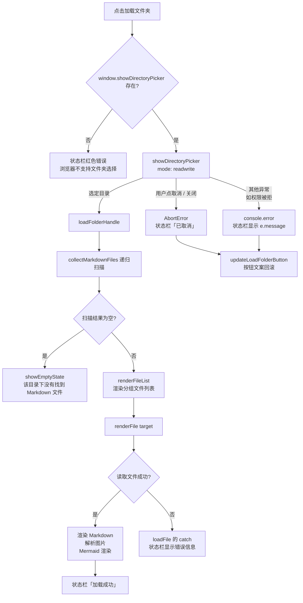
```mermaid
graph TD
    A["点击加载文件夹"] --> B{"window.showDirectoryPicker 存在?"}
    B -->|否| C["状态栏红色错误<br/>浏览器不支持文件夹选择"]
    B -->|是| D["showDirectoryPicker<br/>mode: readwrite"]
    D -->|"用户点取消 / 关闭"| E["AbortError<br/>状态栏「已取消」"]
    D -->|"其他异常<br/>如权限被拒"| F["console.error<br/>状态栏显示 e.message"]
    D -->|"选定目录"| G["loadFolderHandle"]
    G --> H["collectMarkdownFiles 递归扫描"]
    H --> I{"扫描结果为空?"}
    I -->|是| J["showEmptyState<br/>该目录下没有找到 Markdown 文件"]
    I -->|否| K["renderFileList<br/>渲染分组文件列表"]
    K --> L["renderFile target"]
    L --> M{"读取文件成功?"}
    M -->|是| N["渲染 Markdown<br/>解析图片<br/>Mermaid 渲染"]
    M -->|否| O["loadFile 的 catch<br/>状态栏显示错误信息"]
    N --> P["状态栏「加载成功」"]
    E --> Q["updateLoadFolderButton<br/>按钮文案回滚"]
    F --> Q
```

注意 `renderFileList()` 与 `showEmptyState()` 是**两条独立的空状态路径**：

- `loadFolderHandle` 先调 `renderFileList()`（`:742`），此时 `currentFiles` 为空 → 侧栏显示「当前目录下没有找到 Markdown 文件」；
- 再调 `showEmptyState('该目录下没有找到 Markdown 文件')`（`:745`），主内容区显示空状态，同时 `tocEl` 被写成「暂无内容」。

两处措辞不同（「当前目录下没有找到」vs「该目录下没有找到」），它们服务的是不同区域，不要为了「统一文案」把二者合并。

### 加载数据流转

```
用户操作: 在系统对话框中选定 D:\docs
  ↓ showDirectoryPicker 返回
FileSystemDirectoryHandle { name: "docs" }
  ↓ clearImageCache() 释放上一目录的 objectURL
  ↓ 递归遍历 entries()
原始条目: { name: "核心业务领域.md", kind: "file", handle: FileSystemFileHandle }
         { name: "业务知识库", kind: "directory", handle: FileSystemDirectoryHandle }
  ↓ 过滤 + 拼接相对路径（递归层传递 prefix，如 "业务知识库/"）
未排序结果: [{ name, path: "业务知识库/核心业务领域.md", handle }, ...]
  ↓ flattenByDirectory() 建树 → 先父目录文件、再子目录
currentFiles: [{ path: "README.md" }, { path: "业务知识库/业务流程索引.md" }, ...]
  ↓ renderFileList()
DOM: <div class="file-dir">根目录</div>
     <button class="file-item" data-path="README.md">…</button>
     <div class="file-dir">业务知识库</div>
     <button class="file-item" data-path="业务知识库/业务流程索引.md">…</button>
  ↓ renderFile(target) → getFile().text()
currentMarkdownText: "# 业务流程详解\n…"（原文）
  ↓ parseHeadingOffsets() + MdRender.renderMarkdown()
headingOffsets: { "业务流程详解": 0, "阅读前": 128, … }
contentEl.innerHTML: 渲染后的 HTML
  ↓ resolveImages() 逐张替换相对图片为 objectURL
最终可见: GitHub 风格正文 + Mermaid 图 + 本地图片 + 左侧分组文件列表
```

### 加载注意事项

1. **`currentFile` 不只是「文件名」。** 它保存的是 `target.path || target.name`（`:753`）。凡是拿它去 `getFileHandle()` 或做相等比较的地方，都必须考虑 `path` 带子目录前缀（如 `a/b.md`）的情形 —— `getFileHandle('a/b.md')` 会直接抛错。
2. **`renderFile` 的句柄重取已改为按 `path` 解析（曾按文件名，已修复）。** 旧实现传的是 `fileEntry.name`（文件名，不含子目录），对子目录文件必然抛 `NotFoundError` 并落回原句柄；更隐蔽的是若根目录恰好存在同名文件，`getFileHandle` 会**成功**并返回根目录那个文件，导致读错内容、进而写错文件。现已改为沿 `entry.path` 用 `/` 拆段、逐级 `getDirectoryHandle` 再 `getFileHandle`（`LightMDKit/public/app.js:616-628`），任一步失败仍回退到扫描时的句柄。新增按路径解析的逻辑时请沿用这个逐级下钻的写法。
3. **扫描上限是静默的。** 超过 3000 个文件或 6 层深度时不会提示用户「只扫了一部分」。如果产品上需要提示，改动点在 `LightMDKit/public/app.js:225` 与 `:235`（需要把「被截断」这一信息带出递归）。
4. **`SCAN_SKIP_DIRS` 是硬编码的 `Set`。** 用户若确实需要浏览 `dist/` 下的 md（例如构建产物里的文档），当前实现无法做到 —— 没有配置项可绕过。
5. **空目录会保留 `currentFolderHandle`。** 因此「更换文件夹...」按钮文案（`updateLoadFolderButton`，`:513`）判的是句柄而非文件数：加载一个空目录后按钮仍显示「更换文件夹...」，这是符合预期的。
6. **`renderFileList` 每次都是全量重建。** 过滤框 `input` 事件直接调它（`:1168`），3000 个文件时每次输入都会重建整段 DOM。若要做性能优化，应先在这里下手。

### 侧边栏视图切换与布局调整

文件列表与文档目录共用同一个侧边栏，通过顶部的「文件列表 / 目录」两个按钮切换；侧栏还能整体收起、拖动改宽。这是文件列表被渲染出来之后紧接着会用到的一组交互。

**Step 1：切换视图** (`LightMDKit/public/app.js:1130`)

```javascript
async function setSidebarView(view) {
  const next = view === 'toc' ? 'toc' : 'files';
  const changed = next !== sidebarView;
  sidebarView = next;
  if (changed) saveSidebarView(next);

  const isFiles = next === 'files';
  if (filePanel) filePanel.hidden = !isFiles;
  if (tocPanel) tocPanel.hidden = isFiles;
  if (btnViewFiles) btnViewFiles.classList.toggle('active', isFiles);
  if (btnViewToc) btnViewToc.classList.toggle('active', !isFiles);

  // 目录视图的内容由 renderToc 按模式决定（现代模式从编辑器原文解析），
  // 切回来时重建一次，避免显示的是切走之前的旧内容
  if (isFiles) {
    await renderFileList();
  } else {
    renderToc();
  }
}
```

两个面板**都常驻 DOM**，切换只改 `hidden` 属性（`:1137`、`:1138`），不重建节点 —— 这样来回切换不会丢失过滤框里已输入的内容。

**Step 2：入口绑定与持久化**

```javascript
btnViewFiles.addEventListener('click', () => setSidebarView('files'));   // :1137
btnViewToc.addEventListener('click', () => setSidebarView('toc'));       // :1138
```

当前视图存进 `localStorage['lightmdkit.sidebarView']`（`SIDEBAR_VIEW_KEY`，`:63`），只认 `'toc'`，其余回落 `'files'`（`:66`）；启动时在 `:1484` 调 `setSidebarView(sidebarView)` 恢复。写存储用 try/catch 包住（`:75`），隐私模式下静默失败不影响本次使用。

**Step 3：收起与拖宽**

```javascript
btnToggleToc.addEventListener('click', () => {
  const isCollapsed = sidebar.classList.toggle('collapsed');
  if (isCollapsed) {
    // 收起时清除内联宽高，让 CSS 类的 40px 生效
    sidebar.style.width = '';
    sidebar.style.minWidth = '';
    sidebar.style.maxWidth = '';
  }
  btnToggleToc.innerHTML = isCollapsed ? '&#9654;' : '&#9664;';
  btnToggleToc.title = isCollapsed ? '显示侧边栏' : '隐藏侧边栏';
});
```

拖宽由 `mousedown`(：1161) 进入拖拽态、`mousemove`(：1171) 实时改宽、`mouseup`(：1183) 收尾：

```javascript
const newWidth = e.clientX;
const minWidth = 200;
const maxWidth = 500;
if (newWidth >= minWidth && newWidth <= maxWidth) {
  sidebar.style.width = newWidth + 'px';
  sidebar.style.minWidth = newWidth + 'px';
  sidebar.style.maxWidth = newWidth + 'px';
}
```

### 侧边栏关键决策点

| 决策点 | 条件 | 结果 | 代码位置 |
|-------|------|------|---------|
| 目标视图归一化 | 非 `'toc'` 的任何值 | 一律当作 `'files'` | `LightMDKit/public/app.js:1131` |
| 是否写存储 | `changed` 为真 | 仅真正变化时才写 localStorage | `LightMDKit/public/app.js:1132` |
| 切到哪个面板 | `isFiles` | 切换 `filePanel` / `tocPanel` 的 `hidden` | `LightMDKit/public/app.js:1137` |
| 切回时的重建 | `isFiles` 真 → `renderFileList`；假 → `renderToc` | 避免显示切走前的旧内容 | `LightMDKit/public/app.js:1144` |
| 收起前是否在拖拽 | `sidebar.classList.contains('collapsed')` | 收起态下拖拽手柄不响应 | `LightMDKit/public/app.js:1184` |
| 宽度越界 | `newWidth` 不在 200–500 之间 | 该次移动被忽略，宽度保持不变 | `LightMDKit/public/app.js:1198` |

### 侧边栏注意事项

1. **`renderToc` 有视图守卫，只在「目录」视图下才真的重建。** 见 [现代模式即时编辑](#现代模式即时编辑) 中的装饰逻辑（`LightMDKit/public/app.js:1464`）：`sidebarView !== 'toc'` 时是空操作。所以「读文件时目录没刷新」不是 bug，而是有意的 —— 去掉守卫会让过滤框在打字时被 `renderFileList` 重建打断。
2. **收起侧栏后拖拽手柄不响应**（`:1184` 直接 return），且收起时清掉内联宽高，让 CSS 类的 40px 生效。恢复展开时宽度回到 CSS 默认值，**不会记住收起前的自定义宽度**。
3. **拖宽上下限 200–500px 是硬编码的**（`:1196`、`:1197`），且用 `e.clientX` 作为宽度，隐含假设侧栏贴着窗口左边。
4. **视图偏好与模式偏好分开存储**：`lightmdkit.sidebarView` 与 `lightmdkit.mode` 互不影响，两个读取函数各自判默认值。

### 目录跳转与高亮

侧边栏「目录」视图把当前文档的 h1–h6 渲染成可点击的目录树：点击某条跳转到对应位置，滚动或移动光标时高亮当前所在小节。它按模式分成两套实现 —— 传统模式从渲染好的 DOM 取标题，现代模式从编辑器原文实时解析。

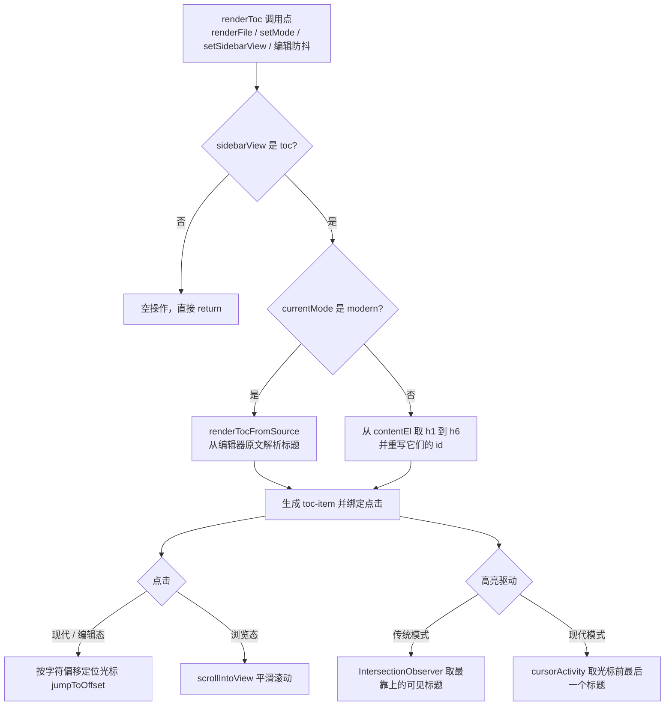
```mermaid
graph TD
    A["renderToc 调用点<br/>renderFile / setMode / setSidebarView / 编辑防抖"] --> B{"sidebarView 是 toc?"}
    B -->|否| C["空操作，直接 return"]
    B -->|是| D{"currentMode 是 modern?"}
    D -->|是| E["renderTocFromSource<br/>从编辑器原文解析标题"]
    D -->|否| F["从 contentEl 取 h1 到 h6<br/>并重写它们的 id"]
    E --> G["生成 toc-item 并绑定点击"]
    F --> G
    G --> H{"点击"}
    H -->|"现代 / 编辑态"| I["按字符偏移定位光标 jumpToOffset"]
    H -->|"浏览态"| J["scrollIntoView 平滑滚动"]
    G --> K{"高亮驱动"}
    K -->|"传统模式"| L["IntersectionObserver 取最靠上的可见标题"]
    K -->|"现代模式"| M["cursorActivity 取光标前最后一个标题"]
```

**Step 1：唯一入口 `renderToc`，运行时被装饰过** (`LightMDKit/public/app.js:1463-1468`)

```javascript
const renderTocContent = renderToc;
renderToc = function () {
  if (sidebarView !== 'toc') return;
  renderTocContent();
  setupTocObserver();
};
```

视图守卫的含义：**侧栏停在「文件列表」页时，`renderToc()` 整个是空操作**，不会重建目录、也不会重建滚动监听。调用点共 4 处：`renderFile`（`:662`，每次读文件后）、`setMode`（`:1037`）、`setSidebarView`（`:1147`，切回目录视图时）、`scheduleLivePreviewRefresh`（`:409`，现代模式编辑防抖 300ms 后）。

**Step 2：标题来源分叉** (`LightMDKit/public/app.js:449`)

```javascript
function _renderTocCurrentView() {
  // 现代模式下 contentEl 是隐藏的且可能已经过期，目录改从编辑器原文实时解析
  if (currentMode === 'modern') {
    renderTocFromSource();
    return;
  }
  tocEl.innerHTML = '';
  const headings = contentEl.querySelectorAll('h1, h2, h3, h4, h5, h6');
  if (headings.length === 0) {
    tocEl.innerHTML = '<p class="toc-empty">当前文件没有标题目录</p>';
    return;
  }

  // 统一重新生成 heading id，确保与 parseHeadingOffsets 生成的键一致
  const usedIds = new Set();
  headings.forEach(h => {
    h.id = generateHeadingId(h.textContent || '', usedIds);
  });
```

传统模式会**重写 DOM 上的 heading id**：`marked` 自己生成的 id 与 `generateHeadingId`（`:267`）规则不同，而编辑态跳转要靠 `headingOffsets[h.id]` 查偏移表，两边必须同构，所以这里统一重算一次。

现代模式走 `renderTocFromSource()`（`:364`），标题来自 `getHeadingsCached`（`:342`）—— 按全文缓存解析结果，避免每次光标移动都 O(n) 重新解析。

**Step 3：点击跳转** —— 三种情形：

| 情形 | 行为 | 代码位置 |
|------|------|---------|
| 现代模式（常驻编辑） | `jumpToOffset(h.offset)` 定位光标 | `LightMDKit/public/app.js:380` |
| 传统 + 编辑态 | `headingOffsets[h.id]` 取偏移 → 转行号 → `setCursor` + `scrollIntoView` | `LightMDKit/public/app.js:481` |
| 传统 + 浏览态 | `h.scrollIntoView({ behavior: 'smooth', block: 'start' })` | `LightMDKit/public/app.js:497` |

```javascript
item.addEventListener('click', e => {
  e.preventDefault();
  jumpToOffset(h.offset);
  updateActiveTocItem(h.id);
});
```

`jumpToOffset`（`:350`）对 CodeMirror 与 textarea 两条路径分别处理：前者 `setCursor` + `scrollIntoView`，后者 `setSelectionRange` + `scrollEditorToOffset`。

**Step 4：高亮** —— `updateActiveTocItem`（`:505`）只切 `.active` 类，不重建节点：

```javascript
function updateActiveTocItem(activeId) {
  tocEl.querySelectorAll('.toc-item').forEach(item => {
    item.classList.toggle('active', item.dataset.target === activeId);
  });
}
```

驱动源按模式分两套：

- **传统模式**：`setupTocObserver`（`:1444`）用 IntersectionObserver，root 取 `.content-wrapper`，`rootMargin: '-56px 0px -70% 0px'`（`:1455`），只取 `isIntersecting` 中最靠上的一个（`:1451`）。重建前先 `observer.disconnect()`（`:1445`）防止旧监听泄漏。
- **现代模式**：`setupTocObserver` 直接 `return`（`:1447`），改由 `cmEditor.on('cursorActivity')`（`:148`）触发 `updateActiveTocItemByCursor`（`:388`）—— 取最后一个 `offset <= 光标偏移` 的标题。这套缓存与计算是为性能准备的，因为光标移动远比滚动频繁。

### 目录关键决策点

| 决策点 | 条件 | 结果 | 代码位置 |
|-------|------|------|---------|
| 视图守卫 | `sidebarView !== 'toc'` | 整个 `renderToc` 空操作 | `LightMDKit/public/app.js:1465` |
| 标题来源 | `currentMode === 'modern'` | 编辑器原文 / `contentEl` 的 DOM | `LightMDKit/public/app.js:455` |
| 无标题 | `headings.length === 0` | 显示「当前文件没有标题目录」 | `LightMDKit/public/app.js:369`、`:462` |
| id 口径 | 恒为 `generateHeadingId` + 独立 `Set` | 与 `headingOffsets`、`extractHeadings` 三处对齐 | `LightMDKit/public/app.js:267`、`:469` |
| 重复标题 | 标题文本重复 | 追加 `-1`、`-2` 后缀 | `LightMDKit/public/app.js:271` |
| 点击行为 | `isEditMode` 真假 | 编辑态定位光标 / 浏览态平滑滚动 | `LightMDKit/public/app.js:481`、`:497` |
| 高亮驱动 | 模式 | IntersectionObserver / 光标位置 | `LightMDKit/public/app.js:1447`、`:148` |
| 解析缓存 | 全文文本是否变化 | 变则重解析，否则复用 | `LightMDKit/public/app.js:343` |

### 目录注意事项

1. **三个 id 生成点必须永远保持同构。** DOM（传统模式 `:469`）、`headingOffsets`（`parseHeadingOffsets`，`:279`）、`extractHeadings`（`:320`）都调用 `generateHeadingId` + 独立 `Set` + 按文档顺序遍历，因此天然对齐 —— 这也正是注释里写明「id 生成与 parseHeadingOffsets 完全同构」的原因（`:317`）。改 `slugify` 或去重规则时，这三处必须一起改，否则会出现「点目录跳到了错误的位置」。
2. **`renderToc` 的声明与赋值分离（曾为隐式全局，已修复）。** 现在 `LightMDKit/public/app.js:38` 有 `let renderToc;` 声明，直到文末 `:1463-1468` 才赋值为带视图守卫的版本，全项目只此一处赋值。因此不要在别处再写 `renderToc = ...` —— 那会覆盖装饰链、让视图守卫失效。
3. **不要直接调用 `_renderTocCurrentView()`。** 它绕过了视图守卫，会让「文件列表」视图下的每次读文件都重建目录；正确入口始终是 `renderToc()`。
4. **两套高亮机制互斥且由模式决定**，不要同时启用：现代模式下 `contentEl` 是隐藏的（`display: none`），IntersectionObserver 对它不会产生有意义的可见性变化。
5. **空状态有两套文案，含义不同。** `showEmptyState` 会把 `tocEl` 写成「暂无内容」（`:611`），表示「还没加载文件」；「当前文件没有标题目录」（`:369`、`:462`）表示「已加载但文档里没有标题」。

---

## 切换与查看文件

用户点击左侧文件列表项、或点击文档内的相对链接，都会走到 `loadFile` 做一次「解析目标 → 更新状态 → 重新渲染」。

### 切换时序图

```mermaid
sequenceDiagram
    autonumber
    participant U as 用户
    participant FL as file-list
    participant OF as openFileFromList
    participant LF as loadFile
    participant FE as findEntryByPath
    participant RF as renderFile
    participant HB as fileHistory

    U->>FL: 点击某个文件项
    FL->>OF: 委托 click（读 dataset.path）
    OF->>OF: path 为空或等于 currentFile? 直接 return
    OF->>HB: fileHistory.push(currentFile)
    OF->>OF: updateBackButton() 启用「← 返回」
    OF->>LF: loadFile(path)
    LF->>FE: findEntryByPath(path)
    alt 找不到条目
        FE-->>LF: null
        LF-->>U: 静默返回（无任何提示）
    else 找到条目
        FE-->>LF: entry
        LF->>LF: currentFile = entry.path || entry.name
        alt 传统模式且处于编辑态
            LF->>LF: stopAutosave(); isEditMode = false; applySurface()
        end
        LF->>RF: renderFile(entry)
        RF->>RF: 重新渲染正文 / 目录 / 图片 / Mermaid
        LF->>LF: updateActiveFileItem() 只切换高亮
        LF-->>U: 状态栏「文件已加载」
    end
```

### 切换执行路径

**Step 1：入口 A —— 文件列表点击** (`LightMDKit/public/app.js:528`)

```javascript
async function openFileFromList(path) {
  if (!path || path === currentFile) return;
  if (currentFile) {
    fileHistory.push(currentFile);
    updateBackButton();
  }
  await loadFile(path);
}
```

事件委托在 `LightMDKit/public/app.js:1162`：

```javascript
fileListEl.addEventListener('click', (e) => {
  const item = e.target.closest('.file-item');
  if (!item) return;
  openFileFromList(item.dataset.path);
});
```

用 `closest('.file-item')` 是因为列表项内部还有 `.file-icon` / `.file-name` 两个子元素；`dataset.path` 来自 `renderFileList` 里的 `item.dataset.path = path`（`:590`），所以这里天然拿的是**相对路径**。

**Step 2：入口 B —— 文档内链接**（详见 [文档内链接跳转与返回](#文档内链接跳转与返回)）把 href 归一后同样交给 `loadFile`。

**Step 3：路径解析** (`LightMDKit/public/app.js:781`)

```javascript
async function loadFile(path) {
  const entry = findEntryByPath(path);
  if (!entry) return;
  setStatus('读取文件...');
  try {
    currentFile = entry.path || entry.name;
    // 传统模式切换文件时自动切回浏览模式；现代模式保持常驻编辑态
    if (isEditMode && currentMode !== 'modern') {
      stopAutosave();
      isEditMode = false;
      applySurface();
    }
    await renderFile(entry);
    updateActiveFileItem();
    setStatus('文件已加载', 'success');
  } catch (e) {
    console.error(e);
    setStatus(e.message, 'error');
  }
}
```

**Step 4：路径匹配** (`LightMDKit/public/app.js:182`)

```javascript
function findEntryByPath(path) {
  if (!path) return null;
  const byPath = currentFiles.find(f => f.path === path);
  if (byPath) return byPath;
  const target = normalizePathForMatch(path);
  return currentFiles.find(f => f.path === undefined && f.name === path)
    || currentFiles.find(f => normalizePathForMatch(f.path || f.name) === target)
    || null;
}
```

三级匹配策略，逐级放宽：

1. **精确匹配 `f.path === path`** —— 正常路径，`currentFiles` 由扫描产生，`path` 来自 `renderFileList` / 历史栈 / 链接解析，口径一致；
2. **旧结构兼容** `f.path === undefined && f.name === path` —— 兼容 `initFromDropParam` 早期只塞 `{ name, handle }` 的形态；
3. **归一化匹配** `normalizePathForMatch` —— 处理 `./sub/a.md`、`sub\a.md`、`SUB/A.MD` 三种写法。

`normalizePathForMatch` (`LightMDKit/public/app.js:176`) 只有三件事，但它是全应用的路径比较口径：

```javascript
return String(path || '').replace(/\\/g, '/').replace(/^\.\//, '').toLowerCase();
```

**Step 5：渲染与高亮** —— `renderFile(entry)` 完成后调用 `updateActiveFileItem()` (`LightMDKit/public/app.js:1153`)：

```javascript
function updateActiveFileItem() {
  fileListEl.querySelectorAll('.file-item').forEach(item => {
    item.classList.toggle('active', item.dataset.path === currentFile);
  });
}
```

它只改 class、**不重建列表**。这一区分很重要：`renderFile` 会调用它（`:664`），而 `renderFileList` 会重建 DOM；如果这里也重建，用户在过滤框打字时每读一个文件就会让输入框失焦。

### 切换关键决策点

| 决策点 | 条件 | 结果 | 代码位置 |
|-------|------|------|---------|
| 重复点击 | `path === currentFile` | 直接返回，不压历史栈、不重渲染 | `LightMDKit/public/app.js:529` |
| 历史栈入栈 | `currentFile` 为真且目标不同 | `fileHistory.push(currentFile)` | `LightMDKit/public/app.js:530` |
| 目标不存在 | `findEntryByPath` 返回 null | **静默 return**，状态栏无提示 | `LightMDKit/public/app.js:783` |
| 编辑态跨文件 | `isEditMode && currentMode !== 'modern'` | 停自动保存、退回浏览态（**不保存**） | `LightMDKit/public/app.js:788` |
| 现代模式跨文件 | `currentMode === 'modern'` | 保持编辑态，`renderFile` 负责把内容灌回编辑器 | `LightMDKit/public/app.js:643` |
| 高亮更新方式 | 恒为 `updateActiveFileItem` | 只切 class，不重建 DOM | `LightMDKit/public/app.js:794` |

### 切换异常处理

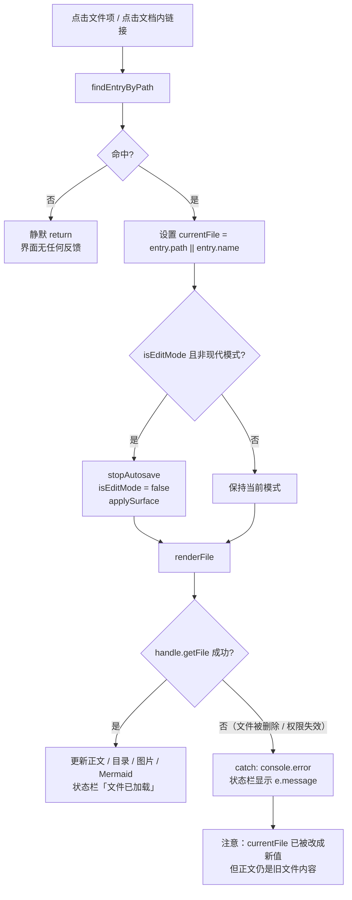
```mermaid
graph TD
    A["点击文件项 / 点击文档内链接"] --> B["findEntryByPath"]
    B --> C{"命中?"}
    C -->|否| D["静默 return<br/>界面无任何反馈"]
    C -->|是| E["设置 currentFile = entry.path || entry.name"]
    E --> F{"isEditMode 且非现代模式?"}
    F -->|是| G["stopAutosave<br/>isEditMode = false<br/>applySurface"]
    F -->|否| H["保持当前模式"]
    G --> I["renderFile"]
    H --> I
    I --> J{"handle.getFile 成功?"}
    J -->|是| K["更新正文 / 目录 / 图片 / Mermaid<br/>状态栏「文件已加载」"]
    J -->|"否（文件被删除 / 权限失效）"| L["catch: console.error<br/>状态栏显示 e.message"]
    L --> M["注意：currentFile 已被改成新值<br/>但正文仍是旧文件内容"]
```

分支「目标不存在」是本流程唯一的静默失败点。它的成因通常是：目录被刷新后文件已删除，而历史栈里还留着旧路径（历史栈在换目录时不会被清空）。

### 切换数据流转

```
用户点击: <button class="file-item" data-path="业务知识库/核心业务领域.md">
  ↓ openFileFromList 读取 dataset.path
"业务知识库/核心业务领域.md"
  ↓ 压入历史栈（值同样是 path，不是 name）
fileHistory: ["README.md"]
  ↓ findEntryByPath 三级匹配
entry: { name: "核心业务领域.md", path: "业务知识库/核心业务领域.md", handle: FileSystemFileHandle }
  ↓ currentFile 更新
"业务知识库/核心业务领域.md"
  ↓ renderFile → handle.getFile() → file.text()
currentMarkdownText: "# 核心业务领域\n…"
  ↓ applySurface / renderToc / updateActiveFileItem / renderMermaid
DOM: 正文替换，侧栏该项带 .active，目录重建
```

### 切换注意事项

1. **不要用 `name` 做文件比较。** `currentFiles` 里 `path` 才是唯一键；`name` 在跨子目录时会碰撞。历史栈、`dataset.path`、`currentFile`、IndexedDB 记录全部统一用 `path`。
2. **`loadFile` 的失败不会回滚 `currentFile`。** `currentFile` 在 `try` 的第一行就被改（`:786`），之后 `renderFile` 抛错只进 `catch` 提示，不会恢复旧值 —— 结果是「`currentFile` 指向 B，正文仍是 A」。若要让失败可恢复，需要把赋值挪到 `renderFile` 成功之后。
3. **传统模式下编辑态切换文件会丢弃未保存的修改吗？不会 —— 但要看清顺序。** `loadFile` 只是 `stopAutosave()` 并退回浏览态（`:789`），**并不调用 `saveCurrentFile`**。数据得以保留是因为自动保存每 3 秒会先落盘一次（见 [编辑并保存文档](#编辑并保存文档)）；用户若在 3 秒内就点了另一个文件，这段修改只存在于 `currentMarkdownText`，随后被 `renderFile` 覆盖。
4. **`findEntryByPath` 的归一化分支会退化为「按 name 匹配」。** 第三级用了 `f.path || f.name`，对正常扫描结果不成问题，但要清楚这里的比较是大小写不敏感的。
5. **无提示的静默失败应被视为缺陷而非设计。** 若产品上要给反馈，改动点在 `LightMDKit/public/app.js:783`，改完注意别影响 `openFileFromList` 的前置判断。

---

## 编辑并保存文档

传统模式下点「编辑」进编辑态、点「浏览」退出并保存；编辑期间每 3 秒自动保存一次。现代模式下这段逻辑被常驻化（见下一节）。

### 保存时序图

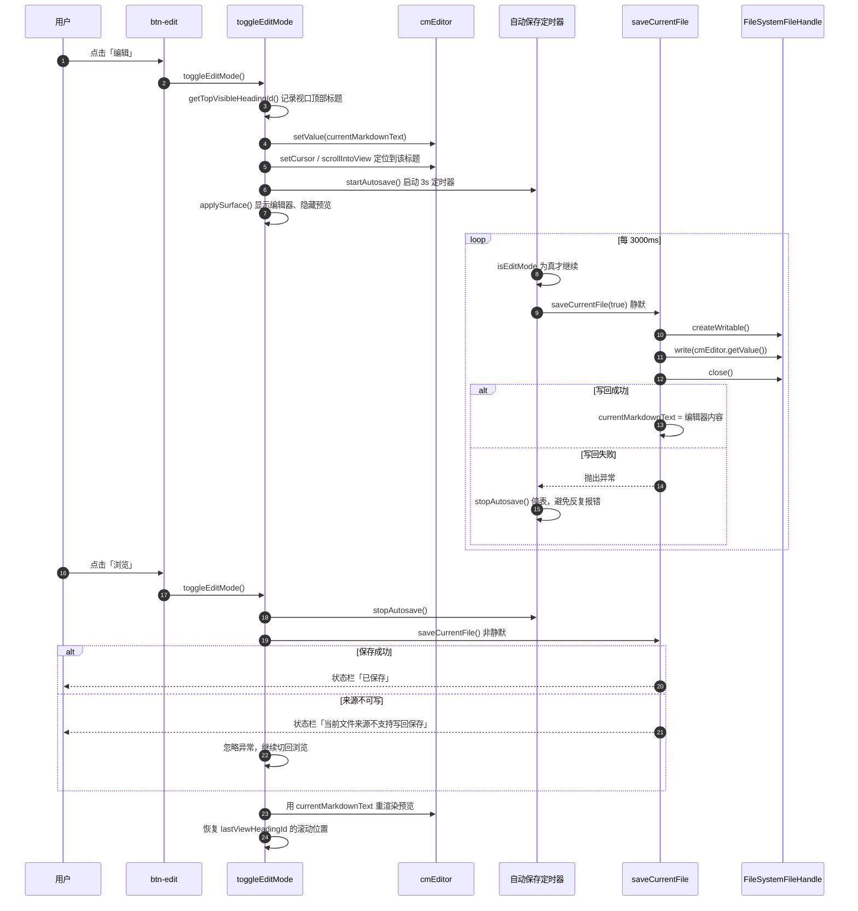
```mermaid
sequenceDiagram
    autonumber
    participant U as 用户
    participant BE as btn-edit
    participant TE as toggleEditMode
    participant CM as cmEditor
    participant SA as 自动保存定时器
    participant SV as saveCurrentFile
    participant FS as FileSystemFileHandle

    U->>BE: 点击「编辑」
    BE->>TE: toggleEditMode()
    TE->>TE: getTopVisibleHeadingId() 记录视口顶部标题
    TE->>CM: setValue(currentMarkdownText)
    TE->>CM: setCursor / scrollIntoView 定位到该标题
    TE->>SA: startAutosave() 启动 3s 定时器
    TE->>TE: applySurface() 显示编辑器、隐藏预览

    loop 每 3000ms
        SA->>SA: isEditMode 为真才继续
        SA->>SV: saveCurrentFile(true) 静默
        SV->>FS: createWritable()
        SV->>FS: write(cmEditor.getValue())
        SV->>FS: close()
        alt 写回成功
            SV->>SV: currentMarkdownText = 编辑器内容
        else 写回失败
            SV-->>SA: 抛出异常
            SA->>SA: stopAutosave() 停表，避免反复报错
        end
    end

    U->>BE: 点击「浏览」
    BE->>TE: toggleEditMode()
    TE->>SA: stopAutosave()
    TE->>SV: saveCurrentFile() 非静默
    alt 保存成功
        SV-->>U: 状态栏「已保存」
    else 来源不可写
        SV-->>U: 状态栏「当前文件来源不支持写回保存」
        TE->>TE: 忽略异常，继续切回浏览
    end
    TE->>CM: 用 currentMarkdownText 重渲染预览
    TE->>TE: 恢复 lastViewHeadingId 的滚动位置
```

### 保存执行路径

**Step 1：进入/退出编辑态** (`LightMDKit/public/app.js:1042`)

```javascript
async function toggleEditMode() {
  // 现代模式没有编辑/浏览切换，防御性返回
  if (currentMode === 'modern') return;
  if (!currentFile) {
    setStatus('请先加载文件', 'error');
    return;
  }
  if (isEditMode) {
    // 从编辑模式切换到浏览模式：先保存，再停止自动保存
    stopAutosave();
    try {
      await saveCurrentFile();
    } catch (e) {
      // 来源不可写（如拖入的单文件没有可写句柄）时保存会失败，
      // 但不能因此卡在编辑模式 —— 继续切回浏览，错误已由 saveCurrentFile 提示
    }
    contentEl.innerHTML = MdRender.renderMarkdown(currentMarkdownText, marked);
    await resolveImages();
    isEditMode = false;
    applySurface();
    renderToc();
    renderMermaid();
```

注意退出时的顺序是**先 `stopAutosave` 再 `saveCurrentFile`**：先停表是为了避免保存过程中的下一个 tick 重入。

**Step 2：进入编辑态时的视图定位** (`LightMDKit/public/app.js:1071`)

```javascript
// 从浏览模式切换到编辑模式
// 记录当前视口最上方的 heading，以便在编辑器中定位到对应位置
const topHeadingId = getTopVisibleHeadingId();
lastViewHeadingId = topHeadingId;

if (cmEditor) cmEditor.setValue(currentMarkdownText);
else editorEl.value = currentMarkdownText;

isEditMode = true;
applySurface();
startAutosave();
```

`getTopVisibleHeadingId()` (`LightMDKit/public/app.js:303`) 用 `getBoundingClientRect()` 在渲染后的 `<h1>~<h6>` 中找第一个 `rect.top >= wrapperTop - 10` 的标题（10px 容差），返回其 id；拿到后用 `headingOffsets[id]` 换算成字符偏移，再转行号 `setCursor` + `scrollIntoView`（`:1085`）。退出编辑态时反过来用 `lastViewHeadingId` 恢复滚动（`:1065`）—— 这是「编辑前后视线不跳走」的关键，改动编辑器初始化时不要破坏 `headingOffsets` 与 DOM `id` 的同构关系。

**Step 3：保存** (`LightMDKit/public/app.js:916`)

```javascript
async function saveCurrentFile(silent = false) {
  if (!currentFile) return;
  // currentFile 是相对路径，同名文件可能分布在多个子目录，必须按 path 取
  const entry = findEntryByPath(currentFile);
  if (!entry) return;
  if (!entry.handle || typeof entry.handle.createWritable !== 'function') {
    const msg = '当前文件来源不支持写回保存';
    if (!silent) setStatus(msg, 'error');
    throw new Error(msg);
  }
  try {
    const writable = await entry.handle.createWritable();
    await writable.write(cmEditor ? cmEditor.getValue() : editorEl.value);
    await writable.close();
    currentMarkdownText = cmEditor ? cmEditor.getValue() : editorEl.value;
    if (!silent) setStatus('已保存', 'success');
  } catch (e) {
    console.error(e);
    setStatus('保存失败: ' + e.message, 'error');
    throw e;
  }
}
```

四个要点：

- **`silent` 参数**：自动保存传 `true`，只写盘不刷状态栏；手动保存传 `false`，成功后显示「已保存」。
- **必须先 `close()`**：`createWritable()` 返回的是临时文件写入流，只有 `close()` 才真正提交到磁盘；漏掉 `close()` 会导致「看起来保存成功但文件没变」。
- **抛异常而非吞掉**：`:924` 与 `:935` 都 `throw`，让 `startAutosave` 能据此停表。
- **失败提示重复**：`catch` 里已经 `setStatus`，调用方 `toggleEditMode` 不再提示 —— 这是有意的分工。

**Step 4：自动保存** (`LightMDKit/public/app.js:939`)

```javascript
function startAutosave() {
  if (autosaveTimer) return;
  autosaveTimer = setInterval(async () => {
    if (!isEditMode) return;
    try {
      await saveCurrentFile(true);
    } catch (e) {
      // 自动保存失败已在 saveCurrentFile 内提示，停止定时器避免反复报错
      stopAutosave();
    }
  }, AUTOSAVE_INTERVAL_MS);
}
```

```javascript
const AUTOSAVE_INTERVAL_MS = 3000;   // LightMDKit/public/app.js:93
```

`if (autosaveTimer) return;` 让 `startAutosave` 幂等，可被多处安全调用。失败即停表是关键设计：拖入的单文件没有可写句柄，若不停表就会每 3 秒弹一次「当前文件来源不支持写回保存」。

**Step 5：编辑器内容实时回写内存** (`LightMDKit/public/app.js:142`)

```javascript
cmEditor.on('change', () => {
  currentMarkdownText = cmEditor.getValue();
  scheduleLivePreviewRefresh();
});
```

因此 `currentMarkdownText` 始终是「编辑器里的最新内容」，`saveCurrentFile` 之外的消费者（渲染预览、解析标题、保存前的状态同步）都依赖它。

### 保存关键决策点

| 决策点 | 条件 | 结果 | 代码位置 |
|-------|------|------|---------|
| 现代模式守卫 | `currentMode === 'modern'` | 直接 return（现代模式无编辑/浏览切换） | `LightMDKit/public/app.js:1044` |
| 未加载文件 | `!currentFile` | 状态栏「请先加载文件」 | `LightMDKit/public/app.js:1045` |
| 方向 | `isEditMode` 真假 | 真=退出并保存，假=进入并定位 | `LightMDKit/public/app.js:1049` |
| 句柄可写性 | `typeof entry.handle.createWritable !== 'function'` | 抛错；静默模式下不提示 | `LightMDKit/public/app.js:921` |
| 无 entry | `findEntryByPath(currentFile)` 为 null | 静默 return（不报错、不抛异常） | `LightMDKit/public/app.js:920` |
| 自动保存失败 | `saveCurrentFile(true)` 抛异常 | `stopAutosave()` 停表 | `LightMDKit/public/app.js:947` |
| 定时器幂等 | `autosaveTimer` 已存在 | 不再新建第二个定时器 | `LightMDKit/public/app.js:940` |
| 退出编辑态保存失败 | `catch` 到异常 | **仍然切回浏览模式**，不卡在编辑态 | `LightMDKit/public/app.js:1054` |
| 无 CodeMirror | `cmEditor` 为 null | 全部降级到 `editorEl`（textarea） | `LightMDKit/public/app.js:928`、`:1078` |

### 保存异常处理

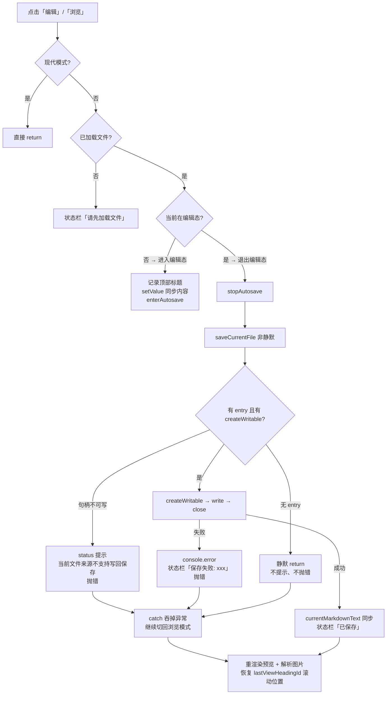
```mermaid
graph TD
    A["点击「编辑」/「浏览」"] --> B{"现代模式?"}
    B -->|是| C["直接 return"]
    B -->|否| D{"已加载文件?"}
    D -->|否| E["状态栏「请先加载文件」"]
    D -->|是| F{"当前在编辑态?"}
    F -->|"否 → 进入编辑态"| G["记录顶部标题<br/>setValue 同步内容<br/>enterAutosave"]
    F -->|"是 → 退出编辑态"| H["stopAutosave"]
    H --> I["saveCurrentFile 非静默"]
    I --> J{"有 entry 且有 createWritable?"}
    J -->|"无 entry"| K["静默 return<br/>不提示、不抛错"]
    J -->|"句柄不可写"| L["status 提示<br/>当前文件来源不支持写回保存<br/>抛错"]
    J -->|是| M["createWritable → write → close"]
    M -->|成功| N["currentMarkdownText 同步<br/>状态栏「已保存」"]
    M -->|失败| O["console.error<br/>状态栏「保存失败: xxx」<br/>抛错"]
    L --> P["catch 吞掉异常<br/>继续切回浏览模式"]
    O --> P
    K --> P
    P --> Q["重渲染预览 + 解析图片<br/>恢复 lastViewHeadingId 滚动位置"]
    N --> Q
```

### 保存数据流转

```
用户在编辑器里敲字
  ↓ cmEditor 'change' 事件
currentMarkdownText: "# 标题\n新加的一行\n…"
  ↓ 每 3000ms（或点「浏览」）
saveCurrentFile(silent)
  ↓ findEntryByPath(currentFile) 按相对路径取回句柄
entry.handle.createWritable()
  ↓ 写入的是编辑器实时值，不是 currentMarkdownText 的旧快照
FileSystemWritableFileStream.write("# 标题\n新加的一行\n…")
  ↓ close() 提交
磁盘文件: D:\docs\业务知识库\核心业务领域.md 内容更新
  ↓ 成功后同步内存
currentMarkdownText = 编辑器内容（二者此时一致）
  ↓ 状态栏
非静默: 「已保存」 / 静默: 无提示
```

### 保存注意事项

1. **两种来源天然不可写。** 一是 `initFromDropParam` 的单文件分支（`LightMDKit/public/app.js:1417`），它的 handle 是手工构造的 `{ getFile: async () => record.fileBlob }`，**根本没有 `createWritable`**；二是浏览器只授予 `read` 权限的目录。两种情况都会走到 `:921` 的分支。若要让拖入的单文件可保存，需要给用户一个「另存为」路径（`showSaveFilePicker`），当前实现没有。
2. **`saveCurrentFile` 有两条「静默 return」路径**（`:917` 无 `currentFile`、`:920` 无 `entry`）。它们不会 `throw`，所以调用方 `await` 之后会认为「保存成功」。刷新目录后当前文件被移除的场景正是如此（见 [刷新目录](#刷新目录)）。
3. **自动保存是「整文件覆盖写」，不是增量写。** 每 3 秒把编辑器全文写入磁盘，大文件会有明显 IO。若要改成「有变更才写」，需要在 `cmEditor.on('change')` 处打脏标记。
4. **保存不写临时文件、不做原子替换。** `createWritable()` 默认直接改目标文件，写入过程中崩溃会留下半截文件。这是浏览器 API 的默认行为，不是本项目的疏漏；若需要原子性，得显式用 `keepExistingData: false` 之外的方案自建备份。
5. **`currentMode === 'modern'` 时编辑器内容由自动保存负责落盘。** 传统模式下用户点「浏览」是一次强制保存点；现代模式没有这个动作，切走模式时靠 `setMode` 里的 `saveCurrentFile(true)`（`LightMDKit/public/app.js:1010`）兜底。
6. **别把 `stopAutosave` 挪到 `saveCurrentFile` 内部。** 它被 `toggleEditMode`、`setMode`、`loadFile` 分别按需调用，一旦内聚到保存函数里，现代模式（常驻编辑态）就会保存一次就停表。

---

## 现代模式即时编辑

现代模式是 Typora 式的常驻即时渲染：编辑器始终可见，语法标记（`#`、`**`、`~~` 等）只在光标所在行显示，其余行按渲染样式呈现。它与传统模式是**互斥的三态界面**之一。

### 模式切换时序图

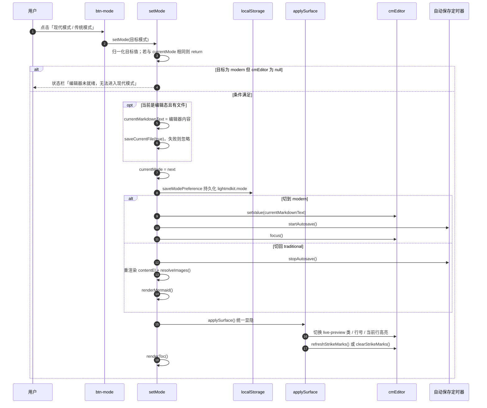
```mermaid
sequenceDiagram
    autonumber
    participant U as 用户
    participant BM as btn-mode
    participant SM as setMode
    participant LS as localStorage
    participant AS as applySurface
    participant CM as cmEditor
    participant SA as 自动保存定时器

    U->>BM: 点击「现代模式 / 传统模式」
    BM->>SM: setMode(目标模式)
    SM->>SM: 归一化目标值；若与 currentMode 相同则 return
    alt 目标为 modern 但 cmEditor 为 null
        SM-->>U: 状态栏「编辑器未就绪，无法进入现代模式」
    else 条件满足
        opt 当前是编辑态且有文件
            SM->>SM: currentMarkdownText = 编辑器内容
            SM->>SM: saveCurrentFile(true)，失败则忽略
        end
        SM->>SM: currentMode = next
        SM->>LS: saveModePreference 持久化 lightmdkit.mode
        alt 切到 modern
            SM->>CM: setValue(currentMarkdownText)
            SM->>SA: startAutosave()
            SM->>CM: focus()
        else 切回 traditional
            SM->>SA: stopAutosave()
            SM->>SM: 重渲染 contentEl + resolveImages()
            SM->>SM: renderMermaid()
        end
        SM->>AS: applySurface() 统一显隐
        AS->>CM: 切换 live-preview 类 / 行号 / 当前行高亮
        AS->>CM: refreshStrikeMarks() 或 clearStrikeMarks()
        SM->>SM: renderToc()
    end
```

### 模式切换执行路径

**Step 1：切换入口** (`LightMDKit/public/app.js:1111`)

```javascript
if (btnMode) {
  btnMode.addEventListener('click', () => {
    setMode(currentMode === 'modern' ? 'traditional' : 'modern');
  });
}
```

**Step 2：模式切换主体** (`LightMDKit/public/app.js:998`)

```javascript
async function setMode(mode) {
  const next = mode === 'modern' ? 'modern' : 'traditional';
  if (next === currentMode) return;
  if (next === 'modern' && !cmEditor) {
    setStatus('编辑器未就绪，无法进入现代模式', 'error');
    return;
  }

  // 切走之前把编辑器里的最新内容同步回内存，并尽量落盘
  if (isEditMode && currentFile) {
    currentMarkdownText = cmEditor ? cmEditor.getValue() : editorEl.value;
    try {
      await saveCurrentFile(true);
    } catch (e) {
      // 来源不可写（如拖入的单文件）时忽略，不影响模式切换
    }
  }

  currentMode = next;
  saveModePreference(next);
```

**Step 3：两种模式的状态迁移** (`LightMDKit/public/app.js:1019`)

```javascript
if (next === 'modern') {
  // 现代模式 = 常驻编辑态
  if (currentFile && cmEditor && !isEditMode) {
    cmEditor.setValue(currentMarkdownText);
  }
  isEditMode = true;
  startAutosave();
} else {
  // 回到传统模式：停在浏览态，重新渲染预览
  stopAutosave();
  isEditMode = false;
  if (currentFile) {
    contentEl.innerHTML = MdRender.renderMarkdown(currentMarkdownText, marked);
    await resolveImages();
  }
}

applySurface();
if (currentFile) renderToc();
if (next === 'traditional') renderMermaid();
if (next === 'modern' && cmEditor) cmEditor.focus();
```

「现代模式 = `isEditMode === true`」是一个恒等式。所有 `isEditMode` 的读点都因此受益：不需要额外的 `currentMode` 判断就能知道「编辑器里是最新内容」。反过来说，任何试图在现代化模式下「进入浏览态」的改动都会破坏这个恒等式。

**Step 4：三态界面统一显隐** (`LightMDKit/public/app.js:961`)

```javascript
function applySurface() {
  const isModern = currentMode === 'modern';
  // 未加载文件时始终显示空状态提示，不要露出一个空编辑器
  const editorVisible = (isModern || isEditMode) && !!currentFile;

  contentEl.style.display = editorVisible ? 'none' : '';

  if (cmEditor) {
    const wrapper = cmEditor.getWrapperElement();
    wrapper.style.display = editorVisible ? '' : 'none';
    wrapper.classList.toggle('live-preview', isModern);
    cmEditor.setOption('lineNumbers', !isModern);
    cmEditor.setOption('styleActiveLine', isModern);
    if (editorVisible) cmEditor.refresh();
    // 删除线标注只在现代模式需要，离开时清掉避免残留
    if (isModern) refreshStrikeMarks();
    else clearStrikeMarks();
  }
  // …btnEdit / btnMode 文案切换
}
```

`editorVisible = (isModern || isEditMode) && !!currentFile` 一行同时覆盖三种形态：

| 形态 | `currentMode` | `isEditMode` | `currentFile` | `editorVisible` | 界面 |
|------|--------------|--------------|---------------|-----------------|------|
| 传统-浏览 | traditional | false | 有 | false | 显示 `contentEl` 预览 |
| 传统-编辑 | traditional | true | 有 | true | 显示 CodeMirror |
| 现代 | modern | true | 有 | true | 显示 CodeMirror + `.live-preview` |
| 任意未加载文件 | 任意 | 任意 | null | false | 显示空状态（不露出空编辑器） |

`btnEdit` 在现代模式被隐藏（`LightMDKit/public/app.js:985`），`btnMode` 的文案按当前模式取反（`:990`）。

**Step 5：删除线标注** (`LightMDKit/public/app.js:424`)

```javascript
const REAL_STRIKE_RE = /~~(?=[^\s~])([\s\S]*?[^\s~])~~(?=[^~]|$)/g;

function refreshStrikeMarks() {
  clearStrikeMarks();
  if (currentMode !== 'modern' || !cmEditor) return;
  const lineCount = cmEditor.lineCount();
  for (let i = 0; i < lineCount; i++) {
    const text = cmEditor.getLine(i);
    if (text.indexOf('~~') === -1) continue;
    REAL_STRIKE_RE.lastIndex = 0;
    let m;
    while ((m = REAL_STRIKE_RE.exec(text)) !== null) {
      const start = m.index;
      const end = start + m[0].length;
      // 内容加删除线；前后两对 ~~ 单独标注以便隐藏（三个区间互不重叠）
      strikeMarks.push(cmEditor.markText({ line: i, ch: start + 2 }, { line: i, ch: end - 2 },
        { className: 'cm-md-strike' }));
      strikeMarks.push(cmEditor.markText({ line: i, ch: start }, { line: i, ch: start + 2 },
        { className: 'cm-md-strike-mark' }));
      strikeMarks.push(cmEditor.markText({ line: i, ch: end - 2 }, { line: i, ch: end },
        { className: 'cm-md-strike-mark' }));
    }
  }
}
```

为什么不用 CodeMirror 5 自带的删除线？构造处注释（`LightMDKit/public/app.js:110`）给了根因：

```javascript
// strikethrough 必须关掉：CM5 自带的删除线把单个 ~ 也当定界符
// （mode/markdown/markdown.js 里 `ch === '~' && stream.eatWhile(ch)` 后直接切换状态），
// 于是「1~100、2~5」这种范围写法会被误判成删除线，两个 ~ 还会被当成标记隐藏掉，
// 直接显示成「1100、25」。真正的 ~~...~~ 改由 markText 单独标注（见 refreshStrikeMarks）。
mode: { name: 'gfm', highlightFormatting: true, strikethrough: false },
```

同一规则在渲染侧由 `LightMDKit/public/md-render.js` 的 `patchStrikethrough` 实现（`LightMDKit/public/md-render.js:143`），覆盖 marked 的 `del` 分词器，只认双波浪线。**编辑侧的 `REAL_STRIKE_RE` 与渲染侧的 `DOUBLE_TILDE_DEL` 必须保持同构**，否则会出现「编辑器里看着是删除线、预览里不是」的错位。

**Step 6：编辑时的防抖刷新** (`LightMDKit/public/app.js:403`)

```javascript
let livePreviewTimer = null;
function scheduleLivePreviewRefresh() {
  if (currentMode !== 'modern') return;
  if (livePreviewTimer) clearTimeout(livePreviewTimer);
  livePreviewTimer = setTimeout(() => {
    livePreviewTimer = null;
    if (currentMode !== 'modern') return;
    renderToc();
    refreshStrikeMarks();
  }, 300);
}
```

行内注释给出了 300ms 防抖的理由：目录与删除线标注都要跟着编辑走，但重建成本不低，不能每敲一个字符就来一次。注意 `if (currentMode !== 'modern') return;` 在定时器回调里被**再判一次** —— 用户可能在 300ms 内切走了模式。

**Step 7：目录的来源分叉** —— 现代模式下 `contentEl` 是隐藏且可能过期的，目录改从编辑器原文解析 (`LightMDKit/public/app.js:455`)：

```javascript
function _renderTocCurrentView() {
  // 现代模式下 contentEl 是隐藏的且可能已经过期，目录改从编辑器原文实时解析
  if (currentMode === 'modern') {
    renderTocFromSource();
    return;
  }
  // …传统模式：从 contentEl 里的 h1~h6 提取
}
```

`renderTocFromSource` (`LightMDKit/public/app.js:364`) 用 `getHeadingsCached` 缓存 `extractHeadings` 的结果（`:342`，缓存键是原文），点击目录项走 `jumpToOffset` 定位光标。两侧的标题 id 由同一个 `generateHeadingId` + 独立的 `Set` 生成，因此 `parseHeadingOffsets`（编辑态偏移表）与 `extractHeadings`（渲染侧目录）算出的 id 天然对齐 —— 注释明确写了这一点（`LightMDKit/public/app.js:317`）。

**Step 8：启动时的模式恢复** (`LightMDKit/public/app.js:1471`)

```javascript
if (currentMode === 'modern') {
  if (cmEditor) {
    isEditMode = true;
    startAutosave();
  } else {
    // CodeMirror 未初始化成功时现代模式无法实现，退回传统模式
    currentMode = 'traditional';
  }
}
applySurface();
```

`currentMode` 的初值来自 `loadModePreference()`（`:45`），读 `localStorage['lightmdkit.mode']`，只认 `'modern'`，其余一律回落 `'traditional'`；`localStorage` 抛异常（隐私模式）时也回落。

### 模式关键决策点

| 决策点 | 条件 | 结果 | 代码位置 |
|-------|------|------|---------|
| 目标值归一化 | 非 `'modern'` 的任何值 | 一律当作 `'traditional'` | `LightMDKit/public/app.js:999` |
| 无变化 | `next === currentMode` | 直接 return | `LightMDKit/public/app.js:1000` |
| 编辑器未就绪 | `next === 'modern' && !cmEditor` | 报错并拒绝切换 | `LightMDKit/public/app.js:1001` |
| 切走前落盘 | `isEditMode && currentFile` | `saveCurrentFile(true)`，异常吞掉 | `LightMDKit/public/app.js:1007` |
| 是否要灌内容 | `currentFile && cmEditor && !isEditMode` | 避免覆盖已有编辑内容 | `LightMDKit/public/app.js:1021` |
| 启动恢复失败 | `currentMode === 'modern' && !cmEditor` | 强制退回 traditional（**不写回 localStorage**） | `LightMDKit/public/app.js:1477` |
| 行号 | `setOption('lineNumbers', !isModern)` | 现代模式隐藏行号，贴近 Typora | `LightMDKit/public/app.js:974` |
| 当前行高亮 | `setOption('styleActiveLine', isModern)` | 只允许现代模式开（传统模式会多出蓝底） | `LightMDKit/public/app.js:976` |
| 删除线标注 | `isModern` | 现代模式重建，否则清除 | `LightMDKit/public/app.js:979` |

### 模式异常处理

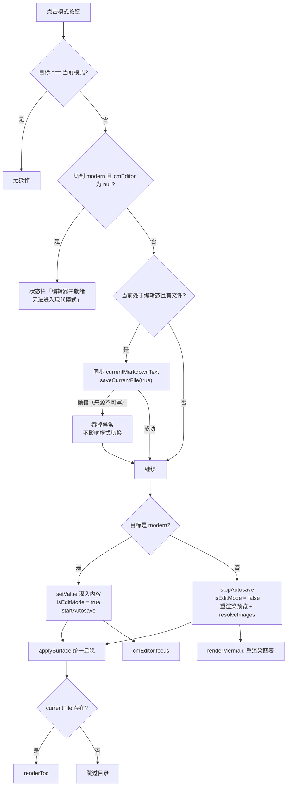
```mermaid
graph TD
    A["点击模式按钮"] --> B{"目标 === 当前模式?"}
    B -->|是| C["无操作"]
    B -->|否| D{"切到 modern 且 cmEditor 为 null?"}
    D -->|是| E["状态栏「编辑器未就绪<br/>无法进入现代模式」"]
    D -->|否| F{"当前处于编辑态且有文件?"}
    F -->|是| G["同步 currentMarkdownText<br/>saveCurrentFile(true)"]
    G -->|"抛错（来源不可写）"| H["吞掉异常<br/>不影响模式切换"]
    G -->|成功| I["继续"]
    H --> I
    F -->|否| I
    I --> J{"目标是 modern?"}
    J -->|是| K["setValue 灌入内容<br/>isEditMode = true<br/>startAutosave"]
    J -->|否| L["stopAutosave<br/>isEditMode = false<br/>重渲染预览 + resolveImages"]
    K --> M["applySurface 统一显隐"]
    L --> M
    M --> N{"currentFile 存在?"}
    N -->|是| O["renderToc"]
    N -->|否| P["跳过目录"]
    L --> Q["renderMermaid 重渲染图表"]
    K --> R["cmEditor.focus"]
```

### 模式数据流转

```
用户点击「现代模式」
  ↓ currentMode: 'traditional' → 'modern'
  ↓ localStorage['lightmdkit.mode'] = 'modern'
  ↓ isEditMode → true（恒等：现代模式即常驻编辑态）
  ↓ startAutosave 启动 3s 定时器
编辑器内容: cmEditor.getValue()（与 currentMarkdownText 同步，来源是 change 事件）
  ↓ applySurface()
wrapper.classList += 'live-preview' → LightMDKit/public/style.css 里 .live-preview 一组规则生效
  ↓ 行号关闭、当前行高亮开启
  ↓ refreshStrikeMarks()
markText 三段标注: cm-md-strike（内容）/ cm-md-strike-mark（前后 ~~ 标记）
  ↓ 光标移动 → 'cursorActivity' → updateActiveTocItemByCursor()
目录高亮: 按光标偏移落在哪个 heading 区间
  ↓ 编辑 → 'change' → scheduleLivePreviewRefresh（300ms 防抖）
目录与删除线标注重建；每 3s 自动落盘
```

### 模式注意事项

1. **传统模式的标记隐藏依赖 CSS，不是 JS 换 DOM。** 全部规则挂在 `.live-preview` 作用域下（`LightMDKit/public/style.css:609` 起），类由 `applySurface()` 切换。改样式时不要写成不带 `.live-preview` 前缀的全局规则，否则传统模式也会被隐藏标记。当前行例外：`.live-preview .CodeMirror-activeline .cm-formatting { … }`（`LightMDKit/public/style.css:665`）把光标所在行的标记恢复显示，这正是「Typora 式」的来源。
2. **`styleActiveLine` 不能在传统模式开。** 它会给当前行加 `.CodeMirror-activeline`，基础样式 `codemirror.css` 的 `.CodeMirror-activeline-background{background:#e8f2ff}` 会刷一层蓝底。项目在 `LightMDKit/public/style.css:623` 显式用 `.CodeMirror:not(.live-preview)` 关掉了它作为兜底。
3. **`theme: 'github'` 是有意为之的空主题。** `codemirror@5` 的 npm 包 `theme/` 目录里没有 github，`LightMDKit/public/index.html` 顶部注释（`LightMDKit/public/index.html:11`）说明：保留它只是为了让容器带 `cm-s-github` 类，从而不启用 `cm-s-default` 的默认配色；真正的配色来自 `LightMDKit/public/style.css` 的 `.content-wrapper .cm-*`。
4. **`refreshStrikeMarks` 是 O(行数) 的。** 每次模式切换、每次 300ms 防抖都会重扫全文 `markText`。几千行的文档会有可感知的开销 —— 若要优化，先跳过不含 `~~` 的行（已经做了，`:430`）。
5. **`renderToc` 是运行时被「装饰」的闭包变量**（`LightMDKit/public/app.js:1463-1468`）。它先在文件顶部声明（`:38` 的 `let renderToc;`），文中赋值为重建目录的实现，文末再被重绑定为带视图守卫的版本；`renderTocContent` 保存着被装饰的原始实现：

   ```javascript
   const renderTocContent = renderToc;
   renderToc = function () {
     if (sidebarView !== 'toc') return;
     renderTocContent();
     setupTocObserver();
   };
   ```

   这意味着**只有当侧栏停在「目录」页时，`renderToc()` 才真的重建目录**；停在「文件列表」页时它是空操作。这个赋值曾因缺少声明而成为隐式全局，已在 `LightMDKit/public/app.js:38` 补上 `let renderToc;` 修复；改动时仍要注意：若在别处也写 `renderToc = ...`，会把装饰链覆盖掉。
6. **现代模式的目录高亮不走 IntersectionObserver。** `setupTocObserver` 在 `currentMode === 'modern'` 时直接 `return`（`LightMDKit/public/app.js:1447`），改由 `cmEditor.on('cursorActivity')` 驱动（`:148`）。两套机制不要混用。

---

## 拖放打开文件或文件夹

用户把 `.md` 文件或文件夹拖进窗口，会**在新标签页**打开。跨标签页传递文件句柄要靠 IndexedDB —— 因为页面重开后内存变量全部丢失，而 `FileSystemHandle` 支持结构化克隆，可以存进 IndexedDB。

### 拖放时序图

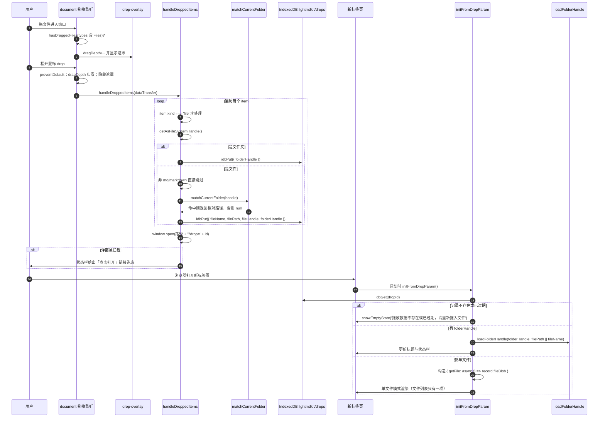
```mermaid
sequenceDiagram
    autonumber
    participant U as 用户
    participant DOC as document 拖拽监听
    participant OV as drop-overlay
    participant HD as handleDroppedItems
    participant MC as matchCurrentFolder
    participant DB as IndexedDB lightmdkit/drops
    participant NT as 新标签页
    participant ID as initFromDropParam
    participant LF as loadFolderHandle

    U->>DOC: 拖文件进入窗口
    DOC->>DOC: hasDraggedFiles(types 含 Files)?
    DOC->>OV: dragDepth++ 并显示遮罩
    U->>DOC: 松开鼠标 drop
    DOC->>DOC: preventDefault；dragDepth 归零；隐藏遮罩
    DOC->>HD: handleDroppedItems(dataTransfer)
    loop 遍历每个 item
        HD->>HD: item.kind === 'file' 才处理
        HD->>HD: getAsFileSystemHandle()
        alt 是文件夹
            HD->>DB: idbPut({ folderHandle })
        else 是文件
            HD->>HD: 非 md/markdown 直接跳过
            HD->>MC: matchCurrentFolder(handle)
            MC-->>HD: 命中则返回相对路径，否则 null
            HD->>DB: idbPut({ fileName, filePath, fileHandle, folderHandle })
        end
    end
    HD->>HD: window.open(路径 + '?drop=' + id)
    alt 弹窗被拦截
        HD->>U: 状态栏给出「点击打开」链接兜底
    end
    U->>NT: 浏览器打开新标签页
    NT->>ID: 启动时 initFromDropParam()
    ID->>DB: idbGet(dropId)
    alt 记录不存在或已过期
        ID->>NT: showEmptyState('拖放数据不存在或已过期，请重新拖入文件')
    else 有 folderHandle
        ID->>LF: loadFolderHandle(folderHandle, filePath || fileName)
        ID->>NT: 更新标题与状态栏
    else 仅单文件
        ID->>ID: 构造 { getFile: async () => record.fileBlob }
        ID->>NT: 单文件模式渲染（文件列表只有一项）
    end
```

### 拖放执行路径

**Step 1：拖拽遮罩控制** (`LightMDKit/public/app.js:1357`)

```javascript
let dragDepth = 0;
document.addEventListener('dragenter', (e) => {
  if (!hasDraggedFiles(e.dataTransfer)) return;
  e.preventDefault();
  dragDepth++;
  if (dropOverlay) dropOverlay.classList.remove('hidden');
});
// 必须阻止默认行为才允许 drop；仅针对文件拖拽，避免影响编辑器内的文本拖放
document.addEventListener('dragover', (e) => {
  if (hasDraggedFiles(e.dataTransfer)) e.preventDefault();
});
document.addEventListener('dragleave', () => {
  dragDepth--;
  if (dragDepth <= 0) {
    dragDepth = 0;
    if (dropOverlay) dropOverlay.classList.add('hidden');
  }
});
```

`dragDepth` 计数器是必需的：`dragenter` / `dragleave` 会在子元素之间反复触发，用布尔量会导致遮罩闪烁。`hasDraggedFiles` (`LightMDKit/public/app.js:1276`) 只检查 `dataTransfer.types` 是否含 `'Files'` —— 拖拽过程中 `dataTransfer` 出于安全限制是空的，只能靠 `types` 判断。

**Step 2：drop 分流** (`LightMDKit/public/app.js:1375`)

```javascript
document.addEventListener('drop', async (e) => {
  if (!hasDraggedFiles(e.dataTransfer)) return;
  e.preventDefault();
  dragDepth = 0;
  if (dropOverlay) dropOverlay.classList.add('hidden');
  try {
    await handleDroppedItems(e.dataTransfer);
  } catch (err) {
    console.error(err);
    setStatus('拖放打开失败: ' + err.message, 'error');
  }
});
```

**Step 3：逐项处理** (`LightMDKit/public/app.js:1315`)

```javascript
async function handleDroppedItems(dataTransfer) {
  let opened = 0;
  const tasks = [];
  for (const item of Array.from(dataTransfer.items)) {
    if (item.kind !== 'file') continue;
    tasks.push((async () => {
      let handle = null;
      if (item.getAsFileSystemHandle) {
        try {
          handle = await item.getAsFileSystemHandle();
        } catch (e) {
          handle = null;
        }
      }
      // 拖入的是文件夹：新标签页直接加载整个目录
      if (handle && handle.kind === 'directory') {
        await openDropInNewTab({ folderHandle: handle });
        opened++;
        return;
      }
      const file = handle ? await handle.getFile() : item.getAsFile();
      if (!file || !isMarkdownName(file.name)) return;
      // matchCurrentFolder 命中时返回该文件在已加载目录中的相对路径，
      // 新标签页据此把文件列表高亮定位到子目录里的对应文件
      const matchedPath = await matchCurrentFolder(handle);
      const record = {
        fileName: file.name,
        filePath: matchedPath || null,
        fileHandle: handle || null,
        fileBlob: handle ? null : file,
        folderHandle: matchedPath ? currentFolderHandle : null,
      };
      await openDropInNewTab(record);
      opened++;
    })());
  }
  await Promise.all(tasks);
  if (opened === 0) {
    setStatus('仅支持拖入 .md / .markdown 文件或文件夹');
  }
}
```

几个关键设计：

- **`tasks` 数组 + `Promise.all`**：每个 item 独立起一个 async 任务，多文件同时拖入时并行处理（会开多个标签页）。
- **`fileBlob` 与 `fileHandle` 二选一**：拿到句柄时存句柄（不需复制文件内容），拿不到时退化为存 `File` 对象本体（可结构化克隆）。这两个字段互斥，靠 `handle ? null : file` 保证。
- **`folderHandle` 只在命中已加载目录时才存**：见下一步。
- **`opened === 0` 的兜底提示**：覆盖了「拖入 .txt」「拖入图片」等场景。

**Step 4：判断拖入文件是否在当前目录内** (`LightMDKit/public/app.js:1282`)

```javascript
async function matchCurrentFolder(fileHandle) {
  if (!currentFolderHandle || !fileHandle) return false;
  for (const f of currentFiles) {
    try {
      if (await f.handle.isSameEntry(fileHandle)) return f.path || f.name;
    } catch (e) { /* 比较失败时忽略 */ }
  }
  return null;
}
```

`isSameEntry` 是 File System Access API 提供的句柄同一性判断，比路径字符串比较更可靠。命中时返回**相对路径**（`f.path`），这正是新标签页能把列表定位到子目录里那个文件的原因。

函数上方注释（`LightMDKit/public/app.js:1215`）说明了这套设计受制于浏览器安全模型：

```javascript
// 注意：浏览器安全限制下，拖入的“文件”拿不到其父目录句柄，因此只有当文件
// 位于当前已加载的目录（isSameEntry 比对）或直接拖入文件夹时，新标签页才能
// 把文件列表定位到所在目录；否则只能打开单个文件。
```

**Step 5：写入 IndexedDB 并开新标签页** (`LightMDKit/public/app.js:1304`)

```javascript
async function openDropInNewTab(record) {
  const id = (window.crypto && crypto.randomUUID)
    ? crypto.randomUUID()
    : String(Date.now()) + '-' + Math.random().toString(16).slice(2);
  record.ts = Date.now();
  await idbPut(id, record);
  const url = location.pathname + '?drop=' + encodeURIComponent(id);
  const win = window.open(url, '_blank');
  if (!win) showNewTabLink(url);
}
```

数据库与仓库 (`LightMDKit/public/app.js:1218`)：

```javascript
const DROP_DB_NAME = 'lightmdkit';
const DROP_STORE = 'drops';
const DROP_TTL_MS = 24 * 60 * 60 * 1000;
```

```javascript
function openDropDb() {
  return new Promise((resolve, reject) => {
    const req = indexedDB.open(DROP_DB_NAME, 1);
    req.onupgradeneeded = () => {
      if (!req.result.objectStoreNames.contains(DROP_STORE)) {
        req.result.createObjectStore(DROP_STORE);
      }
    };
    req.onsuccess = () => resolve(req.result);
    req.onerror = () => reject(req.error);
  });
}
```

`createObjectStore(DROP_STORE)` 没有传 `keyPath`，是**外键模式**（out-of-line keys），所以 `idbPut` 的调用形态是 `store.put(value, key)`（`:1239`）。

**Step 6：新标签页恢复** (`LightMDKit/public/app.js:1389`)

```javascript
async function initFromDropParam() {
  const dropId = new URLSearchParams(location.search).get('drop');
  if (!dropId) return;

  let record = null;
  try {
    record = await idbGet(dropId);
  } catch (e) {
    console.error(e);
  }
  if (!record) {
    showEmptyState('拖放数据不存在或已过期，请重新拖入文件');
    return;
  }

  try {
    if (record.folderHandle) {
      // 拿到了目录句柄（拖入文件夹，或文件位于当前已加载目录）：
      // 文件列表定位到该目录，并选中对应文件（优先用相对路径，能定位到子目录）
      await loadFolderHandle(record.folderHandle, record.filePath || record.fileName);
      document.title = record.folderHandle.name + ' - LightMDKit';
      …
    } else {
      // 浏览器安全限制：无法从拖入的单个文件获取其所在目录，仅打开该文件
      const handle = record.fileHandle || {
        getFile: async () => record.fileBlob,
      };
      currentFolderHandle = null;
      // 单文件没有目录，path 就等于文件名 —— 让文件列表与高亮逻辑
      // 始终有唯一的 path 可用，不必到处判空
      currentFiles = [{ name: record.fileName, path: record.fileName, handle }];
      currentFile = record.fileName;
      await renderFileList();
      folderLabel.textContent = record.fileName;
      folderLabel.title = '浏览器安全限制，无法自动定位到文件所在目录';
      document.title = record.fileName + ' - LightMDKit';
      updateLoadFolderButton();
      await renderFile(currentFiles[0]);
      …
    }
  } catch (e) { /* 状态栏「打开拖入内容失败」 */ }
}
```

单文件分支的 `{ getFile: async () => record.fileBlob }` 是一个**鸭子类型句柄** —— 只实现了 `getFile`，没有 `createWritable`。这直接决定了拖入的单文件不可保存（见 [保存注意事项](#保存注意事项)）。

**Step 7：过期清理** (`LightMDKit/public/app.js:1255`)

```javascript
async function idbPurgeExpired() {
  try {
    const db = await openDropDb();
    await new Promise((resolve) => {
      const tx = db.transaction(DROP_STORE, 'readwrite');
      const store = tx.objectStore(DROP_STORE);
      const now = Date.now();
      store.openCursor().onsuccess = (e) => {
        const cursor = e.target.result;
        if (cursor) {
          const v = cursor.value;
          if (!v || !v.ts || now - v.ts > DROP_TTL_MS) cursor.delete();
          cursor.continue();
        }
      };
      tx.oncomplete = () => { db.close(); resolve(); };
      tx.onerror = () => { db.close(); resolve(); };
    });
  } catch (e) { /* IndexedDB 不可用时忽略 */ }
}
```

每次页面启动时执行（`LightMDKit/public/app.js:1485`），TTL 24 小时。注释解释了为什么可以放心清理：文件句柄权限只随浏览器会话保留，记录本就无需长期存在。

### 拖放关键决策点

| 决策点 | 条件 | 结果 | 代码位置 |
|-------|------|------|---------|
| 是否文件拖拽 | `types` 含 `'Files'` | 非文件拖拽完全不拦截（编辑器内文本拖放不受影响） | `LightMDKit/public/app.js:1276` |
| 遮罩显隐 | `dragDepth` 归零 | 归零才隐藏，避免子元素间抖动 | `LightMDKit/public/app.js:1370` |
| item 类型 | `item.kind !== 'file'` | 跳过（如拖入文本片段） | `LightMDKit/public/app.js:1319` |
| 是否目录 | `handle.kind === 'directory'` | 直接存目录句柄开新标签页 | `LightMDKit/public/app.js:1330` |
| 文件类型 | `!isMarkdownName(file.name)` | 跳过，不计入 `opened` | `LightMDKit/public/app.js:1336` |
| 能否定位目录 | `matchCurrentFolder` 返回路径 | 是 → 存 `folderHandle`，新标签页可定位 | `LightMDKit/public/app.js:1339` |
| 句柄缺失 | `handle` 为 null | 退化为存 `fileBlob` | `LightMDKit/public/app.js:1344` |
| 弹窗拦截 | `window.open` 返回 null | 状态栏插入「点击打开」链接 | `LightMDKit/public/app.js:1312` |
| 全部跳过 | `opened === 0` | 提示「仅支持拖入 .md / .markdown 文件或文件夹」 | `LightMDKit/public/app.js:1352` |
| 记录过期 | `now - v.ts > 24h` | `cursor.delete()` | `LightMDKit/public/app.js:1266` |

### 拖放异常处理

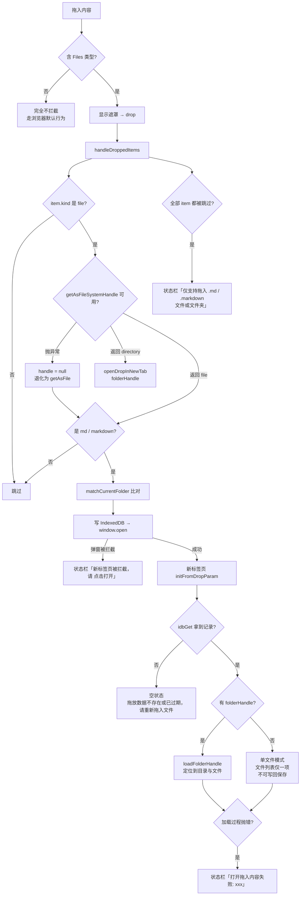
```mermaid
graph TD
    A["拖入内容"] --> B{"含 Files 类型?"}
    B -->|否| C["完全不拦截<br/>走浏览器默认行为"]
    B -->|是| D["显示遮罩 → drop"]
    D --> E["handleDroppedItems"]
    E --> F{"item.kind 是 file?"}
    F -->|否| G["跳过"]
    F -->|是| H{"getAsFileSystemHandle 可用?"}
    H -->|"抛异常"| I["handle = null<br/>退化为 getAsFile"]
    H -->|"返回 directory"| J["openDropInNewTab<br/>folderHandle"]
    H -->|"返回 file"| K{"是 md / markdown?"}
    I --> K
    K -->|否| G
    K -->|是| L["matchCurrentFolder 比对"]
    L --> M["写 IndexedDB → window.open"]
    M -->|"弹窗被拦截"| N["状态栏「新标签页被拦截，请 点击打开」"]
    M -->|成功| O["新标签页 initFromDropParam"]
    O --> P{"idbGet 拿到记录?"}
    P -->|否| Q["空状态<br/>拖放数据不存在或已过期，请重新拖入文件"]
    P -->|是| R{"有 folderHandle?"}
    R -->|是| S["loadFolderHandle<br/>定位到目录与文件"]
    R -->|否| T["单文件模式<br/>文件列表仅一项<br/>不可写回保存"]
    S --> U{"加载过程抛错?"}
    T --> U
    U -->|是| V["状态栏「打开拖入内容失败: xxx」"]
    E --> W{"全部 item 都被跳过?"}
    W -->|是| X["状态栏「仅支持拖入 .md / .markdown<br/>文件或文件夹」"]
```

### 拖放数据流转

```
用户拖入: D:\docs\业务知识库\核心业务领域.md（该目录已在本页加载）
  ↓ drop 事件 → handleDroppedItems
item.getAsFileSystemHandle() → FileSystemFileHandle
  ↓ isMarkdownName 通过
  ↓ matchCurrentFolder → 与 currentFiles 中每个 handle 做 isSameEntry
命中 → "业务知识库/核心业务领域.md"
  ↓ 组装记录
{
  fileName: "核心业务领域.md",
  filePath: "业务知识库/核心业务领域.md",
  fileHandle: FileSystemFileHandle,
  fileBlob: null,
  folderHandle: FileSystemDirectoryHandle,
  ts: 1757…（毫秒时间戳）
}
  ↓ idbPut(id, record)  ← id 为 crypto.randomUUID()
IndexedDB: lightmdkit / drops / <uuid> → record
  ↓ window.open('/?drop=<uuid>')
新标签页 URL: http://localhost:3456/?drop=3f2c…
  ↓ initFromDropParam → idbGet
record（句柄经结构化克隆还原；权限随会话保留）
  ↓ record.folderHandle 存在
loadFolderHandle(handle, "业务知识库/核心业务领域.md")
  ↓ 重新扫描目录 → 文件列表呈现整棵目录树
  ↓ findEntryByPath 按相对路径命中
currentFile = "业务知识库/核心业务领域.md"，正文渲染
```

### 拖放注意事项

1. **句柄权限不跨会话。** 记录里存的是句柄，浏览器重启后权限失效，`getFile()` 会抛 `NotAllowedError`（此时新标签页已关闭、记录靠 TTL 清理）。不要把这条路子当作「持久化的最近打开列表」来用。
2. **`matchCurrentFolder` 的返回值类型不统一**：无目录句柄或无 fileHandle 时返回 `false`，正常未命中返回 `null`。调用处只用了真值判断（`matchedPath || null`），目前无害，但若将来要区分「没有目录」与「不在目录内」，需要先统一返回类型。
3. **拖入文件与拖入文件夹是两条体验差异极大的路径。** 只拖文件时用户会看到「浏览器限制未定位所在目录，可手动『加载文件夹』」的提示（`LightMDKit/public/app.js:1431`）；这是浏览器安全模型的硬限制，不是可以修的 bug，修改文案时要保留这个信息量。
4. **一次拖入多个 md 会开多个标签页。** `tasks` 里的每个任务各自 `window.open`。浏览器通常会拦截多弹窗，被拦截的会退化为状态栏链接。
5. **`idbPut` / `idbGet` 每次都开关一次数据库连接**（`db.close()` 在事务回调里）。调用频率低，可接受；若要高频读写需复用连接。
6. **`record.fileBlob` 存的是 `File` 对象本体。** 大文件（如几十 MB 的 md 与内嵌内容）会被完整复制进 IndexedDB，24 小时后才清理。这是「拿不到句柄」时的必要代价。

---

## 文档内链接跳转与返回

文档里写 `[另一篇](./sub/a.md)` 时，点击不应跳出页面，而应在当前页打开同目录下的另一篇 Markdown；「← 返回」按钮沿着 `fileHistory` 栈回退。

### 跳转时序图

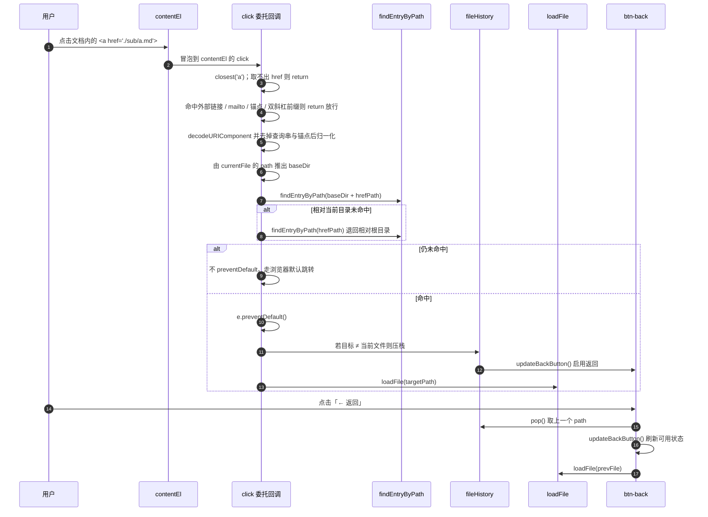
```mermaid
sequenceDiagram
    autonumber
    participant U as 用户
    participant CE as contentEl
    participant CK as click 委托回调
    participant FE as findEntryByPath
    participant HB as fileHistory
    participant LF as loadFile
    participant BB as btn-back

    U->>CE: 点击文档内的 <a href="./sub/a.md">
    CE->>CK: 冒泡到 contentEl 的 click
    CK->>CK: closest('a')；取不出 href 则 return
    CK->>CK: 命中外部链接 / mailto / 锚点 / 双斜杠前缀则 return 放行
    CK->>CK: decodeURIComponent 并去掉查询串与锚点后归一化
    CK->>CK: 由 currentFile 的 path 推出 baseDir
    CK->>FE: findEntryByPath(baseDir + hrefPath)
    alt 相对当前目录未命中
        CK->>FE: findEntryByPath(hrefPath) 退回相对根目录
    end
    alt 仍未命中
        CK->>CK: 不 preventDefault，走浏览器默认跳转
    else 命中
        CK->>CK: e.preventDefault()
        CK->>HB: 若目标 ≠ 当前文件则压栈
        HB->>BB: updateBackButton() 启用返回
        CK->>LF: loadFile(targetPath)
    end
    U->>BB: 点击「← 返回」
    BB->>HB: pop() 取上一个 path
    BB->>BB: updateBackButton() 刷新可用状态
    BB->>LF: loadFile(prevFile)
```

### 跳转执行路径

**Step 1：事件委托** (`LightMDKit/public/app.js:868`)

```javascript
contentEl.addEventListener('click', async (e) => {
  const link = e.target.closest('a');
  if (!link) return;
  const href = link.getAttribute('href');
  if (!href) return;
  // 跳过外部链接、锚点、mailto 等
  if (/^(https?:|mailto:|#|\/\/)/i.test(href)) return;
```

用 `contentEl` 上的委托而不是逐链接绑定：`renderFile` 每次都会整体替换 `contentEl.innerHTML`，逐链接绑定会随内容一起丢失。

**Step 2：相对当前文件所在目录解析** (`LightMDKit/public/app.js:876`)

```javascript
// 先按「相对当前文件所在目录」解析，再退回「相对根目录」，
// 两种情况都命中不了才放弃（保持与旧逻辑一致的宽松匹配）
const hrefPath = normalizePathForMatch(decodeURIComponent(href.split(/[?#]/)[0]));
if (!hrefPath) return;
const currentEntry = findEntryByPath(currentFile);
const baseDir = currentEntry && currentEntry.path && currentEntry.path.indexOf('/') !== -1
  ? currentEntry.path.slice(0, currentEntry.path.lastIndexOf('/') + 1)
  : '';
const entry = findEntryByPath(baseDir + hrefPath) || findEntryByPath(hrefPath);
```

三级处理保证了宽松匹配：

| 当前文件 | 链接 href | 解析结果 |
|---------|----------|---------|
| `README.md` | `./a.md` | `baseDir=''` → `a.md` |
| `sub/b.md` | `./a.md` | `baseDir='sub/'` → `sub/a.md` |
| `sub/b.md` | `sub/a.md`（相对根目录写法） | 第一级得 `sub/sub/a.md` 未命中 → 退回 `sub/a.md` 命中 |
| `sub/b.md` | `../c.md` | 归一化不去 `..`，`sub/../c.md` 与 `../c.md` 均未命中 → 不拦截 |

注意 `normalizePathForMatch` **只去前导 `./`，不做 `..` 折叠**，所以 `../` 这类跨层级相对链接不受支持（浏览器默认行为接管，会试图按 URL 导航）。这是一处已知的能力边界。

**Step 3：入栈与跳转** (`LightMDKit/public/app.js:894`)

```javascript
if (entry) {
  e.preventDefault();
  const targetPath = entry.path || entry.name;
  if (currentFile && currentFile !== targetPath) {
    fileHistory.push(currentFile);
    updateBackButton();
  }
  await loadFile(targetPath);
}
```

**Step 4：返回栈** (`LightMDKit/public/app.js:909`)

```javascript
function updateBackButton() {
  btnBack.disabled = fileHistory.length === 0;
}

btnBack.addEventListener('click', async () => {
  if (fileHistory.length === 0) return;
  const prevFile = fileHistory.pop();
  updateBackButton();
  await loadFile(prevFile);
});
```

`fileHistory` 存的是**相对路径字符串**（`LightMDKit/public/app.js:97`），与 `openFileFromList` 共用同一个栈 —— 也就是说「点文件列表」和「点文档内链接」产生的历史被统一记录，返回按钮的行为对两者一致。

### 跳转关键决策点

| 决策点 | 条件 | 结果 | 代码位置 |
|-------|------|------|---------|
| 是否 `<a>` | `closest('a')` 为 null | 不处理 | `LightMDKit/public/app.js:869` |
| 外部/锚点链接 | `^(https?:\|mailto:\|#\|//)` | 直接 return，放行浏览器默认行为 | `LightMDKit/public/app.js:874` |
| 链接解码 | `decodeURIComponent` 带 try 语义 | 中文路径可正常匹配 | `LightMDKit/public/app.js:852` |
| 目录基准 | 当前文件 path 含 `/` | `baseDir` 取到最后一个 `/`（含） | `LightMDKit/public/app.js:890` |
| 两级查找 | 相对当前目录 → 相对根目录 | 都未命中则不拦截 | `LightMDKit/public/app.js:893` |
| 是否入栈 | `currentFile !== targetPath` | 自链接不入栈（避免返回栈出现重复项） | `LightMDKit/public/app.js:897` |
| 返回栈空 | `fileHistory.length === 0` | 返回按钮 `disabled` | `LightMDKit/public/app.js:906` |

### 跳转异常处理

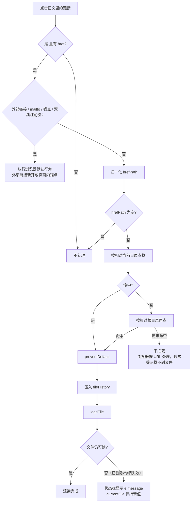
```mermaid
graph TD
    A["点击正文里的链接"] --> B{"是 <a> 且有 href?"}
    B -->|否| C["不处理"]
    B -->|是| D{"外部链接 / mailto / 锚点 / 双斜杠前缀?"}
    D -->|是| E["放行浏览器默认行为<br/>外部链接新开或页面内锚点"]
    D -->|否| F["归一化 hrefPath"]
    F --> G{"hrefPath 为空?"}
    G -->|是| C
    G -->|否| H["按相对当前目录查找"]
    H --> I{"命中?"}
    I -->|否| J["按相对根目录再查"]
    I -->|是| K["preventDefault"]
    J -->|命中| K
    J -->|"仍未命中"| L["不拦截<br/>浏览器按 URL 处理，通常提示找不到文件"]
    K --> M["压入 fileHistory"]
    M --> N["loadFile"]
    N --> O{"文件仍可读?"}
    O -->|是| P["渲染完成"]
    O -->|"否（已删除/句柄失效）"| Q["状态栏显示 e.message<br/>currentFile 保持新值"]
```

### 跳转数据流转

```
文档内容: "详见 [核心业务领域](./核心业务领域.md)"
  ↓ 点击 <a href="./业务知识库/核心业务领域.md">
  ↓ 正则跳过外部链接判断
  ↓ decodeURIComponent → "./业务知识库/核心业务领域.md"
  ↓ split(/[?#]/)[0] → 去掉查询串与锚点
hrefPath: "业务知识库/核心业务领域.md"（normalizePathForMatch 去前导 ./ 并转小写）
  ↓ 当前文件 README.md（path 无 /）→ baseDir = ''
  ↓ findEntryByPath("业务知识库/核心业务领域.md")
entry: { name: "核心业务领域.md", path: "业务知识库/核心业务领域.md", handle }
  ↓ fileHistory.push("README.md")
fileHistory: ["README.md"] → 返回按钮变为可用
  ↓ loadFile → renderFile
正文更新；点击「← 返回」→ pop 得 "README.md" → loadFile 回到原文件
```

### 跳转注意事项

1. **`fileHistory` 只有内存、没有持久化，且换目录时不清空。** `loadFolderHandle` 不重置它（`LightMDKit/public/app.js:731` 起）。切换文件夹后旧路径全部失效，此时点「← 返回」会走 `findEntryByPath` 未命中 → 静默 return（见 [切换注意事项](#切换注意事项)），表现为「返回按钮点了没反应」。若要修，应在 `loadFolderHandle` 里清栈并 `updateBackButton()`。
2. **返回栈可能记录到已删除的文件。** 与上一条同源。刷新目录后文件被删除，历史栈不会同步清理。
3. **`..` 相对路径不被支持。** 判定逻辑只做前缀拼接，不做路径折叠。若产品需要支持，改动点在 `LightMDKit/public/app.js:852` 附近，需要引入真正的路径归一化（折叠 `.` 与 `..`），并注意此时不能再用「拼接后查找」的方式。
4. **同名的根目录文件与子目录文件不会混淆**，这是本流程的核心价值：`baseDir + hrefPath` 得到的是相对根的完整路径，`findEntryByPath` 的第一级是精确 `path` 比较。不要为了让查找更"宽松"而把这一级删掉。
5. **链接目标不存在时没有任何提示。** 非 md 链接（如 `.pdf`）会走浏览器默认跳转，而指向不存在 md 的链接（命中不了任何一级查找）同样走浏览器默认行为 —— 在本地 HTTP 服务下会得到 404。如果希望这类情况有提示，需在未命中的分支里显式判断「看起来像 md 链接」再给状态栏反馈。

---

## 刷新目录

「刷新」按钮重新扫描当前目录，发现新增/删除的文件，并重新读取当前文件内容。

### 刷新时序图

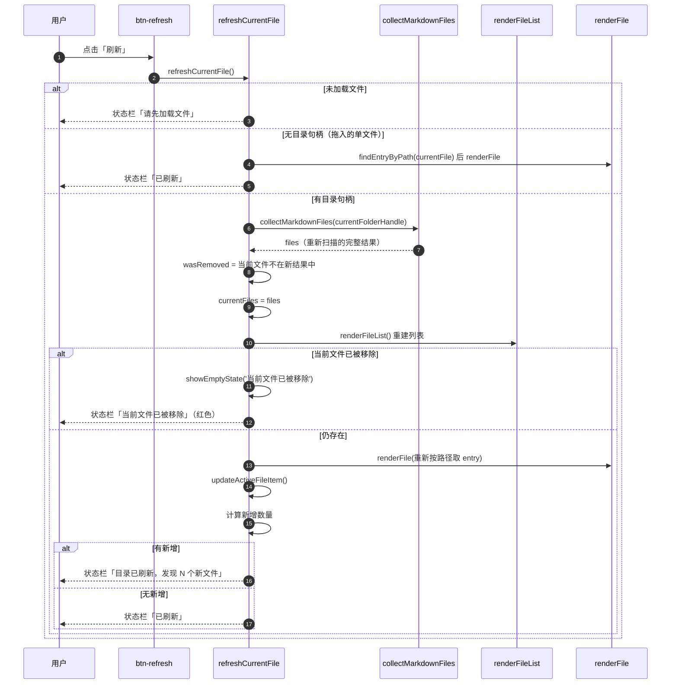
```mermaid
sequenceDiagram
    autonumber
    participant U as 用户
    participant BR as btn-refresh
    participant RC as refreshCurrentFile
    participant CM as collectMarkdownFiles
    participant RL as renderFileList
    participant RF as renderFile

    U->>BR: 点击「刷新」
    BR->>RC: refreshCurrentFile()
    alt 未加载文件
        RC-->>U: 状态栏「请先加载文件」
    else 无目录句柄（拖入的单文件）
        RC->>RF: findEntryByPath(currentFile) 后 renderFile
        RC-->>U: 状态栏「已刷新」
    else 有目录句柄
        RC->>CM: collectMarkdownFiles(currentFolderHandle)
        CM-->>RC: files（重新扫描的完整结果）
        RC->>RC: wasRemoved = 当前文件不在新结果中
        RC->>RC: currentFiles = files
        RC->>RL: renderFileList() 重建列表
        alt 当前文件已被移除
            RC->>RC: showEmptyState('当前文件已被移除')
            RC-->>U: 状态栏「当前文件已被移除」（红色）
        else 仍存在
            RC->>RF: renderFile(重新按路径取 entry)
            RC->>RC: updateActiveFileItem()
            RC->>RC: 计算新增数量
            alt 有新增
                RC-->>U: 状态栏「目录已刷新，发现 N 个新文件」
            else 无新增
                RC-->>U: 状态栏「已刷新」
            end
        end
    end
```

### 刷新执行路径

**Step 1：入口与两种前置分支** (`LightMDKit/public/app.js:802`)

```javascript
async function refreshCurrentFile() {
  if (!currentFile) {
    setStatus('请先加载文件', 'error');
    return;
  }
  if (!currentFolderHandle) {
    // 拖入单个文件等场景没有目录句柄：跳过目录扫描，仅重新读取当前文件内容
    setStatus('刷新中...');
    try {
      const entry = findEntryByPath(currentFile);
      if (entry) await renderFile(entry);
      setStatus('已刷新', 'success');
    } catch (e) {
      console.error(e);
      setStatus(e.message, 'error');
    }
    return;
  }
```

事件绑定在 `LightMDKit/public/app.js:859`：

```javascript
btnRefresh.addEventListener('click', refreshCurrentFile);
```

**Step 2：重新扫描并判定移除** (`LightMDKit/public/app.js:821`)

```javascript
setStatus('刷新中...');
try {
  // 重新扫描文件夹以发现新增/删除的文件（含子目录）
  const files = await collectMarkdownFiles(currentFolderHandle);

  const oldCount = currentFiles.length;

  // 检查当前文件是否仍然存在
  const wasRemoved = !files.some(f => f.path === currentFile);
  currentFiles = files;

  await renderFileList();

  if (wasRemoved) {
    showEmptyState('当前文件已被移除');
    setStatus('当前文件已被移除', 'error');
    return;
  }
```

判定用的是 `f.path === currentFile` **全等比较**，而不是 `findEntryByPath`。这带来一个不对称：`findEntryByPath` 有归一化和按 name 兜底的多级匹配，而 `wasRemoved` 只认精确路径。单文件模式（`currentFiles = [{ name, path: fileName }]`）不会走到这里，因为那条路径在前面被 `!currentFolderHandle` 拦下了。

**Step 3：重载与新增统计** (`LightMDKit/public/app.js:839`)

```javascript
// 重新加载当前文件
const entry = findEntryByPath(currentFile);
if (entry) {
  await renderFile(entry);
  updateActiveFileItem();
}

// 检查是否有新文件加入
const newlyAdded = files.length - oldCount;
if (newlyAdded > 0) {
  setStatus('目录已刷新，发现 ' + newlyAdded + ' 个新文件', 'success');
} else {
  setStatus('已刷新', 'success');
}
```

`newlyAdded` 是**净增量**（新总数 − 旧总数），不是「新增文件数」。同时新增 2 个、删除 1 个时，提示只会说「发现 1 个新文件」。

**Step 4：刷新触发的重渲染** —— `renderFile` 会从句柄重新 `getFile()`（`LightMDKit/public/app.js:633`），所以外部编辑器对文件的修改能被读到。`updateActiveFileItem()` 在重建列表之后再执行一次，保证高亮落在正确的项上（`renderFileList` 重建时也按 `currentFile` 加了 `active` 类，这次调用是双保险）。

### 刷新关键决策点

| 决策点 | 条件 | 结果 | 代码位置 |
|-------|------|------|---------|
| 未加载文件 | `!currentFile` | 状态栏「请先加载文件」 | `LightMDKit/public/app.js:803` |
| 无目录句柄 | `!currentFolderHandle` | 跳过扫描，只重读当前文件 | `LightMDKit/public/app.js:807` |
| 文件被移除 | `!files.some(f => f.path === currentFile)` | 空状态 + 红色提示，**直接 return** | `LightMDKit/public/app.js:828`、`:833` |
| 扫描是否复用 | 恒为 `collectMarkdownFiles(currentFolderHandle)` | 与首次加载口径完全一致 | `LightMDKit/public/app.js:823` |
| 新增统计 | `files.length - oldCount > 0` | 提示「发现 N 个新文件」 | `LightMDKit/public/app.js:847` |
| 高亮修正 | `findEntryByPath(currentFile)` 有值 | `renderFile` + `updateActiveFileItem` | `LightMDKit/public/app.js:840` |

### 刷新异常处理

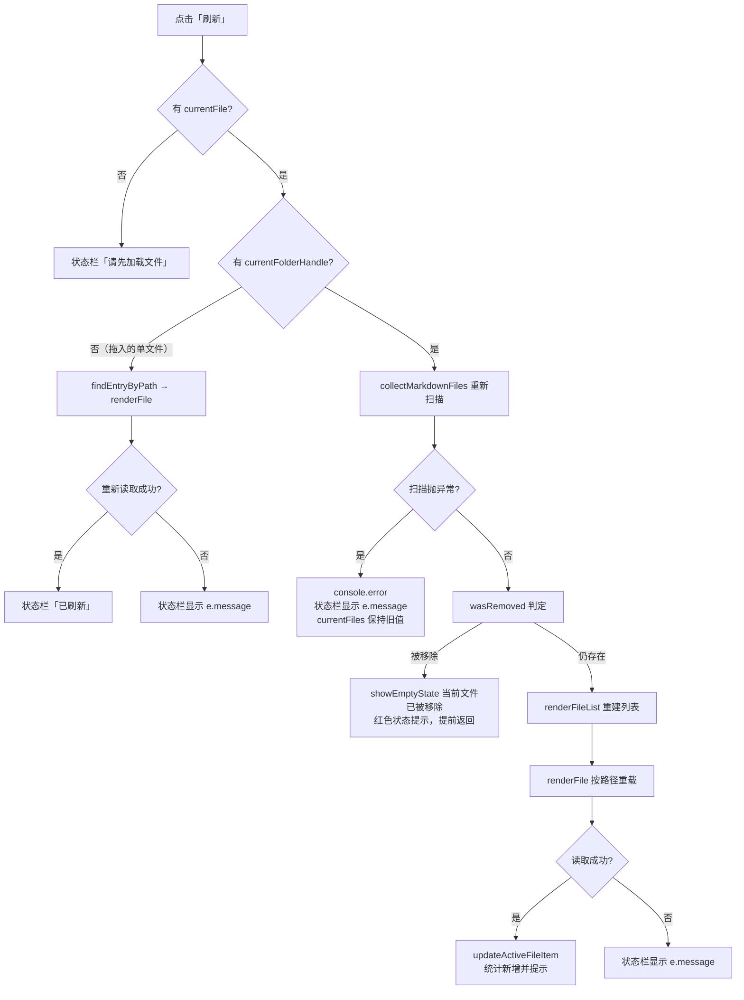
```mermaid
graph TD
    A["点击「刷新」"] --> B{"有 currentFile?"}
    B -->|否| C["状态栏「请先加载文件」"]
    B -->|是| D{"有 currentFolderHandle?"}
    D -->|"否（拖入的单文件）"| E["findEntryByPath → renderFile"]
    E --> F{"重新读取成功?"}
    F -->|是| G["状态栏「已刷新」"]
    F -->|否| H["状态栏显示 e.message"]
    D -->|"是"| I["collectMarkdownFiles 重新扫描"]
    I --> J{"扫描抛异常?"}
    J -->|是| K["console.error<br/>状态栏显示 e.message<br/>currentFiles 保持旧值"]
    J -->|否| L["wasRemoved 判定"]
    L -->|被移除| M["showEmptyState 当前文件已被移除<br/>红色状态提示，提前返回"]
    L -->|仍存在| N["renderFileList 重建列表"]
    N --> O["renderFile 按路径重载"]
    O --> P{"读取成功?"}
    P -->|是| Q["updateActiveFileItem<br/>统计新增并提示"]
    P -->|否| R["状态栏显示 e.message"]
```

### 刷新数据流转

```
用户点击「刷新」
  ↓ collectMarkdownFiles(currentFolderHandle) 重新遍历磁盘
磁盘现状: 新增 new.md；删除 old.md；修改 README.md
  ↓ files: [{ path: "README.md" }, { path: "new.md" }, …]
  ↓ oldCount 取旧 currentFiles.length（用于净增量计算）
  ↓ wasRemoved = !files.some(f => f.path === currentFile)
  ↓ currentFiles = files（旧数组整体替换）
  ↓ renderFileList() → 列表重建，目录分组重排，过滤框当前条件仍生效
  ↓ findEntryByPath(currentFile) 取回新数组里的同一条目
  ↓ entry.handle.getFile() → file.text()   ← 读到磁盘上的最新内容
currentMarkdownText 更新；contentEl 重渲染；图片缓存未清（沿用 imageUrlCache）
  ↓ updateActiveFileItem() 修正高亮
状态栏: 「目录已刷新，发现 1 个新文件」/「已刷新」/「当前文件已被移除」
```

注意 `refreshCurrentFile` **不会**调用 `clearImageCache()`（对比 `loadFolderHandle` 的 `:732`）。图片被替换时，`imageUrlCache` 里仍是旧 blob 的 objectURL，会一直显示旧图。

### 刷新注意事项

1. **编辑态点刷新会丢弃未保存的修改。** `renderFile` 在 `isEditMode` 为真时会把编辑器内容整段替换成磁盘内容（`LightMDKit/public/app.js:647` 的 `cmEditor.setValue(currentMarkdownText)`，此时 `currentMarkdownText` 已被磁盘内容覆盖）。现代模式下同样成立，而且随后的自动保存还会把这份磁盘内容再写回一次。若要让刷新对编辑态安全，应在编辑态先 `saveCurrentFile()` 或提示用户。
2. **「当前文件已被移除」后 `currentFile` 没有被清空。** `:833` 直接 `return`，`currentFile` 仍是那个已失效的路径。后果是：此后点「刷新」还会再报一次同样的提示（因为 `!currentFile` 判断为假），编辑与保存则因 `findEntryByPath` 返回 null 而静默失效。要修就在 `:833` 前把 `currentFile = null` 并 `applySurface()`。
3. **`imageUrlCache` 在刷新时不清。** 图片文件被替换后仍显示旧图，直到切换目录或换文件夹（`loadFolderHandle` 会清）。若要修，在 `:831` 后调 `clearImageCache()`。
4. **新增统计是净增量。** 若提示文案要精确表达「新增 N / 删除 M」，需要改成分别统计两个集合的差集。
5. **刷新不会重新读取过滤框语义之外的状态。** 侧栏过滤框的值会被 `renderFileList` 重新应用（`:554`），所以刷新后用户视角一致 —— 这也意味着过滤框里若有内容，新增文件可能被过滤掉而"看不见"，但状态栏仍会报出新增数量。

---

## 服务端 API 渲染链路

> ⚠️ **当前 UI 未调用，为外部集成保留。**
>
> 经代码检索确认，`LightMDKit/public/app.js` 与 `LightMDKit/public/index.html` 中**没有任何 `fetch(` / `XMLHttpRequest` / `/api/` 引用** —— `LightMDKit/server.js` 里的 4 个接口没有任何前端调用方。本文档前面的 7 个流程（加载文件夹、切换与查看文件、编辑并保存、现代模式、拖放、链接跳转、刷新目录）**全部走浏览器 File System Access API，一个字节都不经过服务端**。
>
> 保留这 4 个接口的用途是**外部集成**：脚本、CI、其他本地工具可以通过 HTTP 直接让 LightMDKit 的渲染器把 Markdown 转成 HTML。**请勿据此推断主流程会经过服务端。**

### 与前端实际链路的关系

| 维度 | 前端实际链路（主链路） | 服务端 API 链路（本节） |
|------|---------------------|----------------------|
| 触发方式 | `btn-load-folder` 等 UI 事件 | `POST /api/select-folder`、`POST /api/load`、`GET /api/file`、`POST /api/refresh` |
| 选目录 | `window.showDirectoryPicker()`（浏览器原生对话框） | PowerShell `FolderBrowserDialog`（`LightMDKit/server.js:25`） |
| 列举文件 | 递归 `dirHandle.entries()`，跳过黑名单，限 6 层 / 3000 个 | `fs.readdirSync` **只扫一层**，无深度与数量限制 |
| 读文件 | `FileSystemFileHandle.getFile()` | `fs.readFileSync` |
| 写文件 | `FileSystemFileHandle.createWritable()` | **无写接口** —— 4 个接口全是只读 |
| Markdown 渲染 | `MdRender.renderMarkdown`（`LightMDKit/public/md-render.js:166`） | **同一个函数的同一份代码**（`LightMDKit/server.js:7` require 同一文件） |
| 权限模型 | 浏览器逐目录授权，用户可见可撤销 | 无授权环节，进程权限直接读盘 |
| 空目录/无 md | 有明确空状态提示 | 返回 `files: []`，由调用方自行处理 |

**两条链路唯一的交汇点是「渲染实现同源」。** `LightMDKit/server.js:7`：

```javascript
const { renderMarkdown } = require('./public/md-render.js');
```

浏览器侧则通过 `LightMDKit/public/index.html:96` 的 `<script src="md-render.js?v=4"></script>` 加载同一个文件。因此表格跨行合并（`mergeTableCells`）、缩进保留（`preserveIndent`）、只认 `~~` 的删除线（`patchStrikethrough`）这三条规则在页面预览与 API 输出中完全一致 —— 改 `md-render.js` 会同时影响两条链路，这也是它没有服务端副本的原因。

### 服务端渲染时序图

以信息最全的 `POST /api/load` 为例：

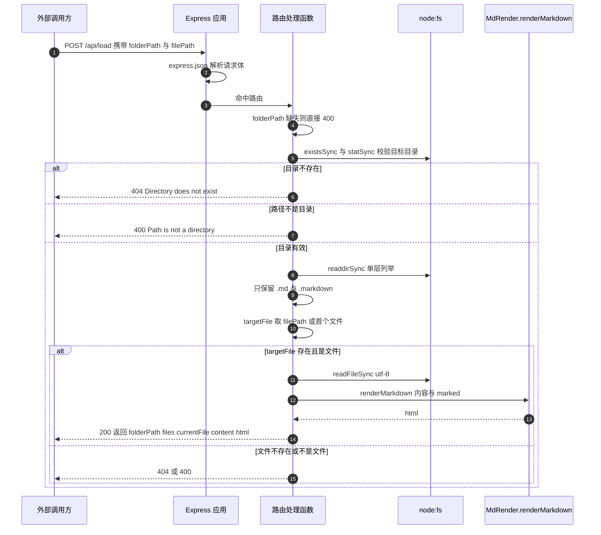
```mermaid
sequenceDiagram
    autonumber
    participant X as 外部调用方
    participant E as Express 应用
    participant H as 路由处理函数
    participant FS as node:fs
    participant R as MdRender.renderMarkdown

    X->>E: POST /api/load 携带 folderPath 与 filePath
    E->>E: express.json 解析请求体
    E->>H: 命中路由
    H->>H: folderPath 缺失则直接 400
    H->>FS: existsSync 与 statSync 校验目标目录
    alt 目录不存在
        H-->>X: 404 Directory does not exist
    else 路径不是目录
        H-->>X: 400 Path is not a directory
    else 目录有效
        H->>FS: readdirSync 单层列举
        H->>H: 只保留 .md 与 .markdown
        H->>H: targetFile 取 filePath 或首个文件
        alt targetFile 存在且是文件
            H->>FS: readFileSync utf-8
            H->>R: renderMarkdown 内容与 marked
            R-->>H: html
            H-->>X: 200 返回 folderPath files currentFile content html
        else 文件不存在或不是文件
            H-->>X: 404 或 400
        end
    end
```

`POST /api/select-folder` 是一条独立支线 —— 它不读文件，而是拉起系统对话框把路径**交给调用方**：

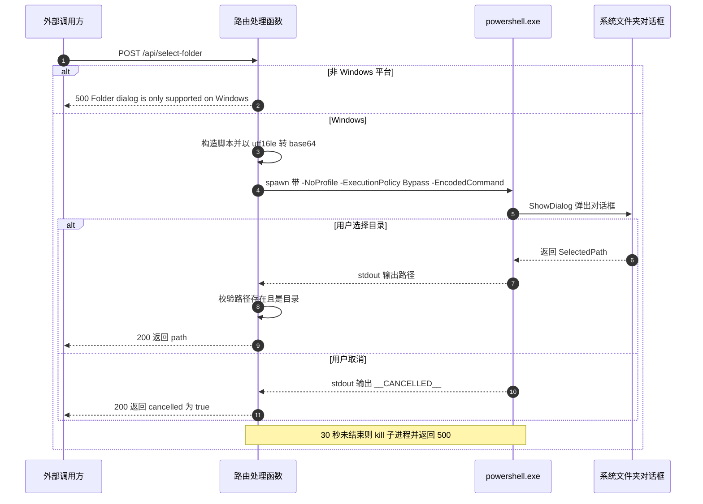
```mermaid
sequenceDiagram
    autonumber
    participant X as 外部调用方
    participant H as 路由处理函数
    participant PS as powershell.exe
    participant OS as 系统文件夹对话框

    X->>H: POST /api/select-folder
    alt 非 Windows 平台
        H-->>X: 500 Folder dialog is only supported on Windows
    else Windows
        H->>H: 构造脚本并以 utf16le 转 base64
        H->>PS: spawn 带 -NoProfile -ExecutionPolicy Bypass -EncodedCommand
        PS->>OS: ShowDialog 弹出对话框
        alt 用户选择目录
            OS-->>PS: 返回 SelectedPath
            PS-->>H: stdout 输出路径
            H->>H: 校验路径存在且是目录
            H-->>X: 200 返回 path
        else 用户取消
            PS-->>H: stdout 输出 __CANCELLED__
            H-->>X: 200 返回 cancelled 为 true
        end
        Note over H,PS: 30 秒未结束则 kill 子进程并返回 500
    end
```

### 服务端执行路径

**Step 1：应用初始化** (`LightMDKit/server.js:10`)

```javascript
const app = express();                     // :10
const PORT = 3456;                         // :11
app.use(express.json());                   // :13
app.use(express.static(path.join(__dirname, 'public')));  // :14
const isWindows = os.platform() === 'win32';              // :16
```

`express.json()` 是后 4 个接口能读到 `req.body` 的前提；`express.static` 让浏览器能加载 `LightMDKit/public/` 下的前端资源 —— **这才是服务端在主链路中真正承担的角色**（静态托管），API 部分与之无关。

**Step 2：`POST /api/load` 参数校验与目录列举** (`LightMDKit/server.js:97`)

```javascript
app.post('/api/load', (req, res) => {
  const { folderPath, filePath } = req.body;

  if (!folderPath) {
    return res.status(400).json({ error: 'folderPath is required' });
  }

  const resolvedFolder = path.resolve(folderPath);

  if (!fs.existsSync(resolvedFolder)) {
    return res.status(404).json({ error: 'Directory does not exist: ' + resolvedFolder });
  }
```

```javascript
  // Scan for markdown files
  let files = [];
  try {
    const entries = fs.readdirSync(resolvedFolder);
    files = entries
      .filter(f => {
        const ext = path.extname(f).toLowerCase();
        return ext === '.md' || ext === '.markdown';
      })
      .map(f => ({
        name: f,
        fullPath: path.join(resolvedFolder, f)
      }));
  } catch (err) {
    return res.status(500).json({ error: 'Failed to read directory: ' + err.message });
  }
```

这里是**服务端与前端能力差异最大的一处**：`fs.readdirSync` 只列举一层，子目录里的 Markdown 不会被收录，也没有 `SCAN_SKIP_DIRS` 黑名单与 3000 文件上限。前端用的是递归版 `collectMarkdownFiles`（见 [加载文件夹并浏览文档](#加载文件夹并浏览文档)）。

**Step 3：渲染并返回** (`LightMDKit/server.js:142`)

```javascript
  if (targetFile) {
    if (!fs.existsSync(targetFile)) {
      return res.status(404).json({ error: 'File does not exist: ' + targetFile });
    }

    const fileStats = fs.statSync(targetFile);
    if (!fileStats.isFile()) {
      return res.status(400).json({ error: 'Path is not a file: ' + targetFile });
    }

    try {
      content = fs.readFileSync(targetFile, 'utf-8');
      html = renderMarkdown(content, marked);
      currentFile = targetFile;
    } catch (err) {
      return res.status(500).json({ error: 'Failed to read file: ' + err.message });
    }
  }
```

`renderMarkdown(content, marked)` 与前端调用的是同一个导出的函数，`marked` 由 `LightMDKit/server.js:6` 的 `require('marked')` 提供（前端则由 `LightMDKit/public/index.html` 的 CDN 脚本提供）。

**Step 4：两个功能等价的只读接口** (`LightMDKit/server.js:171`、`LightMDKit/server.js:199`)

`GET /api/file` 与 `POST /api/refresh` 的处理体完全一致（校验 → 读盘 → 渲染 → 返回 `{ content, html, path }`），差别只有两点：参数来源（query 的 `path` vs body 的 `filePath`）与 HTTP 方法。之所以是两个接口，是历史命名使然 —— `refresh` 表达的是「前端刷新当前文件」的语义，而前端后来改走文件句柄，两者都已无调用方。

**Step 5：`POST /api/select-folder` 的系统对话框** (`LightMDKit/server.js:19`)

```javascript
  const psScript = `
    [Console]::OutputEncoding = [System.Text.Encoding]::UTF8
    Add-Type -AssemblyName System.Windows.Forms
    $owner = New-Object System.Windows.Forms.Form
    $owner.TopMost = $true
    $fbd = New-Object System.Windows.Forms.FolderBrowserDialog
    $fbd.Description = "请选择要加载的 Markdown 文件夹"
    $fbd.ShowNewFolderButton = $false
    $result = $fbd.ShowDialog($owner)
    $owner.Dispose()
    if ($result -eq [System.Windows.Forms.DialogResult]::OK) {
      Write-Output $fbd.SelectedPath
    } else {
      Write-Output "__CANCELLED__"
    }
  `;

  const scriptBuffer = Buffer.from(psScript, 'utf16le');
  const encodedCommand = scriptBuffer.toString('base64');
```

脚本以 **UTF-16LE 编码后再 base64**（`-EncodedCommand` 的约定），这样才能让中文描述文案与中文路径正确回传；stdout 也被显式设为 `setEncoding('utf8')`（`:56`）。取消选择靠**哨兵字符串 `__CANCELLED__`** 回传（`:79`），而不是退出码 —— 因为 PowerShell 里用户取消并非错误。

### 服务端关键决策点

| 决策点 | 条件 | 结果 | 代码位置 |
|-------|------|------|---------|
| 平台检查 | `!isWindows` | 500 `Folder dialog is only supported on Windows` | `LightMDKit/server.js:21` |
| 对话框超时 | 30 秒未收到 `close` | `child.kill()` + 500 `Folder dialog timed out` | `LightMDKit/server.js:66` |
| 子进程退出码 | `code !== 0` | 打印 stderr + 500 `Failed to open folder dialog` | `LightMDKit/server.js:73` |
| 用户取消 | stdout 等于 `__CANCELLED__` | 200 `{ cancelled: true }`（**不是错误**） | `LightMDKit/server.js:79` |
| 路径校验 | 空或 `existsSync` 失败 | 400 `Invalid or non-existent path selected` | `LightMDKit/server.js:83` |
| 类型校验 | `!stats.isDirectory()` | 400 `Selected path is not a directory` | `LightMDKit/server.js:87` |
| `/api/load` 缺参 | `!folderPath` | 400 `folderPath is required` | `LightMDKit/server.js:100` |
| 目标文件回退 | 未传 `filePath` 且有文件 | `targetFile = files[0].fullPath` | `LightMDKit/server.js:134` |
| 目录列举失败 | `readdirSync` 抛异常 | 500 `Failed to read directory: …` | `LightMDKit/server.js:129` |
| 文件读取失败 | `readFileSync` 抛异常 | 500 `Failed to read file: …` | `LightMDKit/server.js:157` |
| 渲染实现 | 恒为共享的 `renderMarkdown` | 与前端预览规则完全一致 | `LightMDKit/server.js:7` |
| 写回能力 | 4 个接口均为只读 | **服务端没有任何写文件接口** | `LightMDKit/server.js:19`、`:97`、`:171`、`:199` |

### 服务端异常处理

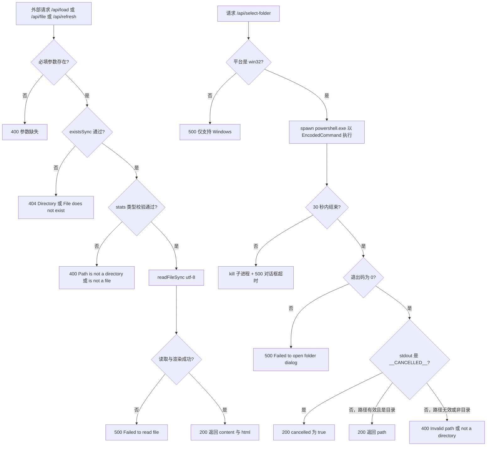
```mermaid
graph TD
    A["外部请求 /api/load 或 /api/file 或 /api/refresh"] --> B{"必填参数存在?"}
    B -->|否| C["400 参数缺失"]
    B -->|是| D{"existsSync 通过?"}
    D -->|否| E["404 Directory 或 File does not exist"]
    D -->|是| F{"stats 类型校验通过?"}
    F -->|否| G["400 Path is not a directory 或 is not a file"]
    F -->|是| H["readFileSync utf-8"]
    H --> I{"读取与渲染成功?"}
    I -->|否| J["500 Failed to read file"]
    I -->|是| K["200 返回 content 与 html"]
    L["请求 /api/select-folder"] --> M{"平台是 win32?"}
    M -->|否| N["500 仅支持 Windows"]
    M -->|是| O["spawn powershell.exe 以 EncodedCommand 执行"]
    O --> P{"30 秒内结束?"}
    P -->|否| Q["kill 子进程 + 500 对话框超时"]
    P -->|是| R{"退出码为 0?"}
    R -->|否| S["500 Failed to open folder dialog"]
    R -->|是| T{"stdout 是 __CANCELLED__?"}
    T -->|是| U["200 cancelled 为 true"]
    T -->|"否，路径有效且是目录"| V["200 返回 path"]
    T -->|"否，路径无效或非目录"| W["400 Invalid path 或 not a directory"]
```

### 服务端数据流转

```
外部请求: POST /api/load
  Body: { folderPath: "D:\\docs", filePath: null }
  ↓ express.json() 解析
req.body: { folderPath: "D:\\docs", filePath: null }
  ↓ path.resolve()
resolvedFolder: "D:\\docs"
  ↓ fs.existsSync + statSync
通过目录校验
  ↓ fs.readdirSync → 过滤 .md/.markdown → map
files: [{ name: "README.md", fullPath: "D:\\docs\\README.md" }, …]
  ↓ targetFile = files[0].fullPath（未传 filePath 时的回退）
"D:\\docs\\README.md"
  ↓ fs.readFileSync(targetFile, 'utf-8')
content: "# 标题\n…"（原文）
  ↓ renderMarkdown(content, marked)  ← 与前端同一份实现
html: "<h1>标题</h1>\n…"
  ↓ res.json()
响应: { folderPath, files, currentFile, content, html }
  ↓ 调用方自行处理（写文件、喂给别的工具、做校验……）
服务端到此结束 —— 它不会保存任何状态，也不写入磁盘
```

### 服务端注意事项

1. **路径参数没有根目录约束，是一处需要留意的安全面。** `path.resolve(folderPath)` / `path.resolve(filePath)`（`LightMDKit/server.js:104`、`:133`、`:178`、`:206`）之后直接读盘，调用方可以传任意绝对路径（如 `C:\Windows\...`）。由于服务只监听 `localhost` 且当前 UI 不调用这些接口，实际暴露面是「本机其他进程/页面若能访问 3456 端口」。若要把这些接口真正开放给外部集成，应当先加白名单根目录校验。
2. **服务端没有写接口，也没有目录选择之外的状态管理。** 想在外部集成里保存文件，只能拿到 `content` 自己写盘 —— 前端那条链路才具备写回能力（靠浏览器授权）。
3. **`/api/load` 的 `files` 不含子目录。** 若外部工具期望它与前端的文件列表一致（前端是递归的），会得到不同结果。要对齐的话，需要把递归扫描逻辑也搬到服务端。
4. **`/api/file` 与 `/api/refresh` 是重复实现。** 改其中一个的行为（比如加缓存、加参数校验）时，记得另一个也要同步，否则两条等价接口会漂移。
5. **改 `LightMDKit/public/md-render.js` 会同时改掉两条链路的渲染结果。** 这是好事（规则统一），但也意味着服务端 API 的输出格式会随前端渲染需求一起变 —— 若将来有外部工具依赖固定 HTML 结构，需要先评估。
6. **`/api/select-folder` 只支持 Windows**（`:21`），且依赖 `powershell.exe` 存在于 PATH。这条路径在前端已经没有调用方（前端用浏览器原生对话框），属于纯外部集成能力。

### 服务启动与端口复用

同属服务端侧的另一条链路是**进程启动与端口复用** —— 它不经过任何 HTTP 请求，却决定了上面这些接口是否有人监听。它决定了「双击 exe / 运行 `npm start` 之后会发生什么」。

#### 启动时序图

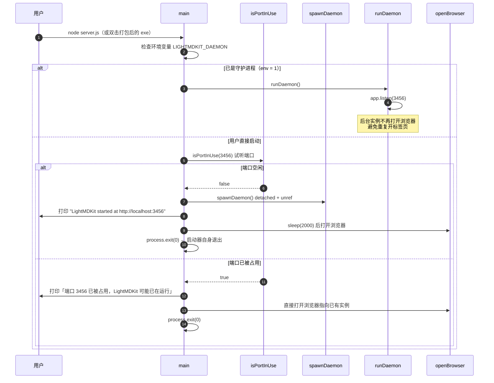
```mermaid
sequenceDiagram
    autonumber
    participant U as 用户
    participant M as main
    participant P as isPortInUse
    participant D as spawnDaemon
    participant S as runDaemon
    participant B as openBrowser

    U->>M: node server.js（或双击打包后的 exe）
    M->>M: 检查环境变量 LIGHTMDKIT_DAEMON
    alt 已是守护进程（env = 1）
        M->>S: runDaemon()
        S->>S: app.listen(3456)
        Note over S: 后台实例不再打开浏览器<br/>避免重复开标签页
    else 用户直接启动
        M->>P: isPortInUse(3456) 试听端口
        alt 端口空闲
            P-->>M: false
            M->>D: spawnDaemon() detached + unref
            M->>U: 打印 "LightMDKit started at http://localhost:3456"
            M->>B: sleep(2000) 后打开浏览器
            M->>M: process.exit(0)  ← 启动器自身退出
        else 端口已被占用
            P-->>M: true
            M->>U: 打印「端口 3456 已被占用，LightMDKit 可能已在运行」
            M->>B: 直接打开浏览器指向已有实例
            M->>M: process.exit(0)
        end
    end
```

#### 启动执行路径

**Step 1：分流** (`LightMDKit/server.js:291`)

```javascript
async function main() {
  if (process.env[DAEMON_ENV] === '1') {
    runDaemon();
    return;
  }

  const portBusy = await isPortInUse(PORT);

  if (!portBusy) {
    spawnDaemon();
    console.log(`LightMDKit started at ${url}`);
    await sleep(2000);
    openBrowser(url);
    process.exit(0);
  }

  console.log(`\n端口 ${PORT} 已被占用，LightMDKit 可能已在运行。`);
  console.log(`打开访问地址: ${url}`);
  openBrowser(url);
  process.exit(0);
}
```

`DAEMON_ENV = 'LIGHTMDKIT_DAEMON'`（`LightMDKit/server.js:227`）。这个环境变量把同一个入口文件分成两种角色：启动器（打开浏览器后退出）与守护进程（常驻监听）。

**Step 2：端口探测** (`LightMDKit/server.js:251`)

```javascript
function isPortInUse(port) {
  return new Promise((resolve) => {
    const tester = net.createServer()
      .once('error', (err) => {
        resolve(err.code === 'EADDRINUSE');
      })
      .once('listening', () => {
        tester.once('close', () => resolve(false));
        tester.close();
      })
      .listen(port);
  });
}
```

用「试着监听」来探测，而不是连接探测 —— 前者能区分「端口被占用」与「端口开着但对方不是 HTTP 服务」。

**Step 3：拉起守护进程** (`LightMDKit/server.js:265`)

```javascript
function spawnDaemon() {
  const child = spawn(process.execPath, [__filename], {
    detached: true,
    stdio: 'ignore',
    windowsHide: true,
    env: { ...process.env, [DAEMON_ENV]: '1' }
  });
  child.unref();
}
```

`detached` + `unref` 让守护进程脱离启动器的进程树，启动器 `process.exit(0)` 后它继续存活；`windowsHide: true` 配合打包成 GUI 子系统（见 `LightMDKit/package.json` 的 `build:win` 脚本调用 `LightMDKit/scripts/set-windows-gui.js`）实现「双击不弹黑窗」。

**Step 4：监听与端口冲突兜底** (`LightMDKit/server.js:275`)

```javascript
function runDaemon() {
  const server = app.listen(PORT, () => {
    // 服务已在后台运行，不自动打开浏览器，避免重复打开新标签页
  });

  server.on('error', (err) => {
    if (err.code === 'EADDRINUSE') {
      console.error(`Port ${PORT} is already in use.`);
      process.exit(1);
    } else {
      console.error('Server error:', err.message);
      process.exit(1);
    }
  });
}
```

**Step 5：打开浏览器** (`LightMDKit/server.js:233`) —— 按平台分发 `cmd /c start`（Windows）、`open`（macOS）、`xdg-open`（Linux），`detached` + `stdio: 'ignore'` + `unref`，并吞掉 `error` 事件避免抛未捕获异常。

#### 启动注意事项

1. **固定端口 3456，没有端口自增逻辑。** 被占用时直接复用已有实例（假定那就是 LightMDKit）。若 3456 被别的程序占用，用户会被导向那个程序 —— 这是设计取舍，改动点在 `LightMDKit/server.js:297`。
2. **`await sleep(2000)` 是硬编码等待**（`LightMDKit/server.js:302`）。机器慢时守护进程可能还没监听就已经打开浏览器，用户会看到连接失败。若要稳健，应改成轮询端口直到可连接。
3. **服务端 4 个 API 接口当前无调用方。** 它们的能力边界、与前端的差异以及路径未做根目录约束的安全注意点，统一写在 [服务端 API 渲染链路](#服务端-api-渲染链路) 一节，这里不再重复。
4. **静态资源目录是 `public/`**（`LightMDKit/server.js:14`），`dist/` 里打包后的 exe 通过 pkg 的 `assets` 配置把 `public/**/*` 一并带上（见 `LightMDKit/package.json`）。

---

## 流程复杂度对比

> 表内模块名同样遵循 `LightMDKit/` 前缀约定：`app.js` 即 `LightMDKit/public/app.js`，`server.js` 即 `LightMDKit/server.js`，其余同理。

| 流程名称 | 复杂度 | 涉及模块 | 主要步骤数 | 主要风险点 |
|---------|-------|---------|----------|-----------|
| 加载文件夹并浏览文档 | 复杂 | app.js（扫描/渲染）+ File System Access API | 7 步 | 扫描上限（6 层 / 3000 文件）为静默截断，用户无感知 |
| 侧边栏视图切换与布局调整 | 简单 | app.js + localStorage + CSS | 5 步 | 视图守卫决定 `renderToc` 是否真的重建 |
| 切换与查看文件 | 中等 | app.js（路径匹配/渲染） | 5 步 | `path` 与 `name` 混用；失败不回滚 `currentFile` |
| 编辑并保存文档 | 中等 | app.js（编辑态/自动保存）+ File System Access API | 5 步 | 拖入单文件不可写；3 秒窗口内切文件会丢改动 |
| 现代模式即时编辑 | 复杂 | app.js（三态界面/CodeMirror markText）+ style.css | 8 步 | 渲染侧与编辑侧删除线规则须同构；`renderToc` 装饰链 |
| 拖放打开文件或文件夹 | 复杂 | app.js + IndexedDB + 新标签页 | 7 步 | 句柄权限不跨会话；拖入单文件丢目录上下文 |
| 文档内链接跳转与返回 | 中等 | app.js（事件委托/历史栈） | 4 步 | 历史栈跨目录不清理；不支持 `..` 相对路径 |
| 刷新目录 | 简单 | app.js（重扫描/重渲染） | 4 步 | 编辑态刷新丢改动；图片缓存不清 |
| 服务端 API 渲染链路 | 中等 | server.js + md-render.js + PowerShell | 5 步 | 当前 UI 无调用方；路径未做根目录约束；只读 |
| 服务启动与端口复用（服务端一节的子链路） | 中等 | server.js + child_process + net | 5 步 | 固定端口 3456；硬编码 2 秒等待 |

---

## 全局共性注意事项

以下四条贯穿多个流程，改任何一处代码前都值得先看一遍。

1. **`path` 是唯一键，`name` 不是。** 出现「定位文件」需求时（列表高亮、链接匹配、历史栈、IndexedDB 记录、保存写回），一律用 `path`。`renderFile` 里重取句柄的调用已按此原则改为沿 `path` 逐级 `getDirectoryHandle` 再取文件（`LightMDKit/public/app.js:616-628`）—— 原先按 `name` 取会在根目录存在同名文件时命中错文件，导致读、编辑、保存全作用在错误的文件上，该隐患已消除。
2. **`currentMarkdownText` 是「编辑器的真值」，不是「磁盘的真值」。** 磁盘内容只在 `renderFile` 之后短暂与它一致；编辑器 `change` 会立刻覆盖它。任何需要「磁盘上的内容」的逻辑都应直接 `handle.getFile()`，不要读这个变量。
3. **三处「静默失败」需要留意。** `loadFile` 未命中目标（`:783`）、`saveCurrentFile` 无 entry（`:920`）、文档内链接未命中路径（`:893` → 不 `preventDefault`）。它们目前都没有用户可见提示，是排障时最容易误判为「没反应」的三个点。
4. **前端完全没有 HTTP 数据通道。** 不要试图通过新增 `/api/*` 接口来实现文件操作 —— 读写能力全在 File System Access API 上，服务端看不到任何文件句柄。服务端新增接口只适合做「本地能做的事」（如打开系统对话框、启动外部程序、跨会话保存偏好），不能替代前端已有的读写路径。

---

> 💡 本文档通过代码追踪生成，展示了实际的业务执行路径。所有行号基于 commit `3bbca34`，修改代码后请同步更新对应引用。
>
> 相关文档：[业务流程索引](./业务流程索引.md) · [核心业务领域](./核心业务领域.md) · [数据结构](../技术知识库/数据结构.md) · [API索引](../技术知识库/API索引.md)
