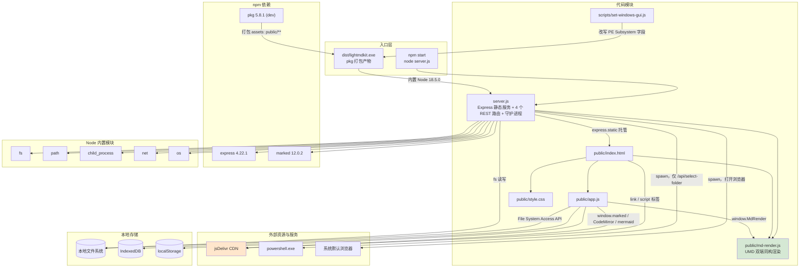
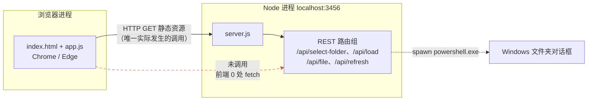
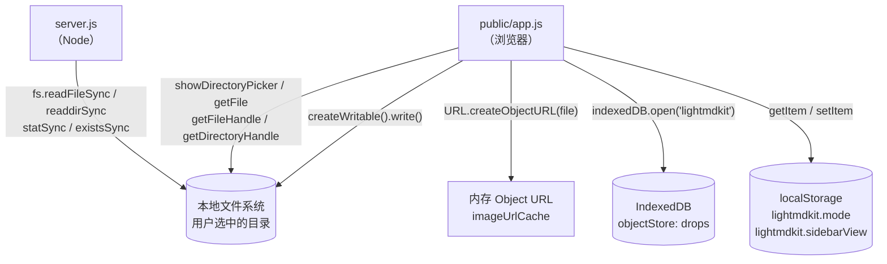

# LightMDKit - 仓库依赖关系

> 基于代码中的依赖调用分析生成。

## 基本信息

- **分析版本**: 2026-09-11 工作区代码（已提交为 `f71e683`，分支 `feat/sidebar-file-browser`）
- **生成时间**: 2026-09-11
- **项目路径前缀**: `LightMDKit/`（下文所有代码位置均以此为前缀）
- **运行形态**: 两种 —— ① `node server.js`（脚本/开发）；② `dist/lightmdkit.exe`（`pkg` 打包，内置 Node 18.5.0 运行时）
- **技术栈特征**: Node.js + Express 后端、原生 JS 前端，**无构建工具、无前端框架、无前端打包产物**；前端第三方库全部走 CDN

> ⚠️ **本项目的最大结构特征**：前端（`public/app.js`）**完全不调用后端 REST API**（全文件 0 处 `fetch` / `XMLHttpRequest` / `axios`）。前后端之间唯一的运行期耦合是 `express.static` 托管 `public/` 目录；唯一的代码级耦合是 `server.js` 通过相对路径 `require('./public/md-render.js')` 复用前端目录下的文件。详见 [4.1](#41-模块--进程间依赖)。

---

## 整体依赖拓扑



> 绿色 `md-render.js` 是**唯一的前后端共享代码单元**；橙色 CDN 是**唯一的非本地外部资源来源**。

---

## 服务间调用关系

本项目是单进程本地应用，**不存在服务间 HTTP / gRPC / SDK 调用**。下图为实际存在的进程与模块调用链。



### 关键结论：REST API 处于「可调用但无调用方」状态

| 路由 | 服务端行为 | 前端调用情况 | 代码位置 |
|------|-----------|-------------|---------|
| `POST /api/select-folder` | 用 PowerShell 弹系统文件夹对话框 | **无调用** | `LightMDKit/server.js:19-94` |
| `POST /api/load` | 扫描目录 + 渲染指定文件 | **无调用** | `LightMDKit/server.js:97-168` |
| `GET /api/file` | 读单个文件并转 HTML | **无调用** | `LightMDKit/server.js:171-196` |
| `POST /api/refresh` | 重新读取并渲染 | **无调用** | `LightMDKit/server.js:199-224` |

`LightMDKit/README.md:55` 对此有明确说明：「前端默认使用浏览器 File System Access API 读取文件，以下接口由服务端提供，可作为替代或扩展使用」。

**影响**：这 4 个路由是**弱依赖**——删掉它们不影响前端任何功能，但会同时移除「非 Chrome 浏览器 / 无 File System Access API 时的降级方案」这一潜在退路（注意该退路当前并未实现，仅库存在）。

---

## 数据存储依赖



**本项目无数据库、无缓存服务、无消息队列。** 全部持久化都落在用户本机。

| 存储服务 | 使用模块 | Client 类型 | 代码位置 | 用途 |
|---------|---------|------------|---------|------|
| 本地文件系统 | `public/app.js` | File System Access API（`showDirectoryPicker`，`mode:'readwrite'`） | `LightMDKit/public/app.js:766` | 用户选择目录，读取 Markdown 与相对路径图片 |
| 本地文件系统 | `public/app.js` | `FileSystemFileHandle.getFile()` | `LightMDKit/public/app.js:633`、`LightMDKit/public/app.js:717` | 读单文件内容 / 读图片转 ObjectURL |
| 本地文件系统 | `public/app.js` | `FileSystemFileHandle.createWritable()` | `LightMDKit/public/app.js:927` | 编辑模式与 3s 自动保存写回原文件 |
| 本地文件系统 | `server.js` | Node.js `fs` 模块 | `LightMDKit/server.js:2`、`LightMDKit/server.js:153`、`LightMDKit/server.js:190`、`LightMDKit/server.js:218` | 备用 API 路由读取文件与扫描目录 |
| IndexedDB | `public/app.js` | 原生 `indexedDB`（DB `lightmdkit` / store `drops`） | `LightMDKit/public/app.js:1222-1274` | 跨标签页传递拖放得到的 `FileSystemHandle`（句柄可结构化克隆） |
| localStorage | `public/app.js` | 原生 `localStorage` | `LightMDKit/public/app.js:45-60`、`LightMDKit/public/app.js:66-81` | 记忆界面模式（传统/现代）与侧边栏视图（文件列表/目录） |
| 内存 | `public/app.js` | `Map` + `URL.createObjectURL` | `LightMDKit/public/app.js:101`、`LightMDKit/public/app.js:679-684`、`LightMDKit/public/app.js:718` | 图片 ObjectURL 缓存，切换文件夹时 `revokeObjectURL` 释放 |

---

## 外部服务依赖

| 服务名称 | 使用模块 | 用途 | 代码位置 | 强度 |
|---------|---------|------|---------|------|
| jsDelivr CDN | `public/index.html` | 托管全部 9 个前端第三方资源 | `LightMDKit/public/index.html:10,18,89-95` | **强**（离线即不可用，无回退） |
| github-markdown-css (`@5`) | `public/index.html` | GitHub 风格排版样式 | `LightMDKit/public/index.html:10` | 强 |
| CodeMirror 5 (`@5`) | `public/index.html` / `public/app.js` | 编辑器内核 + overlay/active-line 插件 + markdown/gfm 模式 | `LightMDKit/public/index.html:18,89-93` | 强（编辑器不可用则现代模式整体失效） |
| Mermaid (`@11`) | `public/index.html` / `public/app.js` | 渲染 ` ```mermaid ` 代码块 | `LightMDKit/public/index.html:94`、`LightMDKit/public/app.js:674` | 弱（`app.js:656` 判空后跳过） |
| marked (`@12`，浏览器侧) | `public/index.html` / `public/app.js` | 前端 Markdown 解析（实时预览） | `LightMDKit/public/index.html:95`、`LightMDKit/public/app.js:637` | 强 |
| PowerShell (`powershell.exe`) | `server.js` | `/api/select-folder` 弹文件夹对话框 | `LightMDKit/server.js:25-51` | 弱（该路由无调用方；非 Windows 直接返回 500） |
| 系统默认浏览器（`cmd /c start`、`open`、`xdg-open`） | `server.js` | 启动后打开页面 | `LightMDKit/server.js:233-249` | 弱（`child.on('error', ()=>{})` 静默忽略，且可手动访问 URL） |

### CDN 资源清单与版本锁定分析

| # | 资源 | URL 版本写法 | 锁定程度 | 代码位置 |
|---|------|-------------|---------|---------|
| 1 | github-markdown-css | `github-markdown-css@5` | 仅锁主版本 | `LightMDKit/public/index.html:10` |
| 2 | CodeMirror 5 样式 | `codemirror@5` | 仅锁主版本 | `LightMDKit/public/index.html:18` |
| 3 | CodeMirror 5 内核 | `codemirror@5` | 仅锁主版本 | `LightMDKit/public/index.html:89` |
| 4 | addon: `mode/overlay` | `codemirror@5` | 仅锁主版本 | `LightMDKit/public/index.html:90` |
| 5 | addon: `selection/active-line` | `codemirror@5` | 仅锁主版本 | `LightMDKit/public/index.html:91` |
| 6 | mode: `markdown` | `codemirror@5` | 仅锁主版本 | `LightMDKit/public/index.html:92` |
| 7 | mode: `gfm` | `codemirror@5` | 仅锁主版本 | `LightMDKit/public/index.html:93` |
| 8 | Mermaid | `mermaid@11` | 仅锁主版本 | `LightMDKit/public/index.html:94` |
| 9 | marked | `marked@12` | 仅锁主版本 | `LightMDKit/public/index.html:95` |

**结论：9 个 CDN 引用全部只写主版本号，没有任何一条锁定到具体的次版本 / 补丁版本，也没有一个带 `integrity`（SRI）或 `crossorigin` 属性。**

jsDelivr 对 `@5` / `@11` / `@12` 这类写法的解析规则是「取该主版本下的最新版本」，因此：

| 风险 | 说明 |
|------|------|
| **上游自动漂移** | 上游一旦发布新的次版本/补丁版本，本项目**未经任何代码改动即自动生效**。渲染结果可能悄然变化，且线上无任何版本记录可回溯。 |
| **路径 404** | 若上游调整 `dist/` / `lib/` / `addon/` 目录结构（CodeMirror 5 已进入维护期，风险相对低但非零），脚本标签会 404 且**无加载失败处理**，表现为编辑器静默失效。 |
| **完全离线不可用** | 与「免安装、本地工作台」的产品定位直接冲突：断网 / 内网隔离环境下打开页面将丢失全部样式、编辑器与图表。`dist/lightmdkit.exe` 打包时 `assets` 只含 `public/**/*`（`LightMDKit/package.json:15-17`），**CDN 资源不在包内，无法离线**。 |
| **无完整性校验** | 缺 `integrity`/`crossorigin`，CDN 被劫持或投毒时浏览器无法拦截。 |
| **企业网络拦截** | 若内网封禁 jsdelivr.net，页面无降级路径。 |

**改进建议（按性价比排序）**：① 把 9 个资源版本号写全（如 `codemirror@5.65.16`）；② 加上 `integrity` + `crossorigin`；③ 若确实要兑现「免安装 + 离线」定位，把这 9 个文件下载到 `public/vendor/` 本地化，CDN 只需在 `pkg.assets` 中随包发布即可。

---

## 依赖详细说明

### 4.1 模块 / 进程间依赖

#### `server.js`（Node 后端进程）依赖

| 被依赖对象 | 依赖类型 | 调用方式 | 代码位置 | 强度 |
|-----------|---------|---------|---------|------|
| express | npm 运行时依赖（`^4.18.2` → 实际 4.22.1） | `require('express')`，`express.json()`、`express.static()`、`app.listen()` | `LightMDKit/server.js:1`、`LightMDKit/server.js:13-14`、`LightMDKit/server.js:276` | 强 |
| marked | npm 运行时依赖（`^12.0.0` → 实际 12.0.2） | `require('marked')` 解构 `{ marked }`，注入 `renderMarkdown` | `LightMDKit/server.js:6`、`LightMDKit/server.js:154`、`LightMDKit/server.js:191`、`LightMDKit/server.js:219` | 强 |
| `public/md-render.js` | 本地模块（跨端共享） | `require('./public/md-render.js')` 取 `renderMarkdown` —— **后端直接引用前端目录下的文件** | `LightMDKit/server.js:7` | 强 |
| Node `fs` | 内置模块 | `readFileSync` / `readdirSync` / `statSync` / `existsSync` | `LightMDKit/server.js:2` | 强 |
| Node `path` | 内置模块 | `resolve` / `join` / `extname` | `LightMDKit/server.js:3` | 强 |
| Node `child_process` | 内置模块 | `spawn` —— 调 PowerShell、启动守护进程、打开浏览器 | `LightMDKit/server.js:4`、`LightMDKit/server.js:45`、`LightMDKit/server.js:246`、`LightMDKit/server.js:266` | 强 |
| Node `net` | 内置模块 | `net.createServer().listen()` 探测端口占用 | `LightMDKit/server.js:5`、`LightMDKit/server.js:251-263` | 强 |
| Node `os` | 内置模块 | `os.platform()` 区分 Windows / macOS / Linux | `LightMDKit/server.js:8`、`LightMDKit/server.js:16`、`LightMDKit/server.js:234` | 强 |

> 端口硬编码 `const PORT = 3456`（`LightMDKit/server.js:11`），无环境变量或配置项覆盖。

#### `public/app.js`（前端）依赖

| 被依赖对象 | 依赖类型 | 调用方式 | 代码位置 | 强度 |
|-----------|---------|---------|---------|------|
| `MdRender`（`public/md-render.js`） | 本地模块（全局变量） | `MdRender.renderMarkdown(text, marked)` | `LightMDKit/public/app.js:637`、`LightMDKit/public/app.js:1031`、`LightMDKit/public/app.js:1058` | 强 |
| `marked` | CDN 全局变量 | 作为参数传入 `MdRender.renderMarkdown` | `LightMDKit/public/app.js:637` | 强 |
| `CodeMirror` | CDN 全局变量 | `CodeMirror.fromTextArea()`，`mode: gfm`、`theme: 'github'`、`styleActiveLine` | `LightMDKit/public/app.js:106-128` | 强（初始化失败会回退 textarea，但现代模式整体失效） |
| `mermaid` | CDN 全局变量 | `mermaid.initialize()` + `mermaid.run()` | `LightMDKit/public/app.js:133-139`、`LightMDKit/public/app.js:674` | 弱（`typeof mermaid === 'undefined'` 时直接 return） |
| `public/index.html` | 宿主文档 | 通过 `document.getElementById` 绑定 20+ 个 DOM 节点 | `LightMDKit/public/app.js:2-22` | 强 |

#### `public/index.html`（页面）依赖

| 被依赖对象 | 依赖类型 | 调用方式 | 代码位置 | 强度 |
|-----------|---------|---------|---------|------|
| `public/style.css` | 本地资源 | `<link rel="stylesheet" href="style.css?v=17">` | `LightMDKit/public/index.html:19` | 强 |
| `public/md-render.js` | 本地资源 | `<script src="md-render.js?v=4">`（UMD 暴露 `window.MdRender`） | `LightMDKit/public/index.html:96` | 强 |
| `public/app.js` | 本地资源 | `<script src="app.js?v=21">` | `LightMDKit/public/index.html:97` | 强 |
| 9 个 CDN 资源 | 外部资源 | `<link>` / `<script>` | `LightMDKit/public/index.html:10,18,89-95` | 强 |

> `style.css` 与 `app.js` 使用 `?v=N` 查询串做缓存失效（`style.css?v=17`、`md-render.js?v=4`、`app.js?v=21`），加上 `index.html:6-8` 的 `Cache-Control` / `Pragma` / `Expires` 三重 no-cache meta —— 这是没有构建工具时的手工缓存策略，**改前端文件后必须同步递增对应的 `?v=`**。

#### `public/md-render.js`（双端共享模块）依赖

UMD 包装（`LightMDKit/public/md-render.js:1-7`）：Node 侧 `module.exports`，浏览器侧挂 `root.MdRender`。**自身零外部依赖**，是纯字符串处理模块。

| 被依赖方 | 引用方式 | 代码位置 |
|---------|---------|---------|
| `server.js` | `require('./public/md-render.js')` | `LightMDKit/server.js:7` |
| `public/index.html` → `public/app.js` | `<script>` 全局 `window.MdRender` | `LightMDKit/public/index.html:96`、`LightMDKit/public/app.js:637` |

### 4.2 Node 内置模块依赖

| 内置模块 | 使用模块 | 用途 | 代码位置 |
|---------|---------|------|---------|
| `fs` | `server.js` | 文件读写、目录扫描、存在性判断 | `LightMDKit/server.js:2` |
| `path` | `server.js` | 路径解析与拼接、扩展名提取 | `LightMDKit/server.js:3` |
| `child_process` | `server.js` | `spawn` 启动 PowerShell / 守护进程 / 浏览器 | `LightMDKit/server.js:4` |
| `net` | `server.js` | TCP 探测 3456 端口是否被占用（单实例守护） | `LightMDKit/server.js:5` |
| `os` | `server.js` | 平台判别（win32 / darwin / linux） | `LightMDKit/server.js:8` |
| `fs` | `scripts/set-windows-gui.js` | 读写 exe 二进制 | `LightMDKit/scripts/set-windows-gui.js:1` |
| `path` | `scripts/set-windows-gui.js` | 定位 `dist/lightmdkit.exe` | `LightMDKit/scripts/set-windows-gui.js:2` |

> 全仓库仅这一个 `require` 清单（`server.js` 与 `scripts/set-windows-gui.js`），无其他 `.js` 文件引入依赖。

### 4.3 浏览器原生 API 依赖

| API | 使用模块 | 用途 | 代码位置 | 强度 |
|-----|---------|------|---------|------|
| `window.showDirectoryPicker()` | `app.js` | 选择本地目录（`mode:'readwrite'`） | `LightMDKit/public/app.js:760`、`LightMDKit/public/app.js:766` | **强**（不支持则核心功能不可用） |
| `FileSystemDirectoryHandle.entries()` | `app.js` | 递归遍历目录（深度上限 6、文件数上限 3000） | `LightMDKit/public/app.js:224-248` | 强 |
| `getFileHandle` / `getDirectoryHandle` | `app.js` | 按路径逐级定位文件与子目录（含图片） | `LightMDKit/public/app.js:615`、`LightMDKit/public/app.js:712-714` | 强 |
| `FileSystemFileHandle.getFile()` | `app.js` | 读取文件内容 / 图片 Blob | `LightMDKit/public/app.js:633`、`LightMDKit/public/app.js:717`、`LightMDKit/public/app.js:1335` | 强 |
| `FileSystemFileHandle.createWritable()` | `app.js` | 写回原文件（编辑保存 + 3s 自动保存） | `LightMDKit/public/app.js:921-929` | 强 |
| `FileSystemHandle.isSameEntry()` | `app.js` | 判断拖入文件是否在当前已加载目录内 | `LightMDKit/public/app.js:1286` | 弱（失败仅降级为「只打开单文件」） |
| `DataTransferItem.getAsFileSystemHandle()` | `app.js` | 拖放时获取文件/目录句柄 | `LightMDKit/public/app.js:1322-1324` | 弱（不可用时回退 `getAsFile()`） |
| `indexedDB` | `app.js` | 跨标签页传递 FileSystemHandle | `LightMDKit/public/app.js:1222-1274` | 弱（不可用时拖放打开降级） |
| `IntersectionObserver` | `app.js` | 滚动时高亮 TOC 当前章节 | `LightMDKit/public/app.js:1450-1458` | 弱（无则目录不高亮，不影响阅读） |
| `localStorage` | `app.js` | 记忆界面模式与侧边栏视图 | `LightMDKit/public/app.js:45-81` | 弱（隐私模式下 try/catch 回退默认值） |
| `URL.createObjectURL` / `revokeObjectURL` | `app.js` | 相对路径图片转 ObjectURL 并缓存 | `LightMDKit/public/app.js:681`、`LightMDKit/public/app.js:718` | 弱 |
| `crypto.randomUUID()` | `app.js` | 生成拖放记录的 IndexedDB 主键 | `LightMDKit/public/app.js:1305-1307` | 弱（有 `Date.now()+Math.random()` 回退） |

> **浏览器兼容性硬约束**：`showDirectoryPicker` 目前仅 Chromium 系（Chrome / Edge 86+）实现，**Firefox 与 Safari 不支持**。`app.js:747` 有特性检测并提示「浏览器不支持文件夹选择，请使用 Chrome 或 Edge」，但此时应用无任何可用功能（因为前端不调用后端 REST API）。`LightMDKit/README.md:45` 已明确要求 Chrome / Edge。
>
> 注：经全量搜索确认，`public/` 下**未使用** `navigator.clipboard` / `Clipboard API`、`ResizeObserver`、`MutationObserver`、`matchMedia`、`structuredClone`、`WebSocket`、`Notification` 等 API。

### 4.4 构建期依赖（devDependencies）

| 依赖 | 版本 | 用途 | 代码位置 | 强度 |
|------|------|------|---------|------|
| `pkg` | `^5.8.1` → 实际 5.8.1 | 把 Node 项目打成单文件 exe | `LightMDKit/package.json:24`、`LightMDKit/package.json:9` | 强（仅构建期） |
| `pkg-fetch` | 3.4.2（`pkg` 传递依赖） | 下载并缓存目标 Node 运行时二进制 | `LightMDKit/package-lock.json`（`node_modules/pkg-fetch`） | 强（仅构建期） |
| Node 运行时 `fetched-v18.5.0-win-x64` | 18.5.0 | 打包进 exe 的 Node 内核；缓存于 `~/.pkg-cache/v3.4/` | `LightMDKit/package.json:12-14` | 强 |
| `scripts/set-windows-gui.js` | 本地脚本 | 直接改写 exe 的 PE 可选头 `Subsystem` 字段（CUI=3 → GUI=2），实现双击不弹命令行窗口 | `LightMDKit/scripts/set-windows-gui.js:34-49` | 强（仅构建期） |

**构建链**（`LightMDKit/package.json:9`）：

```
npm run build:win
  = pkg . --output dist/lightmdkit.exe      # 打包 server.js + node_modules + public/** 为单文件
  && node scripts/set-windows-gui.js        # 改写 PE Subsystem，转成 Windows GUI 子系统
```

`pkg` 配置（`LightMDKit/package.json:11-18`）：

| 配置项 | 值 | 说明 |
|-------|-----|------|
| `targets` | `["node18-win-x64"]` | 目标平台固定为 Windows x64 + Node 18 |
| `assets` | `["public/**/*"]` | 前端静态资源必须显式声明，否则 `express.static` 在 exe 内找不到 `public/` |

> `pkg` 未配置 `scripts` 字段（即不做字节码编译），源码以明文形式打进 exe。

### 4.5 消息队列依赖

**本项目无消息队列依赖** —— 无生产者、无消费者、无 Topic。所有「跨标签页通信」通过 IndexedDB（`drops` store）完成，属本地存储而非消息队列。

---

## 版本锁定与兼容性注意点（踩坑记录）

> 以下均已在源码注释中留有说明，升级相关依赖时**必须逐条复核**。

### 1. CodeMirror 5 的 `github` 主题在 npm 包里不存在
`codemirror@5` 的 `theme/` 目录只有 65 个主题，**没有 `github`**。若按常规写法引入 `theme/github.min.css` 会 **404**。

- 规避方式：编辑器配色改由 `LightMDKit/public/style.css` 中的 `.content-wrapper .cm-*` 规则提供；`public/index.html` **有意不引任何 CodeMirror 主题**。
- 但 `app.js` 里**必须保留 `theme: 'github'`**（`LightMDKit/public/app.js:119`）——它的作用不是加载主题文件，而是让容器带上 `cm-s-github` 类。一旦摘掉，CodeMirror 会回落到 `cm-s-default`，基础主题那批 `.cm-s-default .cm-*` 颜色就会生效，**反而改变现有观感**。
- 源码说明见 `LightMDKit/public/index.html:11-17`。

### 2. CodeMirror 5 把单个 `~` 当删除线定界符
CM5 自带的 markdown 分词器 `ch === '~' && stream.eatWhile(ch)` 后直接切换状态，导致中文文档常见的范围写法（「1~100、2~5」）被误判成删除线，两个 `~` 被当标记隐藏，**直接显示成「1100、25」**。

- 规避方式：`mode.strikethrough: false`（`LightMDKit/public/app.js:115`，注释见 `app.js:106-110`）；真正的 `~~...~~` 由 `markText` 单独标注（`refreshStrikeMarks`，`LightMDKit/public/app.js:424-452`）。
- 关掉它不影响传统模式：`style.css` 本来就没有样式化 `cm-strikethrough` / `cm-formatting-strikethrough`。

### 3. marked 12 的 `del` 分词器同样允许单个 `~`
marked 12 的规则为 `/^(~~?)(?=[^\s~])([\s\S]*?[^\s~])\1(?=[^~]|$)/`，**`~~?` 允许单波浪线**，中文范围写法在前端实时预览中同样会被误判。

- 规避方式：`patchStrikethrough()` 覆盖 tokenizer，只认 `~~`（`LightMDKit/public/md-render.js:140-164`），`renderMarkdown` 内每次调用前自动打补丁。
- ⚠️ **这是对依赖内部实现的强耦合**：`DOUBLE_TILDE_DEL` 与「返回 `undefined` 表示不匹配、返回 `false` 才回退内置实现」的约定都建立在 marked 的分词器契约上。**升级 marked 主版本时必须重新核对 `del` 规则与 `marked.use({tokenizer})` 的语义。**

### 4. marked / GFM 不支持多行单元格
GFM 表格的单元格内容换行时，marked 会把后续行解析成独立行。

- 规避方式：`mergeTableCells()` 预处理，把跨行单元格合并回同一行并用 `<br>` 表示换行（`LightMDKit/public/md-render.js:72-132`）。
- 另有 `preserveIndent()` 把非结构性的行首缩进转成 `&nbsp;`（`LightMDKit/public/md-render.js:10-57`），避免缩进被当成代码块吞掉。

### 5. `marked` 的 engines 约束与 `pkg` target 必须一致
`marked@12.0.2` 的 `engines` 为 `{"node": ">= 18"}`（见 `package-lock.json`）。当前 `pkg.targets = ["node18-win-x64"]` 恰好满足（实际内置 Node **18.5.0**）。

- ⚠️ 若将来把 target 降到 `node16-*`，会在运行期报引擎不兼容而失败。

### 6. `pkg` 已停止维护，运行时被锁死在 Node 18.5.0
`pkg@5.8.1` 依赖 `pkg-fetch@3.4.2`，首次构建会从 GitHub Releases 下载 `fetched-v18.5.0-win-x64`，缓存于 `~/.pkg-cache/v3.4/`（本机已确认存在）。

- ⚠️ **首次构建必须联网**；离线环境构建会直接失败。
- ⚠️ `vercel/pkg` 已归档停止维护，打包出的 exe **固定携带 Node 18.5.0，无法跟随 Node 安全更新**，也无法利用新版 Node 的性能改进。这是本项目长期维护的最大技术债。

### 7. `scripts/set-windows-gui.js` 是未文档化的二进制补丁
脚本直接读取 exe 字节流，按 PE 格式定位可选头 `Subsystem` 字段（DOS 头 `0x3C` 处取 PE 偏移 → `+4+20` 跳到可选头 → `+0x44` 取 Subsystem），把 `3`（WINDOWS_CUI）改成 `2`（WINDOWS_GUI）。

- 该偏移对 PE32 与 PE32+ 均为 `0x44`（脚本 `LightMDKit/scripts/set-windows-gui.js:27-35` 已校验 magic `0x10B`/`0x20B`）。
- ⚠️ 升级 `pkg` 或更换目标运行时后，**必须重新验证 `pkg` 输出仍是标准 PE 且偏移未变**；否则会静默改坏 exe。
- 副作用：改成 GUI 子系统后 `console.log` 输出无处可去（无控制台），故障排查只能靠接口行为——这也是 `server.js` 中大量 `console.log` / `console.error` 在 exe 形态下**不可见**的原因。

### 8. 前后端共享 `md-render.js` 的双端约束
`md-render.js` 是 UMD 模块，同时被 Node（`LightMDKit/server.js:7`）与浏览器（`index.html:96`）加载。修改它时必须保证：

- 不引用任何 DOM / Node 专有 API（当前为纯字符串处理，符合约束）；
- UMD 包装头（`md-render.js:1-7`）不能破坏，否则会同时打断两端；
- Node 侧 `require` 的路径是 `./public/md-render.js` —— **后端反向依赖前端目录**。若重排（如把 `md-render.js` 移出 `public/`），必须同步改 `LightMDKit/server.js:7`、`index.html:96` 与 `pkg.assets` 三处。

### 9. 手工缓存失效策略
无构建工具，前端资源靠 URL 查询串破缓存：`style.css?v=17`、`md-render.js?v=4`、`app.js?v=21`（`LightMDKit/public/index.html:19,96,97`）。

- ⚠️ **改前端文件忘了递增 `?v=`，用户会拿到浏览器旧缓存**，且 `index.html` 自身的 no-cache meta（`index.html:6-8`）只保证 HTML 不被缓存，救不了 JS/CSS。

### 10. package-lock 必须提交
`package-lock.json` 为 `lockfileVersion: 3`，锁定了 193 个包。声明版本与实际版本存在偏移：

| 声明 | 实际锁定 | 说明 |
|------|---------|------|
| `express: ^4.18.2` | **4.22.1** | 次版本已前进多个版本 |
| `marked: ^12.0.0` | **12.0.2** | 补丁版本 |
| `pkg: ^5.8.1` | **5.8.1** | — |

⚠️ 若不提交 lock 文件，`npm install` 会拉到更新的次版本，可能出现与当前验证结果不一致的行为。

---

## 依赖统计

| 模块 / 形态 | 依赖库数 | 被依赖次数 | 存储数 | 外部服务数 |
|------------|---------|-----------|-------|-----------|
| `server.js`（Node 进程） | 2 npm（express、marked）+ 5 Node 内置 + 1 本地模块 = **8** | 4（`start.bat`、`start.sh`、`npm start`、`pkg` 入口） | 1（本地文件系统） | 2（PowerShell、系统浏览器） |
| `public/app.js`（浏览器） | 4 前端库（marked、CodeMirror、mermaid、MdRender）+ 12 项浏览器原生 API = **16** | 1（`index.html`） | 3（本地文件系统、IndexedDB、localStorage） | 3（jsDelivr CDN 上的一组包） |
| `public/md-render.js`（双端共享） | **0**（纯字符串处理，零外部依赖） | 2（`server.js`、`public/app.js`） | 0 | 0 |
| `public/index.html`（页面） | 3 本地资源 + 9 个 CDN 引用 = **12** | 1（`express.static` 托管） | 0 | 1（jsDelivr CDN） |
| `scripts/set-windows-gui.js`（构建脚本） | 2 Node 内置 | 1（`npm run build:win`） | 1（exe 文件） | 0 |
| 构建链（`pkg` + `pkg-fetch` + Node 18.5.0） | **3** | 1（`package.json` scripts） | 0 | 1（GitHub Releases 下载运行时） |

### 依赖关系分类汇总

> 各分类互不重叠，可加总。第 4.1 节中的 `md-render.js` 反向引用表为「被依赖方视角」，不重复计数。

| 依赖类别 | 数量 | 来源 |
|---------|------|------|
| 模块 / 组件间依赖（npm 包与本地模块，不含 Node 内置模块） | 12 | 4.1 节三张表 |
| Node 内置模块依赖 | 7 | 4.2 节 |
| CDN 包依赖（github-markdown-css、CodeMirror、Mermaid、marked） | 4 | 4.3 / 4.4 节 |
| 浏览器原生 API 依赖 | 12 | 4.3 节 |
| 数据存储依赖 | 7 | 数据存储依赖节 |
| 构建期依赖 | 4 | 4.4 节 |
| 外部服务依赖 —— 系统程序（PowerShell、系统默认浏览器） | 2 | 4.4 节 |
| **合计** | **48** | — |

> CDN 资源的**逐标签明细共 9 条**（4.3 节表格），是上述 4 个 CDN 包在页面中的展开引用，**不重复计入合计**。

### 强 / 弱依赖分布

| 强度 | 数量 | 典型代表 |
|------|------|---------|
| **强依赖** | **33** | express、marked、`md-render.js`、File System Access API（`showDirectoryPicker` / `entries` / `getFile` / `getFileHandle` / `createWritable`）、CodeMirror、9 个 CDN 引用、全部 Node 内置模块、`pkg` 构建链 |
| **弱依赖** | **15** | mermaid、`isSameEntry`、`getAsFileSystemHandle`、IndexedDB、IntersectionObserver、localStorage、`createObjectURL`、`crypto.randomUUID`、PowerShell 路由、系统浏览器调用 |

### 循环依赖检查

✅ **未发现循环依赖。**

依赖方向为单向无环：

```
public/index.html → public/app.js → public/md-render.js
                                  ↗
server.js ────────────────────────┘
```

唯一需要留意的是**方向反转的一处耦合**：`server.js`（Node 进程）通过 `require('./public/md-render.js')` 反向依赖了前端资源目录。它不构成循环（`md-render.js` 不回引 `server.js`），但意味着**前端目录的物理位置被后端代码引用**，重排目录会同时打断两端 + `pkg.assets` 三处。

---

> 📊 共分析 5 个代码模块（`server.js`、`public/app.js`、`public/md-render.js`、`public/index.html`、`scripts/set-windows-gui.js`）+ 2 种运行形态（`node server.js` / `dist/lightmdkit.exe`）+ 1 条构建链，识别 **48 条依赖关系**；其中强依赖 33 条、弱依赖 15 条；无循环依赖，无数据库，无消息队列，无服务间 HTTP / gRPC 调用。
>
> ⚠️ 最需要关注的三件事：① 前端**完全不调用**后端 REST API，4 个路由处于「可调用但无调用方」状态；② 9 个 CDN 引用全部只锁主版本且无 SRI，**离线不可用且会随上游自动漂移**；③ `pkg` 已停止维护，exe 内的 Node 运行时被锁死在 18.5.0。
