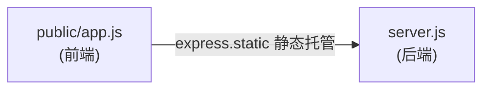
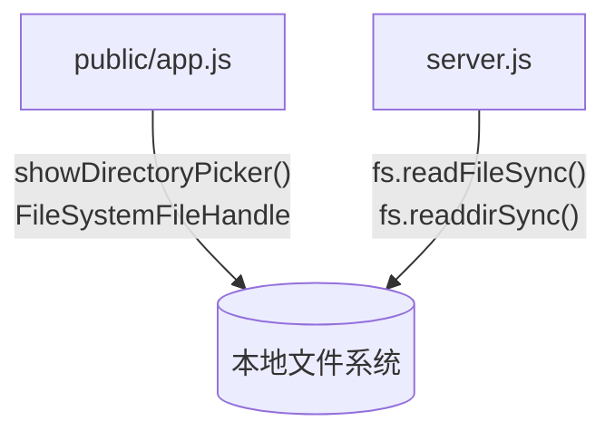

# LightMDKit - 仓库依赖关系

> 基于代码中的依赖调用分析生成。

## 基本信息

- **分析版本**: N/A (非 Git 仓库)
- **生成时间**: 2026-04-30

## 整体依赖拓扑

```mermaid
graph TB
    subgraph "应用服务层"
        FE[前端 public/app.js]
        BE[后端 server.js]
    end

    subgraph "数据存储层"
        LocalFS[(本地文件系统)]
    end

    subgraph "外部服务"
        CDN[jsdelivr CDN]
        PS[PowerShell (Windows)]
    end

    BE -->|express.static| FE
    BE -->|fs 读写| LocalFS
    BE -->|spawn| PS
    FE -->|CDN 引入| CDN
```

### 服务间调用关系



> 前端通过浏览器原生 **File System Access API** 直接读写本地文件，不通过后端 API。后端提供的 `/api/*` 路由（`/api/select-folder`、`/api/load`、`/api/file`、`/api/refresh`）当前未被前端调用。

### 数据存储依赖



## 依赖详细说明

### 模块间依赖

#### 前端 (public/app.js) 依赖

| 被依赖服务 | 依赖类型 | 调用方式 | 代码位置 | 强度 |
|-----------|---------|---------|---------|------|
| marked (CDN 全局变量) | CDN 资源 | `marked.parse(text)` | `LightMDKit/public/app.js:203` | 强 |
| 浏览器 File System Access API | 浏览器原生 API | `window.showDirectoryPicker()` | `LightMDKit/public/app.js:216` | 强 |
| 浏览器 FileSystemFileHandle | 浏览器原生 API | `handle.getFile()` / `handle.createWritable()` | `LightMDKit/public/app.js:199`, `LightMDKit/public/app.js:376` | 强 |

#### 后端 (server.js) 依赖

| 被依赖服务 | 依赖类型 | 调用方式 | 代码位置 | 强度 |
|-----------|---------|---------|---------|------|
| express | npm 包 | `require('express')` | `LightMDKit/server.js:1` | 强 |
| marked | npm 包 | `require('marked')` | `LightMDKit/server.js:6` | 强 |
| Node.js fs | 内置模块 | `require('fs')` | `LightMDKit/server.js:2` | 强 |
| Node.js path | 内置模块 | `require('path')` | `LightMDKit/server.js:3` | 强 |
| Node.js child_process | 内置模块 | `require('child_process')` | `LightMDKit/server.js:4` | 强 |
| Node.js net | 内置模块 | `require('net')` | `LightMDKit/server.js:5` | 强 |
| Node.js os | 内置模块 | `require('os')` | `LightMDKit/server.js:7` | 强 |
| Node.js readline | 内置模块 | `require('readline')` | `LightMDKit/server.js:8` | 强 |

#### 前端资源依赖 (public/index.html)

| 被依赖服务 | 依赖类型 | 调用方式 | 代码位置 | 强度 |
|-----------|---------|---------|---------|------|
| github-markdown-css | CDN 资源 | `<link>` 标签 | `LightMDKit/public/index.html:10` | 强 |
| marked (CDN) | CDN 资源 | `<script>` 标签 | `LightMDKit/public/index.html:54` | 弱 |
| app.js | 内部模块 | `<script>` 标签 | `LightMDKit/public/index.html` | 强 |

> **注**：`LightMDKit/public/app.js` 通过 CDN 引入的 `marked` 全局变量调用 `marked.parse()`（第 203 行），而非通过 npm `require()`。CDN 版本是前端唯一的 marked 来源。

### 数据存储依赖

| 存储服务 | 使用模块 | Client 类型 | 代码位置 | 用途 |
|---------|---------|------------|---------|------|
| 本地文件系统 | 前端 (app.js) | File System Access API | `LightMDKit/public/app.js:216` | 通过浏览器 API 读取和写入用户选择的 Markdown 文件 |
| 本地文件系统 | 后端 (server.js) | Node.js fs 模块 | `LightMDKit/server.js:2` | 读取磁盘文件、目录扫描（备用 API 接口使用） |

### 外部服务依赖

| 服务名称 | 使用模块 | 用途 | 代码位置 |
|---------|---------|------|---------|
| jsdelivr CDN | public/index.html | 加载 github-markdown-css 样式 (v5) | `LightMDKit/public/index.html:10` |
| jsdelivr CDN | public/index.html | 加载 marked 解析库 (v12) | `LightMDKit/public/index.html:54` |

### 消息队列依赖

本项目无消息队列依赖。

## 依赖统计

| 模块名称 | 依赖库数 | 被依赖次数 | 数据库数 | 外部服务数 |
|---------|-----------|-----------|---------|-----------|
| server.js (后端) | 9 (express + marked + 6 内置模块 + PowerShell) | 0 | 0 | 1 (PowerShell) |
| app.js (前端) | 3 (marked CDN + File System Access API + FileSystemFileHandle API) | 1 (被 index.html 引用) | 0 | 0 |
| index.html | 3 (github-markdown-css CDN + marked CDN + app.js) | 1 (被 express.static 托管) | 0 | 1 (CDN) |

---

> 共分析 3 个模块（后端/前端逻辑/前端页面），识别 15 个依赖关系。
