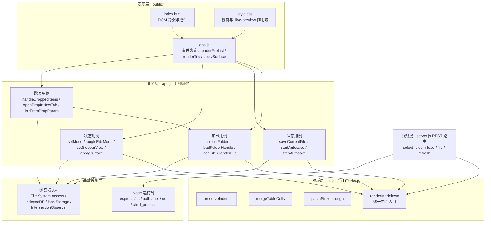
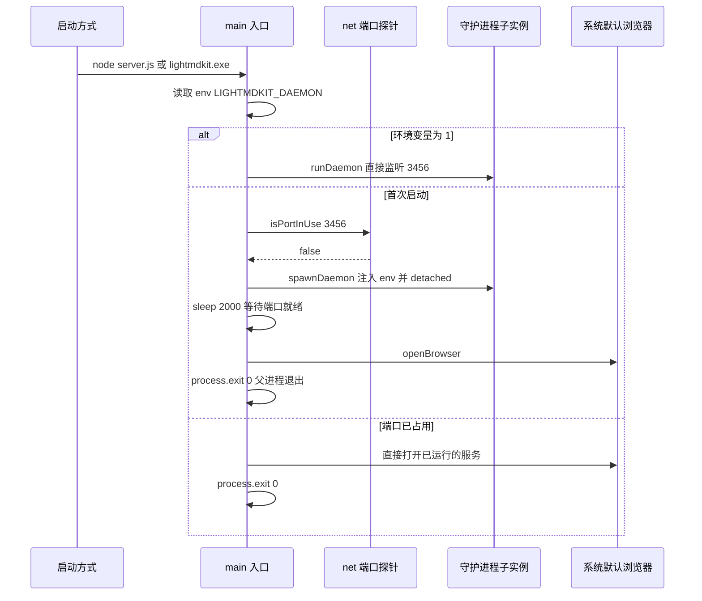
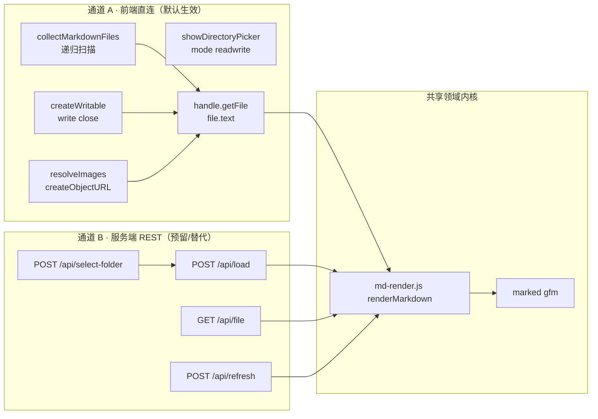
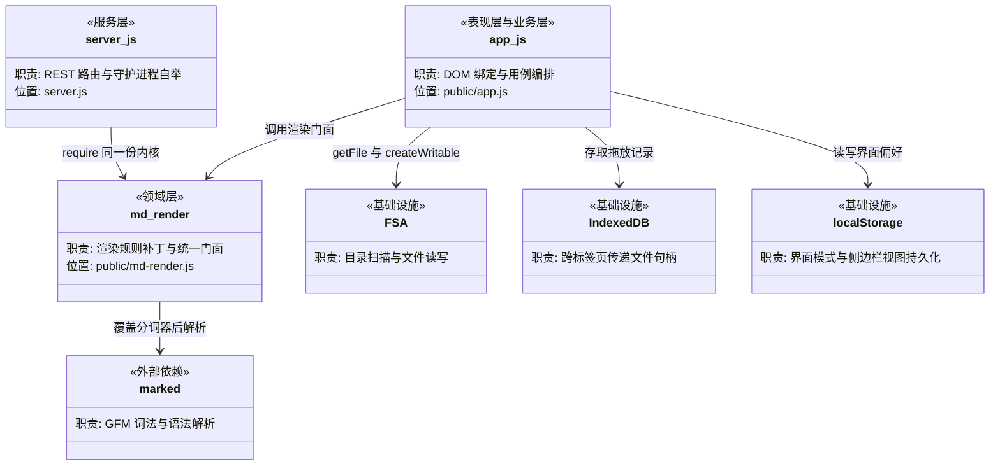

# 仓库架构

> 本文档聚焦于 LightMDKit 的**分层架构、技术架构和逻辑架构**。

> **文档定位**：
> - 本文档关注"怎么组织"（分层设计、架构模式、模块关系）
> - 模块列表和目录结构请参考 [仓库概览](./仓库概览.md)
> - 外部依赖关系请参考 [仓库依赖](./仓库依赖.md)
>
> **文档版本**：分析对象为 2026-09-11 的工作区代码（已提交为 `f71e683`，分支 `feat/sidebar-file-browser`，基于 `main` 的 `3bbca34`） · 生成日期 2026-09-11
> **代码位置约定**：格式为 `LightMDKit/文件路径:行号`。其中 `LightMDKit/` 是**逻辑项目前缀（项目名）**，**不是磁盘上的目录** —— 仓库根目录本身就是项目根。核对行号请直接读工作区文件。

---

## 架构模式识别

### 项目类型

**架构类型**：**薄服务端 + 富客户端的单体分层架构**

它形式上是一个单包（single-package）单体仓库，但在运行时拆成两个协作进程，且**业务重心完全落在浏览器一侧**：

| 运行时 | 承载内容 | 代码规模 | 是否必需 |
| --- | --- | --- | --- |
| Node 进程（`server.js`） | 静态资源托管、守护进程自举、4 个可选 REST 接口 | 313 行 | 是（只为了把 `public/` 发出去） |
| 浏览器进程（`public/`） | 全部交互逻辑、文件读写、Markdown 渲染、状态管理 | 1465 + 172 行 JS | 是（真正的应用主体） |

### 识别依据

- **单体而非微服务**：单一 `package.json`（`LightMDKit/package.json:1-26`）、单一入口 `server.js`、无服务发现 / 无进程间 RPC / 无消息中间件；`server.js` 内 4 个路由同属一个 Express 实例（`LightMDKit/server.js:19-224`）。
- **非 MVC、非 DDD**：仓库中不存在 `domain/`、`repository/`、`service/`、`dao/` 等分层目录；不存在 ORM、数据库、Model 层——**文件系统本身就是数据源**，没有持久化模型可言。
- **非标准三层架构**：目录按「前端静态资源 / 构建脚本 / 文档」划分（`public/`、`scripts/`、`doc/`、`agent-rules/`），而不是按 `controller/service/dao` 划分。
- **前端无框架、无构建工具**：`LightMDKit/public/app.js:1` 与 `LightMDKit/public/app.js:1487` 构成**唯一一个 IIFE**，内部 1465 行平铺；`LightMDKit/public/index.html:89-97` 用 9 个 `<script>` 标签按顺序加载依赖，没有任何打包/转译环节。
- **星型拓扑**：`app.js` 是整个系统的唯一枢纽，`md-render.js`、CodeMirror、Mermaid、marked、IndexedDB、File System Access API 全部以它为调用中心（见下文"逻辑架构"）。

因此本项目最贴切的描述是：**一个以浏览器 File System Access API 为数据平面、以纯函数渲染内核为共享领域逻辑、以 Express 侧车（sidecar）为可选通道的单体分层应用**。

---

## 分层架构

### 分层设计



### 层级职责说明

| 层级 | 职责 | 主要位置 | 不应该做什么 | 实际越界情况 |
| --- | --- | --- | --- | --- |
| **表现层** | DOM 结构、视觉呈现、事件绑定、列表与目录的 DOM 重建 | `public/index.html`、`public/style.css`、`public/app.js` 的 `renderFileList`（`LightMDKit/public/app.js:539-607`）、`renderTocFromSource`（`LightMDKit/public/app.js:364-385`） | ❌ 不包含业务规则 | 与业务层同处一个 IIFE，**物理上未隔离**，仅逻辑可分 |
| **业务层** | 用例编排：加载、保存、模式切换、跨标签页引导 | `public/app.js` 的 `loadFolderHandle`（`718-743`）、`loadFile`（`768-787`）、`saveCurrentFile`（`894-915`）、`setMode`（`976-1018`） | ❌ 不关心 HTTP 细节 | 直接持有 DOM 引用（`LightMDKit/public/app.js:2-22`），是**有意的取舍**——无框架下最省事 |
| **领域层** | Markdown 语义规则补丁，纯函数、无副作用、可在两端复用 | `LightMDKit/public/md-render.js:10-169` | ❌ 不访问文件系统、不碰 DOM | 位于 `public/` 静态目录中，语义上属"领域层"但物理上被当作"静态资源" |
| **服务层** | HTTP 路由、参数校验、调用领域层渲染 | `LightMDKit/server.js:19-224` | ❌ 不应包含渲染规则 | 无渲染规则，正确委托给 `md-render.js`（`LightMDKit/server.js:7`、`LightMDKit/server.js:154`） |
| **基础设施层** | 文件读写、网络监听、进程派生、偏好持久化 | 浏览器侧 `LightMDKit/public/app.js:688-727`、`1196-1251`；Node 侧 `LightMDKit/server.js:1-8` | ❌ 不包含业务判断 | `LightMDKit/server.js:83-90` 混入了"选中路径是否为目录"这类业务校验 |

### 层间调用规则

- ✅ **允许**：表现层 → 业务层（`btnRefresh.addEventListener('click', refreshCurrentFile)`，`LightMDKit/public/app.js:859`）
- ✅ **允许**：业务层 → 领域层（`MdRender.renderMarkdown(text, marked)`，`LightMDKit/public/app.js:637`）
- ✅ **允许**：所有层使用基础设施层（业务层直接用 File System Access API，`LightMDKit/public/app.js:766`、`905-907`）
- ✅ **允许**：服务层与业务层**平级**调用同一个领域层入口（`LightMDKit/server.js:154` 与 `LightMDKit/public/app.js:637` 调用同一函数）
- ❌ **禁止**：领域层回调业务层——`md-render.js` 保持纯函数，无任何回调注入
- ⚠️ **特例**：服务层**不被**表现层调用。前端全文无 `fetch` / `/api/` / `XMLHttpRequest`（已用 grep 核实），两条链路是并行关系而非上下依赖，详见下文"双通道文件访问"。

---

## 技术架构

### 技术选型

| 技术类别 | 选型 | 用途 | 使用方式 |
| --- | --- | --- | --- |
| **HTTP 框架** | Express 4 | 静态托管 + 4 个 REST 路由 | `const app = express()`（`LightMDKit/server.js:10`）；仅挂载两个内置中间件（`LightMDKit/server.js:13-14`），无自定义中间件、无路由拆分 |
| **Markdown 解析（浏览器）** | marked 12（CDN） | GFM 解析 | `LightMDKit/public/index.html:95` 以 `<script>` 引入全局 `marked`，运行时以参数注入渲染内核 |
| **Markdown 解析（Node）** | marked 12（npm） | 服务端预渲染 | `LightMDKit/server.js:6` `require('marked')`，同样以参数注入（`LightMDKit/server.js:154`） |
| **渲染增强内核** | 自研 `md-render.js` | 缩进保真 / 表格合并 / 删除线规则修正 | **UMD 双端复用**（`LightMDKit/public/md-render.js:1-7`）：Node 走 `module.exports`，浏览器挂 `window.MdRender`，是两端唯一的渲染真相源 |
| **编辑器** | CodeMirror 5（CDN） | GFM 编辑 + 现代模式实时预览 | `LightMDKit/public/app.js:105-155` 在 `try/catch` 中初始化，失败则降级为 `#editor` 原生 `<textarea>`（`LightMDKit/public/app.js:152-155`） |
| **图表渲染** | Mermaid 11（CDN） | ` ```mermaid ` 代码块渲染 | `LightMDKit/public/app.js:133-139` 惰性 `initialize`；`renderMermaid()`（`LightMDKit/public/app.js:668-677`）按需 `mermaid.run`，现代模式下**主动跳过**（`LightMDKit/public/app.js:671`） |
| **文件访问** | File System Access API | 目录递归扫描、文件读写 | 主通道，见下文详述 |
| **跨标签页传参** | IndexedDB | 传递 `FileSystemHandle` | `LightMDKit/public/app.js:1218-1273`，自定义轻量封装（`idbPut` / `idbGet` / `idbPurgeExpired`），带 24h TTL 清理 |
| **配置管理** | 无配置文件 | 常量硬编码 + localStorage | 端口 `const PORT = 3456`（`LightMDKit/server.js:11`）；扫描上限 `SCAN_MAX_DEPTH` / `SCAN_MAX_FILES`（`LightMDKit/public/app.js:85-86`）；用户偏好存 localStorage（`LightMDKit/public/app.js:42-81`） |
| **打包** | pkg | 生成免安装单文件 exe | `LightMDKit/package.json:9` `build:win`；产物 `dist/lightmdkit.exe`（约 40MB） |

### 设计模式应用

#### 1. 守护进程自举（Self-Detaching Daemon）

**实现方式**：进程通过**环境变量区分角色**，首次启动的进程派生子进程后立即退出，由子进程长期持有监听端口。

**示例**（`LightMDKit/server.js:291-311`）：
```javascript
async function main() {
  if (process.env[DAEMON_ENV] === '1') {   // DAEMON_ENV = 'LIGHTMDKIT_DAEMON'
    runDaemon();
    return;
  }
  const portBusy = await isPortInUse(PORT);
  if (!portBusy) {
    spawnDaemon();                          // 注入 env，detached + unref
    await sleep(2000);
    openBrowser(url);
    process.exit(0);                        // 父进程退出，子进程继续服务
  }
  // 端口已占用 → 直接复用已有服务
  openBrowser(url);
  process.exit(0);
}
```

关键实现点：
- 角色判定靠环境变量而非命令行参数（`LightMDKit/server.js:227`、`LightMDKit/server.js:270`、`LightMDKit/server.js:292`），保证 `node server.js` 与打包后的 `lightmdkit.exe` 行为一致。
- 端口探测用 `net.createServer().listen()` 的 `EADDRINUSE` 错误码，而非 HTTP 探测（`LightMDKit/server.js:251-263`）。
- 子进程以 `detached: true` + `unref()` + `windowsHide: true` 派生（`LightMDKit/server.js:265-273`），脱离父进程控制台。
- `runDaemon()` 内的 `listen` 回调是**故意留空**的（`LightMDKit/server.js:275-279`），避免后台服务再开一个浏览器标签页。

**运行时时序**：



#### 2. 中间件模式（Middleware Chain）

**服务端**（`LightMDKit/server.js:13-14`）只使用 Express 内置中间件，形成最短的一条链：

```javascript
app.use(express.json());                                        // 1. 请求体 JSON 解析
app.use(express.static(path.join(__dirname, 'public')));        // 2. public/ 静态托管
```

> 整个仓库**没有任何自定义 Express 中间件**，也没有集中式错误处理中间件——这是后文评估中列出的改进点之一。

**前端**则用"函数装饰"实现了等价于中间件的横切关注点插入。

#### 3. 函数装饰 / 装饰器模式（`renderToc` 重赋值）

`renderToc` 不是普通函数，而是一个**在 IIFE 末尾被重新赋值**的装饰结果。它先在文件顶部声明（`LightMDKit/public/app.js:38` 的 `let renderToc;`），文中赋值给重建目录的实现（原叫 `_renderTocCurrentView`，`LightMDKit/public/app.js:453-503`），末尾再被重绑定为带视图守卫的版本：

```javascript
// public/app.js:1463-1468
const renderTocContent = renderToc;
renderToc = function () {
  if (sidebarView !== 'toc') return;      // ← 视图守卫
  renderTocContent();
  setupTocObserver();                     // ← 追加的副作用
};
```

设计意图（见 `LightMDKit/public/app.js:450-452` 的注释）：**所有调用点（`LightMDKit/public/app.js:662`、`1015`、`1040`、`1125`）统一写 `renderToc()` 不必关心当前侧边栏在看哪个面板**，由装饰层统一裁决是否真的重建，否则"读文件 → 重建目录"会把用户正在看的文件列表挤掉。

> 注意：该赋值曾因缺少声明而创建**隐式全局变量** `window.renderToc`，现已在 `LightMDKit/public/app.js:38` 补上 `let renderToc;` 修复（见后文评估第 6 条）。改动装饰链时仍要注意：全项目只在文末赋值一次，别处再写 `renderToc = ...` 会覆盖视图守卫。

#### 4. 策略替换 / 分词器覆盖（Tokenizer Override）

`md-render.js` 覆盖 marked 内置的删除线分词器，用以修正 marked 12 把单个 `~` 当定界符导致的误判：

```javascript
// public/md-render.js:140-164
const DOUBLE_TILDE_DEL = /^~~(?=[^\s~])([\s\S]*?[^\s~])~~(?=[^~]|$)/;
const patchedMarked = new WeakSet();          // ← 幂等守卫，防止重复打补丁

function patchStrikethrough(marked) {
  if (!marked || typeof marked.use !== 'function' || patchedMarked.has(marked)) return marked;
  patchedMarked.add(marked);
  marked.use({
    tokenizer: {
      del(src) {
        const cap = DOUBLE_TILDE_DEL.exec(src);
        if (cap) return { type: 'del', raw: cap[0], text: cap[1],
                          tokens: this.lexer.inlineTokens(cap[1]) };
        // 返回 undefined = 不匹配，借此屏蔽内置的单波浪线规则
      },
    },
  });
}
```

三处值得注意的设计：
- **弱引用集合做幂等**：`patchedMarked` 用 `WeakSet` 以 marked 实例为键，避免 `renderMarkdown` 每次调用都重复 `marked.use` 累积分词器（`LightMDKit/public/md-render.js:141`、`144`）。
- **返回值语义的刻意利用**：返回 `undefined` 而非 `false`，是为了**阻断**回退到内置实现，而非回退（`LightMDKit/public/md-render.js:138-139` 注释明确说明）。
- **依赖注入而非直接引用**：`marked` 由调用方传入（`renderMarkdown(markdown, marked)`，`LightMDKit/public/md-render.js:166`），使同一份代码既能在 Node 用 npm 包、又能在浏览器用 CDN 全局变量。

#### 5. 门面模式（Facade）

`renderMarkdown` 是把三个变换串成一线的统一门面，两端都只认这一个入口：

```javascript
// public/md-render.js:166-169
function renderMarkdown(markdown, marked) {
  patchStrikethrough(marked);
  return marked.parse(preserveIndent(mergeTableCells(markdown)), { gfm: true, breaks: true });
}
```

调用方：`LightMDKit/server.js:154`、`LightMDKit/server.js:191`、`LightMDKit/server.js:219`、`LightMDKit/public/app.js:637`、`LightMDKit/public/app.js:1031`、`LightMDKit/public/app.js:1058`。

#### 6. 集中式界面状态机（Single-Function Surface Resolver）

三种界面形态（传统-浏览 / 传统-编辑 / 现代）的显隐，**全部由 `applySurface()` 一个函数裁决**（`LightMDKit/public/app.js:961-995`），不再散落在各处写内联 style：

```javascript
// public/app.js:961-995
function applySurface() {
  const isModern = currentMode === 'modern';
  const editorVisible = (isModern || isEditMode) && !!currentFile;

  contentEl.style.display = editorVisible ? 'none' : '';
  if (cmEditor) {
    const wrapper = cmEditor.getWrapperElement();
    wrapper.style.display = editorVisible ? '' : 'none';
    wrapper.classList.toggle('live-preview', isModern);   // ← 现代模式唯一开关
    cmEditor.setOption('lineNumbers', !isModern);
    cmEditor.setOption('styleActiveLine', isModern);
    if (isModern) refreshStrikeMarks(); else clearStrikeMarks();
  }
  btnEdit.style.display = isModern ? 'none' : '';
  // ...
}
```

`wrapper.classList.toggle('live-preview', isModern)` 是整个"现代模式"的**唯一开关**：`LightMDKit/public/style.css:606-616` 的全部实时预览规则都挂在 `.live-preview` 作用域下，因此传统模式的外观零受影响。而 `styleActiveLine` 之所以必须按模式开关，是因为基础 `codemirror.css` 会给 `.CodeMirror-activeline-background` 刷蓝底（`LightMDKit/public/app.js:123-127` 注释、`LightMDKit/public/style.css:618-625` 兜底）。

---

## 逻辑架构

### 双通道文件访问（本项目最核心的架构决策）

前端与文件系统之间存在**两条能力对等但取向不同的链路**，二者**并行存在、互不调用**。



#### 职责边界对照

| 维度 | 通道 A：File System Access API | 通道 B：服务端 `/api/*` |
| --- | --- | --- |
| **触发入口** | `window.showDirectoryPicker({ mode: 'readwrite' })`（`LightMDKit/public/app.js:766`） | HTTP 请求（`LightMDKit/server.js:19`、`97`、`171`、`199`） |
| **目录选择 UI** | 浏览器内置选择器 | 系统原生 FolderBrowserDialog，经 PowerShell 拉起（`LightMDKit/server.js:25-51`） |
| **目录扫描范围** | **递归**，最大 6 层 / 3000 文件（`LightMDKit/public/app.js:224-248`） | **仅单层**，`fs.readdirSync` 一次（`LightMDKit/server.js:118-127`） |
| **扫描排除规则** | 跳过 `node_modules` / `.git` / `dist` 等（`LightMDKit/public/app.js:88-90`） | 无排除规则 |
| **读取** | `handle.getFile()` → `file.text()`（`LightMDKit/public/app.js:633-634`） | `fs.readFileSync(path, 'utf-8')`（`LightMDKit/server.js:153`） |
| **写入** | ✅ `createWritable()` → `write()` → `close()`（`LightMDKit/public/app.js:927-929`） | ❌ **无写接口** |
| **图片解析** | ✅ 相对路径逐级 `getDirectoryHandle` → `createObjectURL`（`LightMDKit/public/app.js:688-727`） | ❌ 不处理 |
| **渲染发生地** | 浏览器（CDN 版 marked，`LightMDKit/public/app.js:637`） | Node（npm 版 marked，`LightMDKit/server.js:154`） |
| **路径安全** | 由浏览器权限沙箱约束，只能访问用户显式授权的目录 | `path.resolve` 后**无根目录约束**（`LightMDKit/server.js:178`、`206`） |
| **浏览器兼容** | 仅 Chrome / Edge（`LightMDKit/public/app.js:760-763` 有降级提示） | 任意现代浏览器 |
| **跨平台** | 浏览器平台相关 | 目录对话框仅 Windows（`LightMDKit/server.js:21-23`），其余路由跨平台 |
| **被谁调用** | 全部业务用例 | **当前无任何调用方**（前端全文无 `fetch` / `/api/` / `XMLHttpRequest`，已核实） |

#### 取舍分析

**选择前端直连作为主通道的收益**：

1. **数据不出本机**——文件内容从未离开浏览器进程，服务端连字节都看不到，这是 README 首句"无需上传文件"的实现基础。
2. **能力更强**——通道 A 支持递归扫描、写回保存、图片解析、子目录定位；通道 B 的 `/api/load` 连子目录都不支持。若以 B 为主通道，现有功能会退化。
3. **零网络往返**——本机回环 HTTP 虽快，但省去序列化与权限校验仍有实际收益。

**保留服务端通道的代价与意图**：

- 4 个路由（`LightMDKit/server.js:19-224`）目前是**纯粹的预留扩展面**：前端不调用，README 也标注为"可作为替代或扩展使用"（`LightMDKit/README.md:55`）。
- 代价是**同一份能力维护两遍**（两套目录扫描、两套路径校验），且二者能力不对等。这是后文评估中的改进点之一。

**两条链路的收敛点**在于渲染内核：无论走哪条路，Markdown 的语义规则只有一份（`public/md-render.js`），Node 侧 `require`（`LightMDKit/server.js:7`）、浏览器侧 `<script>`（`LightMDKit/public/index.html:96`）加载的是**同一个文件**。这一点至关重要——它保证了 `mergeTableCells` 的表格合并、`preserveIndent` 的缩进保真、`patchStrikethrough` 的删除线修正不会在两种渲染路径间产生结果漂移。

### 核心模块职责

| 模块 | 层级 | 核心职责 | 代码位置 |
| --- | --- | --- | --- |
| **`app.js` 状态区** | 业务层 | 持有 `currentFiles` / `currentFile` / `currentFileHandle` / `sidebarView` / `currentMode` 等全部应用状态 | `LightMDKit/public/app.js:24-101` |
| **`collectMarkdownFiles`** | 业务层 | 递归扫描目录句柄，返回带相对路径扁平的 `[{ name, path, handle }]` | `LightMDKit/public/app.js:224-248` |
| **`flattenByDirectory`** | 业务层 | 按树逐层铺平排序，避免子目录与文件交替插花导致分组标题重复 | `LightMDKit/public/app.js:197-219` |
| **`loadFolderHandle`** | 业务层 | 加载目录的统一用例，手动选择与拖放打开共用 | `LightMDKit/public/app.js:731-756` |
| **`renderFile`** | 业务层 | 读取文件 → 解析标题偏移 → 渲染 HTML → 处理图片 → 应用界面 → 渲染目录 | `LightMDKit/public/app.js:614-666` |
| **`saveCurrentFile`** | 业务层 | 经 `createWritable` 写回磁盘，静默/提示两种模式 | `LightMDKit/public/app.js:916-937` |
| **`setMode`** | 业务层 | 传统 ↔ 现代模式切换，负责落盘、持久化偏好、重建渲染 | `LightMDKit/public/app.js:998-1040` |
| **`applySurface`** | 业务层 | 三种界面形态显隐的唯一裁决点 | `LightMDKit/public/app.js:961-995` |
| **`setupTocObserver`** | 业务层 | IntersectionObserver 驱动目录滚动高亮 | `LightMDKit/public/app.js:1443-1459` |
| **拖放通道** | 业务层 | IndexedDB 传递 `FileSystemHandle`，跨标签页打开 | `LightMDKit/public/app.js:1218-1355`、`1367-1415` |
| **`md-render.js`** | 领域层 | Markdown 渲染规则补丁（三处）与统一门面 | `LightMDKit/public/md-render.js:1-172` |
| **`server.js` 路由** | 服务层 | 参数校验 + 调用领域层 + JSON 响应 | `LightMDKit/server.js:19-224` |
| **`server.js` 自举** | 基础设施 | 端口探测、守护进程派生、浏览器唤起 | `LightMDKit/server.js:226-311` |

### 模块协作关系



### 数据流向

#### 流程一：加载文件夹 → 递归扫描 → 渲染文档

```
用户点击「📁 加载文件夹...」(public/index.html:41)
  → selectFolder() 捕获 AbortError 等异常 (public/app.js:759-778)
  → window.showDirectoryPicker({ mode: 'readwrite' }) 取得目录句柄 (public/app.js:766)
  → loadFolderHandle(dirHandle)                                    (public/app.js:731-756)
      ├─ clearImageCache() 释放上一目录的 objectURL                 (public/app.js:732)
      ├─ collectMarkdownFiles(dirHandle) 递归扫描                   (public/app.js:737)
      │    └─ flattenByDirectory 按树铺平排序                       (public/app.js:246)
      ├─ renderFileList() 渲染分组文件列表                          (public/app.js:742)
      └─ renderFile(target) 渲染首个或指定文件                      (public/app.js:754)
           ├─ handle.getFile() → file.text()                        (public/app.js:633-634)
           ├─ parseHeadingOffsets(text) 建立 headingId→字符偏移 映射 (public/app.js:636)
           ├─ MdRender.renderMarkdown(text, marked) → 注入 HTML     (public/app.js:637)
           ├─ resolveImages() 相对图片路径转 objectURL              (public/app.js:641)
           ├─ applySurface() 决定显示编辑器还是预览                 (public/app.js:661)
           ├─ renderToc() 经装饰器裁决是否重建目录                  (public/app.js:662)
           └─ renderMermaid() 渲染 ```mermaid 代码块                (public/app.js:665)
```

#### 流程二：编辑保存

```
用户点击「编辑」(public/index.html:31)
  → toggleEditMode()                                             (public/app.js:1042-1107)
      ├─ 记录视口顶部 heading，用于切回时恢复滚动位置              (public/app.js:1074-1075)
      ├─ cmEditor.setValue(currentMarkdownText)                  (public/app.js:1077)
      ├─ applySurface() 切换为编辑器表面                          (public/app.js:1081)
      └─ startAutosave() 启动 3s 定时器                           (public/app.js:1082)

用户键入
  → cmEditor.on('change') 同步 currentMarkdownText                (public/app.js:142-145)
      └─ scheduleLivePreviewRefresh() 300ms 防抖（仅现代模式）     (public/app.js:403-412)
           ├─ renderToc() → renderTocFromSource() 从原文重解析标题 (public/app.js:364-385)
           └─ refreshStrikeMarks() 重标删除线区间                  (public/app.js:424-448)

自动保存（每 3s，AUTOSAVE_INTERVAL_MS = 3000）
  → saveCurrentFile(silent=true)                                 (public/app.js:941-944)
      ├─ findEntryByPath(currentFile) 按相对路径取句柄             (public/app.js:919)
      ├─ entry.handle.createWritable() → write() → close()        (public/app.js:927-929)
      └─ 失败时 stopAutosave() 避免反复报错                        (public/app.js:945-948)

用户点击「浏览」
  → toggleEditMode() 保存后切回预览，重新渲染 + 恢复滚动位置
```

#### 流程三：拖放打开新标签页

```
用户将 .md 文件 / 文件夹拖入窗口
  → dragenter 计数 dragDepth，显示遮罩层 (public/app.js:1358-1374)
  → drop → handleDroppedItems(dataTransfer)                       (public/app.js:1315-1355)
      ├─ item.getAsFileSystemHandle() 取句柄                      (public/app.js:1324)
      ├─ 拖入文件夹 → record = { folderHandle }                    (public/app.js:1330-1334)
      ├─ 拖入文件 → matchCurrentFolder() 用 isSameEntry 比对        (public/app.js:1282-1290)
      │    ├─ 命中：record 带 folderHandle + filePath（含子目录路径）
      │    └─ 未命中：受浏览器安全限制，只能带 fileHandle / fileBlob (public/app.js:1416-1419 说明)
      └─ openDropInNewTab(record)                                 (public/app.js:1304-1313)
           ├─ crypto.randomUUID() 生成 id
           ├─ idbPut(id, record) 写入 IndexedDB（句柄可结构化克隆）  (public/app.js:1235-1243)
           └─ window.open(location.pathname + '?drop=' + id)

新标签页启动
  → initFromDropParam()                                          (public/app.js:1389-1437)
      ├─ idbGet(dropId) 取回记录
      ├─ 有 folderHandle → loadFolderHandle(handle, filePath) 定位到所在目录
      └─ 仅 fileHandle → 构造单元素 currentFiles，标注浏览器限制
  → idbPurgeExpired() 清理超 24h 的记录                            (public/app.js:1255-1274)
```

---

## 架构评估

### 架构优势

**数据主权与隐私边界清晰**
- ✅ 主通道全程不经过服务端，文件内容零上传（`LightMDKit/public/app.js:766`、`620-621`），这是 README 核心卖点的技术兑现。
- ✅ 服务端仅承担静态托管职责（`LightMDKit/server.js:14`），攻击面在默认使用路径下极小。

**渲染内核单一实现，双端零漂移**
- ✅ `md-render.js` 用 UMD 同时服务 Node（`LightMDKit/server.js:7`）与浏览器（`LightMDKit/public/index.html:96`），三处针对真实缺陷的规则补丁不会在两条渲染路径间产生分歧。
- ✅ 依赖注入式设计（`marked` 由调用方传入，`LightMDKit/public/md-render.js:166`）使内核与具体的 marked 加载方式解耦，可脱离本项目单测。

**界面形态裁决点收敛**
- ✅ 三种界面形态的显隐全部由 `applySurface()` 决定（`LightMDKit/public/app.js:961-995`），避免了内联 style 散落各处。
- ✅ 现代模式的全部视觉规则挂在 `.live-preview` 一个类下（`LightMDKit/public/style.css:606-616`），传统模式外观零回归——这是该特性能在单文件 CSS 中安全叠加的关键。

**降级路径完整**
- ✅ CodeMirror 初始化失败 → 回退原生 textarea（`LightMDKit/public/app.js:152-155`）。
- ✅ localStorage 抛异常（隐私模式）→ 回退默认模式与默认视图（`LightMDKit/public/app.js:48-50`、`64-66`）。
- ✅ 新标签页被拦截 → 状态栏渲染可点击链接兜底（`LightMDKit/public/app.js:1293-1302`）。
- ✅ 无目录句柄（拖入单文件）→ 跳过目录扫描仅重读文件（`LightMDKit/public/app.js:807-818`）。

**性能防护意识**
- ✅ 递归扫描设深度与数量双上限（`LightMDKit/public/app.js:85-86`），避免误选巨型目录时界面卡死。
- ✅ 图片 `objectURL` 按路径缓存并显式回收（`LightMDKit/public/app.js:704-720`、`666-671`），避免 Blob 泄漏。
- ✅ 标题解析结果按文本内容缓存（`LightMDKit/public/app.js:341-347`），规避 `getValue()` 的 O(n) 开销在光标移动时被反复触发。
- ✅ 现代模式编辑时用 300ms 防抖重建目录（`LightMDKit/public/app.js:403-412`）。

**不可逆操作前的位置保全**
- ✅ 编辑/浏览切换与模式切换都记录并恢复视口位置（`LightMDKit/public/app.js:1074-1075`、`1043-1048`），减少上下文丢失。

### 潜在改进点

#### ⚠️ 1. `public/app.js` 单文件 1465 行，表现层与业务层物理未分离

- **发现位置**：`LightMDKit/public/app.js:1-1487`
- **问题**：整个前端是一个 IIFE，DOM 引用（`:2-22`）、应用状态（`:24-97`）、渲染内核调用、目录扫描、拖放通道、界面状态机全部平铺在同一作用域。表现层与业务层只在逻辑上可分，物理上无法独立测试或复现。文件已达 54KB，任何改动都需要在 1465 行中定位。
- **建议**：至少拆成 4 个 ES Module —— `state.js`（状态与常量）、`scanner.js`（`collectMarkdownFiles` / `flattenByDirectory` / `findEntryByPath`）、`toc.js`（标题解析与目录渲染）、`app.js`（用例编排与 DOM 绑定）。这些模块之间没有循环依赖（`collectMarkdownFiles` 只依赖 `isMarkdownName` 与两个常量），拆分成本低。注意当前 CodeMirror/Mermaid 依赖 CDN 全局变量，拆分前需先确认加载顺序由 `LightMDKit/public/index.html:89-97` 显式保证。

#### ⚠️ 2. 服务端缺少统一错误处理中间件，校验代码重复

- **发现位置**：`LightMDKit/server.js:128-130`、`156-158`、`193-195`、`221-223`
- **问题**：4 个路由各自 `try/catch` 后手写 `res.status(500).json({ error: ... })`；文件存在性 / 是否为文件这两段校验在 `/api/file` 与 `/api/refresh` 中**逐字重复**（`LightMDKit/server.js:180-187` 与 `208-215`）。全文件共 4 处 `catch (err)`、7 处 `res.status(500)`。
- **建议**：抽取 `assertReadableFile(p)` 辅助函数消除重复校验；改用 Express 错误中间件 `app.use((err, req, res, next) => res.status(err.status || 500).json({ error: err.message }))`，路由内只做 `next(err)`。注意该中间件必须注册在 `LightMDKit/server.js:14` 的静态中间件之后。

#### ⚠️ 3. 服务端 `0.0.0.0` 监听 + 路径无根目录约束

- **发现位置**：`LightMDKit/server.js:276`（`app.listen(PORT, () => {...})` 未指定 host）、`LightMDKit/server.js:178`、`LightMDKit/server.js:206`
- **问题**：`app.listen(port, callback)` 省略 host 时默认绑定所有网络接口，而非回环地址。配合 `/api/file` 对 `path.resolve(filePath)` 的结果**不做任何根目录约束**就直接 `readFileSync`（`LightMDKit/server.js:189-191`），局域网内任何主机都能读取本机任意可读文件。项目的对外承诺是"本地工作台"，当前监听范围与这一定位不符。
- **建议**：改为 `app.listen(PORT, '127.0.0.1', ...)`（`LightMDKit/server.js:276`），`isPortInUse` 中的探测 server 同理（`LightMDKit/server.js:261`）。如需保留局域网访问能力，则应为 `/api/*` 增加基于分层的根目录白名单校验，而非接受任意绝对路径。

#### ⚠️ 4. 双通道能力不对等，且服务端通道当前无调用方

- **发现位置**：`LightMDKit/server.js:97-168`（`/api/load` 仅单层 `readdirSync`，`LightMDKit/server.js:118-127`）；`public/app.js` 全文无 `fetch` / `/api/` / `XMLHttpRequest` 调用
- **问题**：前端从未调用任何 `/api/*` 接口（已用 grep 核实），4 个路由是纯预留面。同时二者能力不对等——通道 A 支持递归扫描、写回、图片解析，通道 B 全部缺失，且通道 B 无写接口。这造成了同一份能力（目录扫描 + 路径校验）维护两遍，且两遍的语义并不一致（一个递归 6 层、一个仅单层）。
- **建议**：二选一。要么在 `LightMDKit/README.md:53-62` 明确标注 4 个接口为"预留扩展接口，当前前端未使用"，并补上写接口与递归扫描使两条通道真正等价；要么直接移除未使用路由，减少维护面。当前"存在但不用、能力还更弱"的状态是两者中最差的一种。

#### ⚠️ 5. 无任何自动化测试

- **发现位置**：`LightMDKit/package.json:7-10`（`scripts` 中只有 `start` 与 `build:win`）、仓库无 `test/` 或 `__tests__/` 目录、无 jest / mocha / vitest 依赖
- **问题**：渲染内核 `public/md-render.js` 是纯函数集合，边界条件却格外密集——`mergeTableCells` 的续行判定（`LightMDKit/public/md-render.js:95-123` 的注释详述了一次踩坑：用"格子数已凑满"判定行结束会漏掉末格续行）、`preserveIndent` 的围栏内跳过与结构性行识别（`LightMDKit/public/md-render.js:40-50`）、`patchStrikethrough` 与 marked 内置正则的博弈（`LightMDKit/public/md-render.js:134-139`）。这些规则目前**只能靠人工回归验证**，而它们恰好是最容易被 marked 版本升级打破的部分。
- **建议**：`md-render.js` 已具备 Node 侧导出（`LightMDKit/public/md-render.js:2-4`），可直接被测试框架 `require`。补一组用例覆盖：单波浪线范围（`1~100`）不被判为删除线、双波浪线正常删除、跨行表格单元格合并、代码围栏内缩进不被转 `&nbsp;`。这三类正是历史缺陷所在，回归价值最高。

#### ✅ 6. （已修复）`renderToc` 曾为隐式全局变量

- **发现位置**：`LightMDKit/public/app.js:1463-1468`（赋值）、`LightMDKit/public/app.js:38`（新增声明）
- **问题**：`renderToc = function () {...}` 曾对从未声明的标识符赋值。IIFE 内无 `'use strict'`，该赋值在非严格模式下会**静默创建 `window.renderToc` 全局变量**，而非模块内私有变量——装饰器本意是内部实现细节，实际却泄漏到全局命名空间。
- **修复**：已在 `LightMDKit/public/app.js:38` 显式声明 `let renderToc;`；文末 `:1463` 改为 `const renderTocContent = renderToc;` 先留住被装饰目标，再用 `renderToc = function () {...}` 重绑定，不再存在未声明赋值。（被装饰目标仍名 `_renderTocCurrentView`，即 `LightMDKit/public/app.js:453`；若进一步更名为 `renderTocCore` 可让语义更清晰，属可选优化。）

#### ⚠️ 7. 删除线规则在两处重复实现，靠注释维系同步

- **发现位置**：`LightMDKit/public/md-render.js:140` 的 `DOUBLE_TILDE_DEL` 与 `LightMDKit/public/app.js:416` 的 `REAL_STRIKE_RE`
- **问题**：两处是同一个正则的两次书写（后者仅多一个 `g` 标志、少了 `^` 锚点），分别服务"HTML 渲染路径"与"CodeMirror 标注路径"。`LightMDKit/public/app.js:414-415` 的注释明确写着"与 md-render.js 里 patchStrikethrough 的规则保持一致"——**规则一致性靠人工注释保证**。一旦未来调整该规则而漏改一处，将出现"预览无删除线、编辑器有删除线"或反之的割裂。
- **建议**：把该正则提为 `md-render.js` 的导出成员（如 `exports.DOUBLE_TILDE_DEL`），`app.js` 直接引用 `MdRender.DOUBLE_TILDE_DEL`。`LightMDKit/public/index.html:96` 已通过 `<script src="md-render.js">` 拿到全局 `MdRender`，改动仅需一行导出、一行引用。

#### ⚠️ 8. 领域层文件位于静态资源目录，职责语义被目录结构掩盖

- **发现位置**：`public/md-render.js`（领域层）与 `public/index.html`、`public/style.css`（表现层）同处 `public/`，且 `public/` 被整体暴露（`LightMDKit/server.js:14`）
- **问题**：按分层设计，渲染内核属于**领域层**，而 `public/` 的语义是"表现层静态资源"。把前者放入后者，导致目录结构无法反映分层关系（对照本文"分层架构"一节即可看出错位）。这不是功能缺陷——浏览器确实需要加载该文件——但会让后续维护者误以为 `public/` 下全是可直接替换的资源。
- **建议**：迁移至 `shared/md-render.js`，浏览器侧在 `LightMDKit/server.js:14` 之外单独挂一条静态路由（如 `app.use('/shared', express.static(path.join(__dirname, 'shared')))`），`LightMDKit/public/index.html:96` 与 `LightMDKit/server.js:7` 同步改路径。`LightMDKit/package.json:15-17` 的 pkg `assets` 白名单也需从 `public/**/*` 扩展。**注意此改动会同时触及打包配置与两端加载路径**，建议在补上第 5 点的测试后再执行。

#### ⚠️ 9. `stop.bat` 按镜像名终止进程，影响范围超出本项目

- **发现位置**：`LightMDKit/stop.bat:6`（`taskkill /F /IM node.exe 2>nul`）
- **问题**：`/IM node.exe` 会强制结束**机器上所有 Node.js 进程**，包括用户同时在跑的开发服务器、构建任务等，与本项目无关的进程也会被杀死。Linux 侧 `LightMDKit/stop.sh:6` 的 `pkill -f "node server.js"` 已按命令行精确匹配，两侧语义不一致。
- **建议**：与 `stop.sh` 对齐，改用命令行匹配。Windows 下可先按端口定位 PID（`netstat -ano | findstr :3456`）再 `taskkill /F /PID <pid>`，或使用 `wmic process where "name='node.exe' and commandline like '%server.js%'"` 过滤。

#### ⚠️ 10. 现代模式与 Mermaid、编辑模式的互斥未在文档层面说明

- **发现位置**：`LightMDKit/public/app.js:670-671`（现代模式跳过 Mermaid 渲染）、`LightMDKit/public/app.js:1024`（现代模式强制 `isEditMode = true`）、`LightMDKit/public/app.js:1044`（现代模式下 `toggleEditMode` 直接返回）
- **问题**：现代模式等价于"常驻编辑态"，因此 ` ```mermaid ` 代码块在该模式下**只以源码形式显示**，不会渲染为图表；编辑/浏览按钮也被隐藏（`LightMDKit/public/app.js:985`）。这是有意的功能取舍（Typora 式体验下图表源码即内容），但 README 的功能列表（`LightMDKit/README.md:5-17`）未标注"仅传统模式可用"，用户从现代模式找不到 Mermaid 渲染入口时会认为是缺陷。
- **建议**：在 `README.md` 的 Mermaid 条目补充"（传统模式的浏览视图下渲染）"，或在现代模式下为 mermaid 代码块保留一个预览入口。

---

> 💡 **相关文档**：
> - 模块列表和技术栈详见: [仓库概览](./仓库概览.md)
> - 外部依赖和中间件详见: [仓库依赖](./仓库依赖.md)
> - HTTP 接口定义详见: [API索引](./技术知识库/API索引.md)
> - 状态与数据结构详见: [数据结构](./技术知识库/数据结构.md)
> - 代码编写规范详见: [代码编写指南](./技术知识库/代码编写指南.md)
