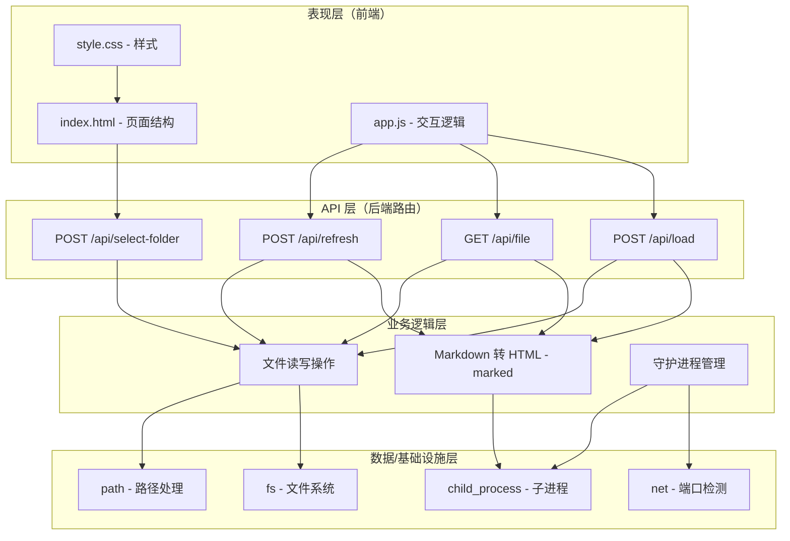
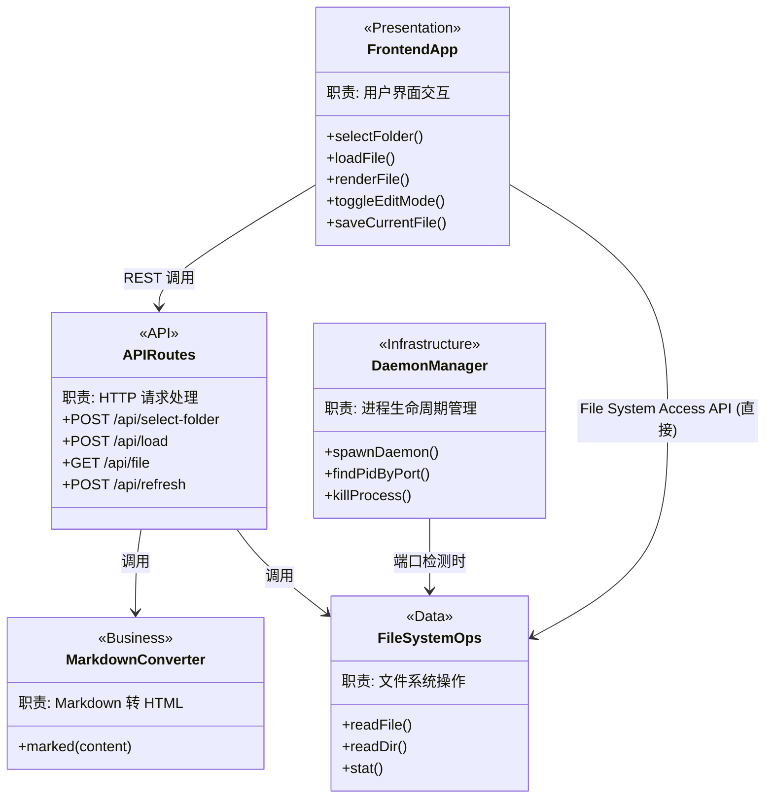

# 仓库架构

> 本文档聚焦于仓库的**分层架构、技术架构和逻辑架构**。

> **文档定位**：
> - 本文档关注"怎么组织"（分层设计、架构模式、类关系）
> - 模块列表和目录结构请参考 [仓库概览](./仓库概览.md)（如不存在则参考本文档"逻辑架构"章节的模块职责表）
> - 外部依赖关系请参考 [仓库依赖](./仓库依赖.md)

## 架构模式识别

### 项目类型

**架构类型**: 单体分层架构

**识别依据**:
- 整个后端集中在单个文件 `md-view/server.js`（350 行），无微服务拆分
- 前端为静态资源目录 `md-view/public/`，由 Express 的 `express.static` 直接托管
- 前后端通过 REST API（`/api/*`）进行通信，属于经典的"静态前端 + API 后端"模式
- 项目定位为本地工具（Markdown 查看器），无需分布式架构

## 分层架构

### 分层设计



### 层级职责说明

| 层级 | 职责 | 主要目录/文件 | 不应该做什么 |
|-----|------|---------|------------|
| **表现层（前端）** | 页面渲染、用户交互、Markdown 实时预览与编辑 | `md-view/public/index.html`, `md-view/public/app.js`, `md-view/public/style.css` | 不包含后端业务逻辑，不直接访问文件系统 |
| **API 层（路由）** | HTTP 请求接收、参数校验、响应返回 | `md-view/server.js` 中的 `app.post`/`app.get` 路由定义 | 不包含复杂的业务规则判断 |
| **业务逻辑层** | Markdown 转换、文件目录扫描、守护进程管理 | `md-view/server.js` 中的路由处理函数和 `main()` 函数 | 不关心 HTTP 协议细节 |
| **数据/基础设施层** | 文件系统读写、路径解析、子进程管理、端口检测 | Node.js 内置模块（`fs`, `path`, `child_process`, `net`, `os`） | 不包含业务判断逻辑 |

### 层间调用规则

- 允许：上层调用下层
- 允许：所有层都可以使用基础设施层（Node.js 内置模块）
- 禁止：下层调用上层
- 禁止：同层内跨职责直接耦合（当前项目中后端逻辑集中在单文件，此规则尚未被严格 enforced）

## 技术架构

### 技术选型

**核心技术栈**:

| 技术类别 | 选型 | 用途 | 使用方式 |
|---------|------|------|---------|
| HTTP 框架 | Express 4.x | Web 服务与路由 | 在 `md-view/server.js:10` 初始化，通过 `app.use` 注册中间件和路由 |
| Markdown 渲染（后端） | marked 12.x | Markdown 转 HTML | 在 `md-view/server.js:6` 引入，通过 `marked(content)` 同步转换 |
| Markdown 渲染（前端） | marked 12.x (CDN) | 前端实时预览 | 在 `md-view/public/index.html:54` 通过 CDN 引入，`md-view/public/app.js` 中调用 `marked.parse()` |
| CSS 主题 | github-markdown-css (CDN) | GitHub 风格 Markdown 样式 | 在 `md-view/public/index.html:10` 通过 CDN 引入 |
| 文件系统 | Node.js fs 模块 | 文件读写和目录扫描 | 同步 API（`readFileSync`, `readdirSync`, `statSync`）用于简单场景 |
| 跨平台支持 | Node.js os 模块 | 操作系统检测 | `md-view/server.js:16` 检测 `win32` 以启用 Windows 专属文件夹对话框 |

### 设计模式应用

#### 守护进程模式

**实现方式**: 自举式进程分离（self-spawning daemon）

**示例** (`md-view/server.js:282-290`):
```javascript
function spawnDaemon() {
  const child = spawn(process.execPath, [__filename], {
    detached: true,
    stdio: 'ignore',
    windowsHide: true,
    env: { ...process.env, [DAEMON_ENV]: '1' }
  });
  child.unref();
}
```

通过环境变量 `MD_VIEW_DAEMON` 区分前台启动器和后台服务进程。前台进程检测端口占用后决定是否 spawn 新的守护进程，实现了"单次启动、后台常驻"的使用体验。

#### 中间件模式

**示例** (`md-view/server.js:13-14`):
```javascript
app.use(express.json());
app.use(express.static('public'));
```

Express 内置中间件链：`express.json()` 解析 JSON 请求体，`express.static('public')` 托管静态前端资源，二者在路由处理前依次执行。

#### 文件系统访问模式（前端 File System Access API）

**实现方式**: 浏览器原生 File System Access API + 后端 REST API 双通道

**示例** (`md-view/public/app.js:208-256`):
```javascript
async function selectFolder() {
  const dirHandle = await window.showDirectoryPicker({ mode: 'readwrite' });
  currentFolderHandle = dirHandle;
  for await (const [name, handle] of dirHandle.entries()) {
    // 扫描 markdown 文件
  }
}
```

前端通过 `showDirectoryPicker` 获取文件夹句柄，直接读取文件内容，绕过后端 API。这种混合架构使得前端具备独立的文件操作能力（编辑、保存），后端仅作为 Markdown 渲染的补充服务。

#### 端口检测与进程管理

**实现方式**: 轮询检测 + 进程查找 + 交互式菜单

**示例** (`md-view/server.js:234-255`):
```javascript
function findPidByPort(port) {
  const cmd = isWindows ? `netstat -ano | findstr :${port}` : `lsof -t -i:${port}`;
  exec(cmd, { encoding: 'utf8' }, (err, stdout) => {
    // 解析 LISTENING 状态的进程 PID
  });
}
```

通过 OS 级别的命令检测端口占用情况，实现了优雅的重启机制。

## 逻辑架构

### 核心模块职责

**模块职责划分**:

| 模块 | 层级 | 核心职责 | 代码位置 |
|-----|------|---------|---------|
| Express 应用初始化 | API 层 | 创建 Express 实例、注册中间件 | `md-view/server.js:10-14` |
| /api/select-folder | API 层 | 调用 PowerShell 打开 Windows 文件夹选择对话框 | `md-view/server.js:19-94` |
| /api/load | API 层 | 加载文件夹、扫描 Markdown 文件、渲染指定文件 | `md-view/server.js:97-168` |
| /api/file | API 层 | 读取单个文件并转换为 HTML | `md-view/server.js:171-196` |
| /api/refresh | API 层 | 重新读取指定文件内容 | `md-view/server.js:199-224` |
| 守护进程管理 | 基础设施层 | 端口检测、进程派生、生命周期管理 | `md-view/server.js:226-349` |
| 前端应用 | 表现层 | UI 交互、文件选择、Markdown 预览与编辑、TOC 生成 | `md-view/public/app.js` |
| 前端样式 | 表现层 | GitHub 风格布局、响应式侧边栏、编辑模式样式 | `md-view/public/style.css` |

### 模块协作关系



### 数据流向

**典型请求的数据流**（通过后端 API）:
```
用户选择文件 → 前端发起 POST /api/load → 后端校验路径
  → fs 读取文件内容 → marked 转换为 HTML → 返回 JSON 响应
  → 前端渲染 HTML 到 contentEl → 生成 TOC 目录
```

**典型请求的数据流**（通过前端 File System Access API）:
```
用户点击"加载文件夹" → 浏览器弹出文件夹选择器
  → 前端遍历目录句柄 → 直接读取 .md 文件内容
  → marked.parse() 前端渲染 → 生成 TOC
```

**编辑保存数据流**:
```
用户点击"编辑" → 切换为 textarea 编辑模式
  → 用户修改内容 → 点击"浏览"触发保存
  → 通过 FileSystemFileHandle.createWritable() 写入磁盘
```

## 架构评估

### 架构优势

**分层清晰**:
- 前后端职责分离明确：前端负责 UI 交互和文件操作（File System Access API），后端负责 Markdown 渲染补充和跨平台兼容
- 依赖方向单一：前端可通过 REST 调用后端，也可直接操作文件系统

**简洁性**:
- 后端集中在单个文件（`md-view/server.js`），无过度工程化，适合本地工具定位
- 前端同样集中在单个文件（`md-view/public/app.js`），便于理解和维护

**可维护性**:
- Express 路由定义直观，每个 API 端点的职责单一
- 前端使用 IIFE（立即执行函数表达式）避免全局命名空间污染

**可扩展性**:
- 中间件机制便于添加横切关注点（如日志、错误处理、CORS）
- File System Access API 的使用使前端具备了独立的文件操作能力，降低了对后端的依赖

### 潜在改进点

⚠️ **后端业务逻辑与路由耦合**:
- 发现位置: `md-view/server.js:97-168`（`/api/load` 路由处理函数）
- 问题: 路由处理函数中直接包含文件扫描、Markdown 转换、路径校验等多层逻辑，未做职责分离
- 建议: 将文件操作和 Markdown 转换抽离为独立的 service 模块

⚠️ **同步文件系统 API 可能阻塞事件循环**:
- 发现位置: `md-view/server.js:118`, `md-view/server.js:153`
- 问题: `fs.readdirSync` 和 `fs.readFileSync` 在大文件夹场景下会阻塞 Node.js 事件循环
- 建议: 对于文件夹扫描和文件读取，考虑使用异步 API（`fs.promises`）配合 async/await

⚠️ **缺乏错误处理中间件**:
- 发现位置: `md-view/server.js` 全局
- 问题: 每个路由独立处理错误，缺少统一的 Express 错误处理中间件
- 建议: 添加 `app.use((err, req, res, next) => {...})` 集中处理异常

⚠️ **路径安全校验不完整**:
- 发现位置: `md-view/server.js:171-196`（`/api/file` 路由）
- 问题: 虽然使用了 `path.resolve`，但未校验请求路径是否在预期目录范围内，存在潜在的路径遍历风险
- 建议: 增加路径白名单或前缀校验，防止访问系统敏感文件

---

> 相关文档**:
> - 模块列表和技术栈详见: [仓库概览](./仓库概览.md)
> - 外部依赖和中间件详见: [仓库依赖](./仓库依赖.md)
> - 数据结构设计详见: [数据结构](./技术知识库/数据结构.md)
> - 代码编写规范详见: [代码编写指南](./技术知识库/代码编写指南.md)
