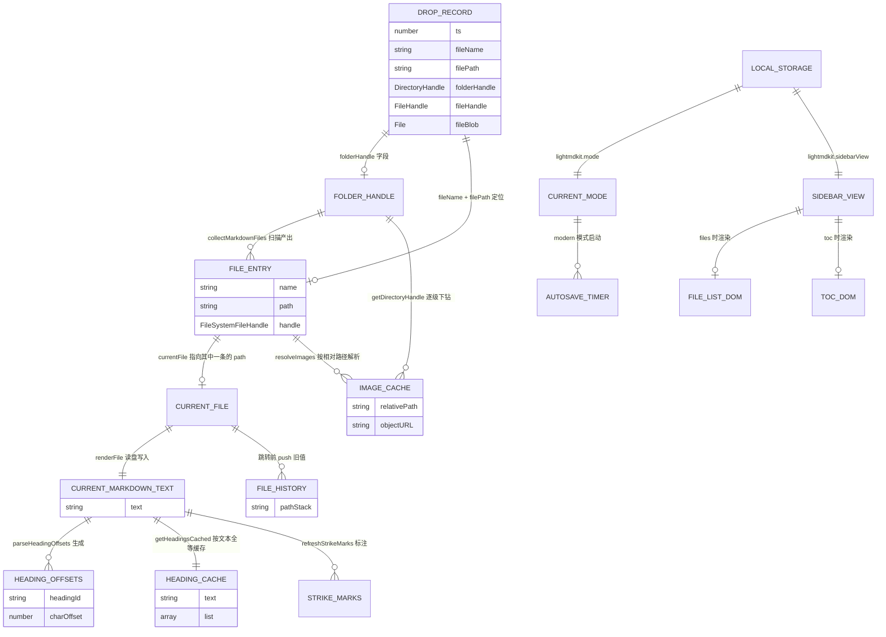

# 数据结构文档

> 本文档从代码仓库中提取，描述 LightMDKit 项目的数据结构设计。
>
> | 项目 | 值 |
> |------|-----|
> | 项目名称 | LightMDKit |
> | 文档版本 | 2026-09-11 工作区代码（已提交为 `f71e683`，分支 `feat/sidebar-file-browser`） |
> | 生成日期 | 2026-09-11 |
> | 分析范围 | `LightMDKit/server.js`、`LightMDKit/public/app.js`、`LightMDKit/public/index.html`、`LightMDKit/public/md-render.js` |
>
> ⚠️ **行号口径说明**：本文档所有行号均以 **2026-09-11 的工作区文件**为准，该状态已提交为 `f71e683`（分支 `feat/sidebar-file-browser`）。`main` 的 `3bbca34` 尚不包含侧边栏文件浏览器、子目录递归扫描等特性（见第 9 章），且 `public/app.js` 行数不同。核对请直接读工作区文件，不要用 `git show 3bbca34:<路径>`。

## 0. 阅读指引

本项目是一个**免安装的本地单页应用 + 无状态 HTTP 服务**，它的"数据结构"分布与常见的数据库应用完全不同：

| 层次 | 是否有数据结构 | 说明 |
|------|---------------|------|
| 数据库 | **无** | 本项目不涉及任何数据库 |
| 中间件 | **无** | 无 Redis / Kafka / MQ / Elasticsearch |
| 服务端内存状态 | **无** | `server.js` 全部是无状态请求-响应，不保存任何会话或缓存 |
| **前端运行时内存状态** | **有（本文档重点）** | `public/app.js` IIFE 顶部的状态变量是全部业务数据的载体 |
| 浏览器持久化 | 有（两处） | `localStorage` 2 个键 + `IndexedDB` 1 库 1 表 |
| 磁盘文件 | 有 | Markdown 文件本身即数据源，通过 File System Access API 直读直写 |

因此本文档第 3 章是核心，第 1、2 章主要用于**澄清本项目不涉及的内容**。

---

## 1. 数据存储系统概览

### 1.1 数据库

**本项目不涉及任何数据库。** 未发现 MySQL、PostgreSQL、SQLite、MongoDB、Elasticsearch 等任何数据库依赖：

- `LightMDKit/package.json` 的 `dependencies` 只有 `express`、`marked` 两个包，无任何数据库驱动或 ORM
- 仓库中不存在 `migrations/`、`db/`、`sql/`、`*.sql`、`*.prisma`、Model/Schema/Entity 文件
- `agent-rules/kb/kb-databases-schema/` 目录在本仓库中不存在

真正的数据源是磁盘上的 Markdown 文件，由浏览器通过 File System Access API 直接读写，服务端不参与文件内容的存取（后端 API 是备用通道，前端当前未调用）。

### 1.2 中间件

**本项目不涉及任何中间件。**

| 中间件类型 | 用途 | 版本要求 | 配置位置 |
|-----------|------|---------|---------|
| Redis | 不涉及 | - | - |
| Kafka | 不涉及 | - | - |
| Pulsar | 不涉及 | - | - |
| Elasticsearch | 不涉及 | - | - |

### 1.3 实际使用的存储设施

| 存储设施 | 用途 | 存放内容 | 代码位置 |
|---------|------|---------|---------|
| 浏览器内存（IIFE 变量） | 全部业务运行态 | 文件清单、当前文件、目录句柄、图片缓存等 | `LightMDKit/public/app.js:2-104` |
| 浏览器 `localStorage` | 界面偏好持久化 | 界面模式、侧边栏视图 | `LightMDKit/public/app.js:42-81` |
| 浏览器 `IndexedDB` | 跨标签页传递文件句柄 | 拖放记录（含 `FileSystemHandle`） | `LightMDKit/public/app.js:1218-1274` |
| 本地文件系统 | 唯一的业务数据源 | `.md` / `.markdown` 文件及其引用的图片 | `LightMDKit/public/app.js:688-727` |
| Node.js `fs` 模块 | 备用读取通道 | 与上面同源的 Markdown 文件 | `LightMDKit/server.js:106-224` |

---

## 2. 服务端数据结构（`LightMDKit/server.js`）

### 2.1 服务端无内存状态

`server.js` **不维护任何跨请求的状态**：没有全局 Map/数组缓存、没有 session、没有定时任务持有数据。每个请求从 `fs` 现读现渲染，响应结束即释放。

唯一的进程级常量与运行参数：

| 常量 | 值 | 说明 | 代码位置 |
|------|-----|------|---------|
| `PORT` | `3456` | HTTP 服务监听端口 | `LightMDKit/server.js:11` |
| `DAEMON_ENV` | `'LIGHTMDKIT_DAEMON'` | 守护进程环境变量名 | `LightMDKit/server.js:227` |
| `isWindows` | `os.platform() === 'win32'` | 控制是否允许弹系统文件夹对话框 | `LightMDKit/server.js:16` |

守护进程启动方式：`main()` 检测端口占用，未被占用时以 `env[DAEMON_ENV]='1'` 派生子进程（`spawnDaemon`），子进程走 `runDaemon()` 真正 `listen`（`LightMDKit/server.js:265-311`）。

### 2.2 API 请求/响应结构

四个接口的完整字段说明与调用示例见 `doc/kb/技术知识库/API索引.md`，此处只列与数据结构相关的部分。

**`POST /api/select-folder`**（`LightMDKit/server.js:19-94`）

| 方向 | 字段 | 类型 | 说明 |
|------|------|------|------|
| 响应 | `path` | string | 用户选中的文件夹绝对路径 |
| 响应 | `cancelled` | boolean | 用户取消时为 `true`（对应 PowerShell 输出的哨兵值 `__CANCELLED__`） |
| 响应 | `error` | string | 失败原因 |

**`POST /api/load`**（`LightMDKit/server.js:97-168`）

| 方向 | 字段 | 类型 | 说明 |
|------|------|------|------|
| 请求 | `folderPath` | string（必填） | 待扫描的目录 |
| 请求 | `filePath` | string（可选） | 指定要加载的文件，缺省取扫描结果的第一个 |
| 响应 | `folderPath` | string | `path.resolve` 后的目录绝对路径 |
| 响应 | `files` | `{ name: string, fullPath: string }[]` | **仅扫描一层**（`fs.readdirSync` 不递归），只收 `.md` / `.markdown` |
| 响应 | `currentFile` | string \| null | 实际加载的文件绝对路径 |
| 响应 | `content` | string | Markdown 原文 |
| 响应 | `html` | string | 渲染后的 HTML |

**`GET /api/file`** 与 **`POST /api/refresh`**（`LightMDKit/server.js:171-224`）

两者的响应结构完全一致：`{ content: string, html: string, path: string }`。区别只是入参位置（查询参数 `path` vs 请求体 `filePath`）。

> **注意差异**：后端 `/api/load` 的 `files[].name` 是**扁平文件名**，而前端 `currentFiles[].path` 是**递归扫描出的相对路径**。两套结构并不通用，前端目前也没有调用后端接口。

---

## 3. 前端运行时数据结构（核心）

全部前端逻辑位于 `LightMDKit/public/app.js` 的单个 IIFE（`LightMDKit/public/app.js:1` ~ `1465`）。状态变量集中声明在 IIFE 顶部（`LightMDKit/public/app.js:24-104`），其余为纯函数——这是本项目最重要的架构约定：**没有状态管理库，状态就是一组闭包变量**。

### 3.1 状态变量总览

| 变量 | 类型 | 初始值 | 生命周期 | 声明位置 |
|------|------|--------|---------|---------|
| `currentFiles` | `FileEntry[]` | `[]` | 加载/刷新文件夹时整体替换 | `LightMDKit/public/app.js:28` |
| `currentFile` | `string \| null` | `null` | 打开文件时写入 | `LightMDKit/public/app.js:30` |
| `currentMarkdownText` | `string` | `''` | 每次读文件 / 编辑器输入时更新 | `LightMDKit/public/app.js:32` |
| `headingOffsets` | `{[id]: number}` | `{}` | 每次读文件重算 | `LightMDKit/public/app.js:34` |
| `headingCache` | `{text, list}` | `{text:null, list:[]}` | 文本变化时整体替换 | `LightMDKit/public/app.js:341` |
| `isEditMode` | `boolean` | `false` | 编辑/浏览切换 | `LightMDKit/public/app.js:40` |
| `currentMode` | `'traditional' \| 'modern'` | 读 localStorage | 全程 | `LightMDKit/public/app.js:43` |
| `sidebarView` | `'files' \| 'toc'` | 读 localStorage | 全程 | `LightMDKit/public/app.js:64` |
| `fileHistory` | `string[]`（栈） | `[]` | 链接跳转时压栈，返回时出栈 | `LightMDKit/public/app.js:97` |
| `currentFolderHandle` | `FileSystemDirectoryHandle \| null` | `null` | 加载文件夹时写入 | `LightMDKit/public/app.js:99` |
| `imageUrlCache` | `Map<string, string>` | `new Map()` | 加载新文件夹时整体清空 | `LightMDKit/public/app.js:101` |
| `lastViewHeadingId` | `string \| null` | `null` | 进入编辑模式前记录 | `LightMDKit/public/app.js:95` |
| `autosaveTimer` | `number \| null` | `null` | 进入/退出编辑模式 | `LightMDKit/public/app.js:92` |
| `cmEditor` | `CodeMirror \| null` | CodeMirror 实例 | 初始化一次 | `LightMDKit/public/app.js:104` |
| `livePreviewTimer` | `number \| null` | `null` | 现代模式防抖 | `LightMDKit/public/app.js:402` |
| `strikeMarks` | `TextMarker[]` | `[]` | 现代模式重绘删除线 | `LightMDKit/public/app.js:417` |
| `isResizing` | `boolean` | `false` | 拖拽侧边栏宽度期间 | `LightMDKit/public/app.js:1181` |
| `dragDepth` | `number` | `0` | 文件拖拽期间（处理子元素 dragenter/leave 计数） | `LightMDKit/public/app.js:1357` |
| `observer` | `IntersectionObserver \| null` | `null` | 重建目录高亮时切换 | `LightMDKit/public/app.js:1443` |

### 3.2 `currentFiles` —— 文件条目数组

```js
// public/app.js:24-28
// { name: string, path: string, handle: FileSystemFileHandle }[]
```

**含义**：当前已加载目录下所有可打开的 Markdown 文件清单，同时驱动侧边栏文件列表与文档内链接跳转。

**字段**：

| 字段 | 类型 | 必填 | 说明 |
|------|------|------|------|
| `name` | string | 是 | 文件名（不含目录），文档内链接 `./xxx.md` 的匹配回退靠它 |
| `path` | string | 是 | **相对当前目录根**的路径，`/` 分隔（如 `业务知识库/核心业务领域.md`），也是 `currentFile` 的取值口径 |
| `handle` | `FileSystemFileHandle` | 条件 | 目录扫描得到；拖入单个文件走 `initFromDropParam` 时用鸭子类型兜底对象 `{ getFile: async () => record.fileBlob }`（`LightMDKit/public/app.js:1417-1419`），无 `createWritable`，故**保存会失败** |

**为什么需要 `path`**：支持递归扫描子目录后，不同子目录可能存在同名文件，`name` 不再唯一，`path` 才是一级主键。`findEntryByPath`（`LightMDKit/public/app.js:182-190`）的三级回退查找体现了这条演进痕迹：

1. 严格 `f.path === path`
2. `f.path === undefined && f.name === path`（兼容只有单个文件的旧结构）
3. `normalizePathForMatch(f.path || f.name) === target`（大小写不敏感、去掉 `./`、反斜杠归一）

**写入者**：
- `collectMarkdownFiles()` 返回（`LightMDKit/public/app.js:224-248`）→ `loadFolderHandle` 赋值（`LightMDKit/public/app.js:739`）
- `refreshCurrentFile()` 重扫后整体替换（`LightMDKit/public/app.js:829`）
- `initFromDropParam()` 构造单文件数组（`LightMDKit/public/app.js:1423`）

**读取者**：`renderFileList`（`535`）、`updateFileCount`（`519`）、`findEntryByPath`（`180-184`）、`matchCurrentFolder`（`1262`）、`refreshCurrentFile` 的增删比对（`812-815`）。

**顺序保证**：`collectMarkdownFiles` 递归收集后调用 `flattenByDirectory`（`LightMDKit/public/app.js:197-219`）按树逐层铺平——某目录自身的文件排完再进子目录。这样渲染分组时同一目录不会被拆成多段、标题不会重复出现。

### 3.3 `currentFile` —— 当前文件相对路径

- **类型**：`string | null`，取值等于某个 `FileEntry.path`（无目录场景下即 `name`）
- **写入**：`loadFolderHandle`（`LightMDKit/public/app.js:753`）、`loadFile`（`773`）、`initFromDropParam`（`1402`）；加载/刷新文件夹时重置为 `null`（`727`）
- **读取**：`saveCurrentFile`（`895-897`，**必须按 path 取 entry**，因为同名文件可能分布在多个子目录）、`refreshCurrentFile`（`815`）、`updateActiveFileItem`（`1133`，与 `item.dataset.path` 比对）、`applySurface`（`942`，`!!currentFile` 决定是否显示编辑器）、文件列表高亮（`585`）

### 3.4 `currentMarkdownText` —— 当前文件原文

- **类型**：`string`
- **写入**：`renderFile`（`LightMDKit/public/app.js:635`，读盘后）、CodeMirror `change` 事件（`139`，每次输入）、`saveCurrentFile`（`908`）、`setMode`（`986`）
- **读取**：`parseHeadingOffsets`（`623`）、`MdRender.renderMarkdown`（`625`、`1009`、`1036`）、`scrollEditorToOffset`（`293`）、目录跳转时的行号换算（`482`、`1065`）、`setMode` 回传统模式重渲染（`1009`）

**一致性约定**：`currentMarkdownText` 是**内存里的权威副本**，CodeMirror 内容通过 `change` 事件单向同步到它，切模式/保存时再由它写回编辑器或磁盘。

### 3.5 `headingOffsets` —— 标题 id → 字符偏移

- **类型**：`{ [headingId: string]: number }`
- **生产**：`parseHeadingOffsets(text)`（`LightMDKit/public/app.js:279-294`）在 `renderFile` 中重算（`623`）
- **id 生成规则**：`slugify(text) || 'heading'`，重复时追加 `-1`、`-2`……（`generateHeadingId`，`263-273`）
- **解析规则**：逐行匹配 `/^(#{1,6})\s+(.*)$/`，`charOffset += line.length + 1`（补回被 `split('\n')` 吃掉的换行符）
- **用途**：把「标题 id」换算成「编辑器里的字符偏移」，再换算成行号做光标定位（`headingOffsets[id] → slice(0,offset).split('\n').length - 1`，见 `482-485`、`1063-1068`、`1075-1077`）

**关键约束**：`parseHeadingOffsets` 与 `extractHeadings`（`316-334`）必须产出**完全同构**的 id 序列（同样的正则、同样的 `generateHeadingId` + 独立 `Set`、同样的顺序遍历），否则现代模式下目录高亮、编辑模式跳转会全部错位。源码中已有注释明示此约定（`LightMDKit/public/app.js:317-319`）。

### 3.6 `headingCache` —— 标题解析结果缓存

```js
// public/app.js:340-347
let headingCache = { text: null, list: [] };
function getHeadingsCached(text) {
  if (headingCache.text !== text) headingCache = { text, list: extractHeadings(text) };
  return headingCache.list;
}
```

| 字段 | 类型 | 说明 |
|------|------|------|
| `text` | string \| null | 缓存对应的原文，作为失效判据（整体替换，不做键级失效） |
| `list` | `{level:number, text:string, offset:number, id:string}[]` | `extractHeadings` 的产物 |

**存在理由**：`cmEditor.getValue()` 是 O(n)，而 `cursorActivity` 触发极其频繁（`LightMDKit/public/app.js:340` 注释）。以原文全等作为缓存键，代价 O(n) 但避免了重复的正则逐行扫描。

**失效方式**：文本一变即整体重建，无显式清理调用。

### 3.7 `fileHistory` —— 浏览历史栈

- **类型**：`string[]`，元素为 `currentFile` 的历史值（用数组 `push` / `pop` 实现 LIFO）
- **压栈点**：`openFileFromList`（`LightMDKit/public/app.js:531`）与文档内链接跳转（`876`），两处都先判 `currentFile && currentFile !== targetPath`
- **出栈点**：返回按钮（`889`）；`updateBackButton`（`883`）以 `length === 0` 控制按钮 `disabled`
- **注意**：加载/刷新文件夹、`loadFile` 直接调用时**不压栈**，所以「返回」只在"点列表/点链接"这类主动跳转后才可用

### 3.8 `currentFolderHandle` —— 目录句柄

- **类型**：`FileSystemDirectoryHandle | null`（`showDirectoryPicker` 的产物）
- **写入**：`loadFolderHandle`（`LightMDKit/public/app.js:733`）；拖入单个文件时显式置 `null`（`1398`）
- **读取与作用**：
  - 刷新时重新扫描（`810`）
  - `renderFile` 沿 `entry.path` 逐级重取句柄，避免句柄级缓存读到旧内容（`616-628`）
  - `resolveImages` 逐级 `getDirectoryHandle` 解析相对图片路径（`694-703`）
  - `matchCurrentFolder` 判断拖入文件是否属于当前目录（`1261`）
  - `updateLoadFolderButton` 决定按钮文案是「加载文件夹...」还是「更换文件夹...」（`511`）
  - 文件列表空态文案区分「空目录」与「未加载」（`543-545`）

> **注意**：`renderFile` 重取句柄时必须沿 `entry.path` 逐级下钻（`LightMDKit/public/app.js:616-628`）。早期版本只传 `entry.name`，子目录文件会取不到句柄而静默回退到 `fileEntry.handle`；更糟的是根目录存在同名文件时 `getFileHandle` 会**成功**返回根目录那个文件，导致读错内容。该问题已修复，改动此段时务必保留「按 `path` 逐级解析 + 任一步失败则回退」这两个要点。

### 3.9 `imageUrlCache` —— 图片 Object URL 缓存

- **类型**：`Map<string, string>`，键 = 归一化后的**相对图片路径**，值 = `URL.createObjectURL(file)` 产物
- **读取**：`resolveImages`（`LightMDKit/public/app.js:704`），命中则直接赋给 `img.src`
- **写入**：未命中时读文件后建 URL 并 `set`（`705-706`）
- **清理**：`clearImageCache`（`LightMDKit/public/app.js:679-684`）遍历 `values()` 逐个 `URL.revokeObjectURL` 再 `clear()`；调用点是 `loadFolderHandle` 开头（`719`）——**换目录时释放上一目录的全部 Object URL**

**路径归一化规则**（`LightMDKit/public/app.js:693-701`）：跳过 `http(s):` / `data:` / `blob:` / `#` / `//` 开头；去掉前导 `./`；按 `[?#]` 截断查询串；`decodeURIComponent` 失败则保持原样。

### 3.10 界面偏好：`currentMode` 与 `sidebarView`

| 变量 | 取值域 | localStorage 键 | 读取函数 | 写入函数 |
|------|--------|----------------|---------|---------|
| `currentMode` | `'traditional'` \| `'modern'` | `lightmdkit.mode` | `loadModePreference`（`LightMDKit/public/app.js:45-52`） | `saveModePreference`（`50-56`） |
| `sidebarView` | `'files'` \| `'toc'` | `lightmdkit.sidebarView` | `loadSidebarView`（`62-69`） | `saveSidebarView`（`71-77`） |

- 键名常量：`MODE_STORAGE_KEY = 'lightmdkit.mode'`（`LightMDKit/public/app.js:42`）、`SIDEBAR_VIEW_KEY = 'lightmdkit.sidebarView'`（`59`）
- **容错约定**：四个函数都用 `try/catch` 包裹——隐私模式或禁用存储时 `localStorage` 会抛异常，读取回退到默认值（`'traditional'` / `'files'`），写入失败静默忽略
- **校验约定**：只做白名单判断（`=== 'modern' ? 'modern' : 'traditional'`），非法值一律回退默认，不做类型转换
- `currentMode` 与 `isEditMode` 是正交的两维：`modern` 是"常驻编辑态"（`setMode` 内强制 `isEditMode = true` 并 `startAutosave()`，`LightMDKit/public/app.js:1024-1025`），而 `traditional` 下 `isEditMode` 由编辑按钮自由切换
- **降级路径**：启动时若 `currentMode === 'modern'` 但 `cmEditor` 初始化失败，则强制退回 `'traditional'`（`LightMDKit/public/app.js:1471-1479`）

### 3.11 自动保存：`autosaveTimer` 与 `AUTOSAVE_INTERVAL_MS`

| 项 | 值 | 位置 |
|----|-----|------|
| `AUTOSAVE_INTERVAL_MS` | `3000`（3 秒） | `LightMDKit/public/app.js:93` |
| `autosaveTimer` | `setInterval` 返回的 id，`null` 表示未启动 | `LightMDKit/public/app.js:92` |

- `startAutosave`（`LightMDKit/public/app.js:939-950`）有**幂等守卫**：`if (autosaveTimer) return`
- 定时回调内先判 `isEditMode`，再以 `silent = true` 调 `saveCurrentFile`
- **自停逻辑**：保存抛异常时调用 `stopAutosave()`，避免反复弹错误提示（`923-926`）
- `stopAutosave`（`930-935`）`clearInterval` 后置 `null`
- 启停时机：`toggleEditMode` 进入编辑（`1060`）/ 退出编辑（`1029`）；`setMode` 切现代（`1003`）/ 切传统（`1006`）；`loadFile` 传统模式下切文件时停止并退出编辑（`776-778`）

### 3.12 递归扫描的边界常量

| 常量 | 值 | 含义 | 位置 |
|------|-----|------|------|
| `SCAN_MAX_DEPTH` | `6` | 最大递归深度，`depth > 6` 即返回 | `LightMDKit/public/app.js:85` |
| `SCAN_MAX_FILES` | `3000` | 最多收集文件数，达到即逐层 `break` | `LightMDKit/public/app.js:86` |
| `SCAN_SKIP_DIRS` | `Set{node_modules, .git, .svn, .hg, .idea, .vscode, dist, build}` | 直接跳过的目录名 | `LightMDKit/public/app.js:88-90` |

**设计取舍**（源码注释 `LightMDKit/public/app.js:83-84` 明示）：超过上限时**停止深入而非报错**——已扫到的文件照常可用，避免误选巨型目录时卡死界面。`dist` 同时被用来避开 `pkg` 打包产物这类噪声。

`collectMarkdownFiles` 先 `for await...of dirHandle.entries()` 收齐再 `localeCompare` 排序（`LightMDKit/public/app.js:227-232`），因为 `entries()` 的顺序由系统决定，排序后才能保证扫描结果稳定。

### 3.13 派生的临时状态

这些变量生命周期短、作用域窄，但同样是理解运行时行为的一环：

| 变量 | 类型 | 作用 | 位置 |
|------|------|------|------|
| `cmEditor` | CodeMirror 实例 | 编辑器主体；初始化失败时为 `null`，全部代码路径都有 textarea 回退分支 | `LightMDKit/public/app.js:104-155` |
| `livePreviewTimer` | 定时器 id | 现代模式编辑时对「重建目录 + 重绘删除线」做 300ms 防抖 | `LightMDKit/public/app.js:402-412` |
| `REAL_STRIKE_RE` | 正则字面量 | 只认 `~~...~~` 的双波浪线删除线 | `LightMDKit/public/app.js:416` |
| `strikeMarks` | `TextMarker[]` | 每行删除线拆成 3 个 `markText` 区间（内容 + 前后各一对 `~~`） | `LightMDKit/public/app.js:417`、`420-444` |
| `lastViewHeadingId` | string \| null | 进入编辑模式前记录视口最上方的 heading id，回浏览态时 `scrollIntoView` 还原位置 | `LightMDKit/public/app.js:95`、`1043-1048`、`1052-1053` |
| `isResizing` | boolean | 侧边栏拖拽期间标记，`mousemove` / `mouseup` 早退用 | `LightMDKit/public/app.js:1181-1211` |
| `dragDepth` | number | 拖拽计数器，处理子元素反复触发 `dragenter` / `dragleave` 的情况 | `LightMDKit/public/app.js:1357-1373` |
| `observer` | IntersectionObserver | 传统模式下按滚动位置高亮目录项；重建前先 `disconnect` | `LightMDKit/public/app.js:1443-1459` |
| `isEditMode` | boolean | 编辑态开关，被 `applySurface` 用于统一决定三种界面形态的显隐 | `LightMDKit/public/app.js:40`、`939-973` |

---

## 4. 持久化数据结构

### 4.1 localStorage

| 键名 | 数据类型 | 取值 | 写入位置 | 读取位置 |
|------|---------|------|---------|---------|
| `lightmdkit.mode` | String | `'traditional'` \| `'modern'` | `saveModePreference`（`LightMDKit/public/app.js:56`） | `loadModePreference`（`43`） |
| `lightmdkit.sidebarView` | String | `'files'` \| `'toc'` | `saveSidebarView`（`73`） | `loadSidebarView`（`64`） |

- **无 TTL**，永久保留直到用户清空站点数据
- 两个键都只存字符串枚举，不存 JSON，不需要 `JSON.parse`
- 写入前已由 `setMode` / `setSidebarView` 把值规范化过（白名单判断）
- 命名规范：`lightmdkit.` 前缀 + camelCase 子键

### 4.2 IndexedDB —— 拖放句柄传递

拖放打开新标签页时，`FileSystemHandle` 无法通过 URL 传递，改用 IndexedDB 做中转（`FileSystemHandle` 支持结构化克隆，可以整体存入）。

**库结构**（`LightMDKit/public/app.js:1218-1233`）：

| 项 | 值 | 位置 |
|----|-----|------|
| 数据库名 `DROP_DB_NAME` | `lightmdkit` | `LightMDKit/public/app.js:1218` |
| 版本 | `1` | `LightMDKit/public/app.js:1224` |
| 对象仓库 `DROP_STORE` | `drops` | `LightMDKit/public/app.js:1219` |
| 主键 | 外置键（`store.put(value, key)`，非 `keyPath`） | `LightMDKit/public/app.js:1239` |
| 索引 | 无 | - |
| 记录 TTL `DROP_TTL_MS` | `24 * 60 * 60 * 1000`（24 小时） | `LightMDKit/public/app.js:1220` |

**主键生成**（`openDropInNewTab`，`LightMDKit/public/app.js:1305-1307`）：优先 `crypto.randomUUID()`，不可用时退化为 `String(Date.now()) + '-' + Math.random().toString(16).slice(2)`。主键经 `encodeURIComponent` 拼进 URL：`location.pathname + '?drop=' + encodeURIComponent(id)`（`1288`）。

**值（记录）结构** —— 由 `handleDroppedItems` 组装（`LightMDKit/public/app.js:1340-1346`）：

| 字段 | 类型 | 必填 | 说明 |
|------|------|------|------|
| `folderHandle` | `FileSystemDirectoryHandle` \| null | 条件 | 有值时新标签页加载整个目录 |
| `fileName` | string | 条件 | 拖入单个文件时必填；拖入文件夹时缺失 |
| `filePath` | string \| null | 否 | 相对路径，由 `matchCurrentFolder` 命中当前已加载目录时给出，用于定位到子目录 |
| `fileHandle` | `FileSystemFileHandle` \| null | 条件 | `item.getAsFileSystemHandle()` 成功时 |
| `fileBlob` | `File` \| null | 条件 | 拿不到句柄时的兜底（`handle ? null : file`），与 `fileHandle` 互斥 |
| `ts` | number | 是 | `Date.now()`，写入前由 `openDropInNewTab` 补上（`1286`） |

**两种记录形态**：

```js
// 形态 A：拖入文件夹（或文件命中当前目录）—— 走目录句柄
{ folderHandle: FileSystemDirectoryHandle, fileName: "a.md", filePath: "sub/a.md",
  fileHandle: FileSystemFileHandle, fileBlob: null, folderHandle: <同上>, ts: 1757... }

// 形态 B：拖入单个文件且不在当前目录 —— 只有文件句柄或 Blob
{ fileName: "a.md", filePath: null, fileHandle: FileSystemFileHandle,
  fileBlob: null, folderHandle: null, ts: 1757... }
```

**过期清理**：`idbPurgeExpired`（`LightMDKit/public/app.js:1255-1274`）用游标全表扫描，`!v || !v.ts || now - v.ts > DROP_TTL_MS` 即 `cursor.delete()`。启动时调用一次（`1463`）。注意 `tx.onerror` 也走 `resolve`（`1249`），清理失败不影响主流程。TTL 24 小时远长于实际需要——注释说明真实原因是**句柄权限只随浏览器会话保留**（`LightMDKit/public/app.js:1254`）。

**读写封装**：`openDropDb`（`1200`）/ `idbPut`（`1213`）/ `idbGet`（`1223`），每个操作独立开库、事务结束即 `db.close()`，不保持长连接。

---

## 5. DOM 元素 ID 清单

来源：`LightMDKit/public/index.html`。JS 侧的引用变量统一在 `LightMDKit/public/app.js:2-22` 声明。

### 5.1 缓存为模块级变量的元素

| HTML 元素 | 标签 / 类型 | id / 选择器 | JS 变量 | index.html | app.js |
|-----------|------------|------------|---------|-----------|--------|
| 目录名标签 | `<span>` | `#folder-label` | `folderLabel` | `:25` | `:3` |
| 新标签页按钮 | `<button>` | `#btn-new-tab` | `btnNewTab` | `:28` | `:13` |
| 返回按钮 | `<button>` | `#btn-back` | `btnBack` | `:29` | `:12` |
| 刷新按钮 | `<button>` | `#btn-refresh` | `btnRefresh` | `:30` | `:2` |
| 编辑/浏览按钮 | `<button>` | `#btn-edit` | `btnEdit` | `:31` | `:10` |
| 模式切换按钮 | `<button>` | `#btn-mode` | `btnMode` | `:32` | `:16` |
| 状态栏 | `<span>` | `#status` | `statusEl` | `:33` | `:5` |
| 侧边栏 | `<aside>` | `.sidebar` | `sidebar` | `:38` | `:9` |
| 拖拽调整宽度手柄 | `<div>` | `.resize-handle` | `resizeHandle` | `:39` | `:14` |
| 侧边栏折叠按钮 | `<button>` | `#btn-toggle-toc` | `btnToggleToc` | `:42` | `:8` |
| 加载文件夹按钮 | `<button>` | `#btn-load-folder` | `btnLoadFolder` | `:45` | `:4` |
| 视图切换：文件列表 | `<button>` | `#btn-view-files` | `btnViewFiles` | `:48` | `:17` |
| 视图切换：目录 | `<button>` | `#btn-view-toc` | `btnViewToc` | `:49` | `:18` |
| 文件列表面板 | `<section>` | `#file-panel` | `filePanel` | `:52` | `:19` |
| 文件过滤框 | `<input type="search">` | `#file-filter` | `fileFilter` | `:54` | `:22` |
| 文件列表容器 | `<nav>` | `#file-list` | `fileListEl` | `:60` | `:21` |
| 目录面板 | `<section>` | `#toc-panel` | `tocPanel` | `:64` | `:20` |
| 目录容器 | `<nav>` | `#toc` | `tocEl` | `:65` | `:6` |
| 内容渲染区 | `<article>` | `#content` | `contentEl` | `:74` | `:7` |
| 编辑器 textarea | `<textarea>` | `#editor` | `editorEl` | `:79` | `:11` |
| 拖放遮罩层 | `<div>` | `#drop-overlay` | `dropOverlay` | `:85` | `:15` |

### 5.2 未缓存、按需查询的元素

| HTML 元素 | 选择器 | 查询方式 | 位置 |
|-----------|--------|---------|------|
| 文件计数 | `#file-count` | `document.getElementById('file-count')`，在 `updateFileCount()` 内部每次现查 | `index.html:58` → `app.js:518` |
| 内容滚动容器 | `.content-wrapper` | `document.querySelector`，用于取视口基准 / IntersectionObserver root | `index.html:72` → `app.js:302`、`1432` |
| 内容滚动内层 | `.content-scroll` | 仅 CSS 使用，JS 未引用 | `index.html:73` |

> **注意**：顶部工具栏的**文件下拉框已被移除**，目录选择改由侧边栏的 `#btn-load-folder` 承担（`index.html:44-46`）。`README.md` 中"因此不再需要顶部的文件下拉框"即指此事。`app.js` 中已无任何 `<select>` 相关引用。

### 5.3 外部 CDN 脚本引入

| 库 | 版本 | 引入位置 | 暴露的全局 |
|----|------|---------|-----------|
| CodeMirror | 5 (`codemirror@5`) | `index.html:89-93` | `CodeMirror` |
| Mermaid | 11 | `index.html:94` | `mermaid` |
| marked | 12 | `index.html:95` | `marked` |
| MdRender（本地） | `?v=4` | `index.html:96` → `public/md-render.js` | `MdRender` |

`md-render.js` 是同名 UMD 模块，浏览器端挂 `root.MdRender`，Node 端 `module.exports`（`LightMDKit/public/md-render.js:1-6`），因此 `LightMDKit/server.js:7` 与 `app.js:624` 共用同一份渲染逻辑。

---

## 6. 数据关系图

### 6.1 前端运行时对象关系



### 6.2 关系说明

| 关系 | 类型 | 说明 |
|------|------|------|
| `currentFolderHandle` → `currentFiles` | 一对多 | 扫描结果；换目录时整体替换 |
| `currentFiles` → `currentFile` | 多对一 | `currentFile` 是某个 `entry.path` 的值拷贝，不是对象引用（`path` 是唯一标识） |
| `currentFile` → `currentMarkdownText` | 一对一 | `renderFile` 中 `currentFile` 先于文本更新 |
| `currentMarkdownText` → `headingOffsets` | 一对多 | 每次读盘全量重算，不做增量 |
| `currentMarkdownText` → `headingCache` | 一对一 | 以文本全等为失效条件；与 `headingOffsets` 是**两条独立生产线**，靠同构 id 生成规则对齐 |
| `currentFolderHandle` / `currentMarkdownText` → `imageUrlCache` | 一对多 | 键为相对路径，换目录时整体 revoke 并清空 |
| `currentFile` → `fileHistory` | 历史序列 | 只存路径字符串，不存句柄；跳转前压栈 |
| `drops` 记录 → 新标签页 | 跨进程/跨页 | 经 IndexedDB 传递，`ts` 控制 24h 过期 |

---

## 7. 数据流向

### 7.1 链路一：点击「加载文件夹」→ 渲染文档

```
用户点击 #btn-load-folder
  └─ selectFolder()                                    app.js:746
     ├─ 检测 window.showDirectoryPicker 是否存在       app.js:747  （不支持则提示用 Chrome/Edge）
     ├─ await window.showDirectoryPicker({ mode:'readwrite' })  app.js:753
     └─ await loadFolderHandle(dirHandle)              app.js:754
        ├─ clearImageCache()                           app.js:719  （revoke 旧目录的全部 Object URL）
        ├─ currentFolderHandle = dirHandle             app.js:720
        ├─ folderLabel.textContent = dirHandle.name    app.js:721
        ├─ files = await collectMarkdownFiles(dirHandle)  app.js:724
        │    └─ 递归 entries() → 过滤 SCAN_SKIP_DIRS → 只收 .md/.markdown
        │        深度 > SCAN_MAX_DEPTH 或数量 ≥ SCAN_MAX_FILES 即停
        │        收尾调 flattenByDirectory() 按树逐层铺平        app.js:242
        ├─ currentFiles = files；currentFile = null    app.js:726-727
        ├─ updateLoadFolderButton()（文案变「更换文件夹...」）app.js:728
        ├─ await renderFileList()                      app.js:729
        │    └─ 读 currentFiles + fileFilter.value → 建 DOM（目录分组 + 按钮项）
        ├─ 若 files 为空 → showEmptyState + setStatus 并返回   app.js:731-735
        ├─ target = findEntryByPath(preferredFileName) || files[0]  app.js:739
        ├─ currentFile = target.path                   app.js:740
        └─ await renderFile(target)                    app.js:741
           ├─ 沿 entry.path 逐级 getDirectoryHandle 重取句柄（失败则回退）app.js:616-628
           ├─ handle.getFile() → file.text()           app.js:620-621
           ├─ currentMarkdownText = text               app.js:622
           ├─ headingOffsets = parseHeadingOffsets(text)  app.js:623
           ├─ contentEl.innerHTML = MdRender.renderMarkdown(text, marked)  app.js:624-625
           ├─ [传统模式] await resolveImages()          app.js:628
           │    └─ 相对路径 → imageUrlCache 查/建 Object URL → 覆写 img.src
           ├─ applySurface()  统一三种界面形态显隐       app.js:648
           ├─ renderToc()     守卫：仅 sidebarView==='toc' 时重建  app.js:649
           ├─ updateActiveFileItem()  只切高亮不重建列表  app.js:651
           └─ renderMermaid() [传统模式]                app.js:652
```

**设计要点**：`loadFolderHandle(dirHandle, preferredFileName)` 同时服务手动选择与拖放两个入口（`LightMDKit/public/app.js:729-730` 注释），保证两处扫描口径一致。`preferredFileName` 既可以是相对路径（文件列表/拖放传入），也可以只是文件名（旧调用），由 `findEntryByPath` 的三级回退兼容。

### 7.2 链路二：编辑保存

```
进入编辑
  ├─ [按钮] toggleEditMode()                           app.js:1020
  │    ├─ 传统模式守卫（modern 直接 return）            app.js:1022
  │    ├─ getTopVisibleHeadingId() → lastViewHeadingId  app.js:1052-1053
  │    ├─ cmEditor.setValue(currentMarkdownText)        app.js:1055
  │    ├─ isEditMode = true；applySurface()；startAutosave()  app.js:1058-1060
  │    └─ 按 headingOffsets[topHeadingId] 定位光标        app.js:1063-1071
  └─ [模式] setMode('modern')                          app.js:976
       ├─ 有未保存编辑则先 saveCurrentFile(true)         app.js:985-992
       ├─ currentMode = 'modern'；saveModePreference()   app.js:994-995
       ├─ isEditMode = true；startAutosave()             app.js:1002-1003
       └─ applySurface() 切到常驻编辑态                   app.js:1014

编辑中
  ├─ cmEditor 'change' 事件                            app.js:138-141
  │    ├─ currentMarkdownText = cmEditor.getValue()
  │    └─ scheduleLivePreviewRefresh()  300ms 防抖 → renderToc() + refreshStrikeMarks()
  ├─ cmEditor 'cursorActivity'（仅现代模式）            app.js:144-147
  │    └─ updateActiveTocItemByCursor()  按光标位置高亮目录
  └─ autosaveTimer 每 3000ms 触发                       app.js:919-927
       └─ if (!isEditMode) return；saveCurrentFile(true)
            └─ 失败 → stopAutosave()（避免反复报错）

落盘 saveCurrentFile(silent)                           app.js:894
  ├─ entry = findEntryByPath(currentFile)   按 path 取，非 name  app.js:897
  ├─ 校验 entry.handle.createWritable 存在，否则抛「来源不支持写回保存」 app.js:899-903
  ├─ writable = await entry.handle.createWritable()    app.js:905
  ├─ writable.write(cmEditor ? getValue() : editorEl.value)  app.js:906
  ├─ writable.close()                                  app.js:907
  └─ currentMarkdownText 与编辑器回同步                  app.js:908
```

**退出编辑**：`toggleEditMode` 的 `isEditMode === true` 分支（`LightMDKit/public/app.js:1049-1070`）先 `stopAutosave()` 再 `await saveCurrentFile()`；保存失败（如拖入的单文件无可写句柄）**不阻止切回浏览态**，错误已由 `saveCurrentFile` 提示（`1032-1035` 注释），改用内存中的 `currentMarkdownText` 重新渲染。

### 7.3 链路三：拖放打开新标签页

```
用户拖入文件/文件夹
  ├─ document dragenter  → hasDraggedFiles() 计数 + 显示 #drop-overlay   app.js:1336-1341
  ├─ document dragover   → 仅文件拖拽时 preventDefault（放行 drop）        app.js:1343-1345
  ├─ document dragleave  → dragDepth-- ；归零才隐藏遮罩                  app.js:1346-1352
  └─ document drop                                                      app.js:1353
       └─ handleDroppedItems(e.dataTransfer)                            app.js:1293
          └─ 遍历 dataTransfer.items（并行 Promise.all）                  app.js:1296-1329
             ├─ item.getAsFileSystemHandle()                            app.js:1300-1306
             ├─【目录】openDropInNewTab({ folderHandle })                app.js:1308-1312
             └─【文件】isMarkdownName 过滤 → matchCurrentFolder(handle)  app.js:1313-1317
                  ├─ 命中（遍历 currentFiles 用 handle.isSameEntry 比对）
                  │    → matchedPath = f.path                            app.js:1264
                  └─ record = { fileName, filePath, fileHandle,
                                fileBlob, folderHandle }                 app.js:1318-1324
                  → openDropInNewTab(record)

openDropInNewTab(record)                                                app.js:1282
  ├─ id = crypto.randomUUID()（无则时间戳+随机数）                        app.js:1283-1285
  ├─ record.ts = Date.now()                                             app.js:1286
  ├─ await idbPut(id, record)   → IndexedDB: lightmdkit / drops         app.js:1287
  │    （FileSystemHandle 支持结构化克隆，可整体入库）
  ├─ url = location.pathname + '?drop=' + encodeURIComponent(id)         app.js:1288
  └─ window.open(url, '_blank')                                          app.js:1289
       └─ 被拦截 → showNewTabLink(url) 在状态栏给可点击链接兜底           app.js:1270-1280

新标签页启动                                                        app.js:1464
  └─ initFromDropParam()                                                app.js:1367
     ├─ dropId = new URLSearchParams(location.search).get('drop')       app.js:1368
     ├─ record = await idbGet(dropId)                                   app.js:1373
     ├─ 取不到 → showEmptyState('拖放数据不存在或已过期...')                app.js:1378
     ├─【分支 A】record.folderHandle 存在                                 app.js:1383
     │    └─ await loadFolderHandle(record.folderHandle,
     │           record.filePath || record.fileName)   ← 复用链路一      app.js:1386
     │       并改写 document.title / setStatus
     └─【分支 B】只有 fileHandle / fileBlob                              app.js:1393-1409
          ├─ handle = record.fileHandle || { getFile: async () => record.fileBlob }
          ├─ currentFolderHandle = null
          ├─ currentFiles = [{ name: record.fileName,
          │                    path: record.fileName,   ← 单文件时 path 即 name
          │                    handle }]                  app.js:1401
          ├─ currentFile = record.fileName
          ├─ renderFileList() → folderLabel 标注浏览器安全限制说明
          └─ renderFile(currentFiles[0])
     └─ 收尾 setStatus 提示
```

**为何需要 IndexedDB**：`FileSystemHandle` 无法序列化进 URL；浏览器安全模型下，拖入的"文件"也拿不到其父目录句柄。因此只有当文件 `isSameEntry` 命中当前已加载目录（`LightMDKit/public/app.js:1280-1281` 注释说明）或直接拖入文件夹时，新标签页才能拿到目录句柄；否则降级为分支 B 只打开单个文件。

**过期清理**：每次页面启动调用 `idbPurgeExpired()`（`LightMDKit/public/app.js:1485`），游标扫描删除 `ts` 缺失或超过 24 小时的记录。

---

## 8. 数据结构设计规范

### 8.1 实际使用的命名规范

从代码中实际观察到的约定（非外部强加）：

| 对象 | 规范 | 实例 |
|------|------|------|
| JS 变量 | 小驼峰 `camelCase` | `currentFiles`、`currentFolderHandle`、`imageUrlCache` |
| 常量 | 全大写下划线 `SCREAMING_SNAKE_CASE` | `SCAN_MAX_DEPTH`、`AUTOSAVE_INTERVAL_MS`、`DROP_TTL_MS` |
| DOM 引用变量 | `btnXxx` / `xxxEl` 后缀区分按钮与容器 | `btnRefresh`、`contentEl`、`fileListEl`、`statusEl` |
| DOM 元素 id | 短横线 `kebab-case`，动词前缀 | `btn-*`、`file-*`、`toc-*` |
| 函数 | 动词开头，`handle*` 处理事件、`render*` 只读渲染、`update*` 局部更新 | `handleDroppedItems`、`renderFileList`、`updateActiveFileItem` |
| `FileEntry` 字段 | 全小写单数 | `name`、`path`、`handle` |
| localStorage 键 | `lightmdkit.` 前缀 + camelCase | `lightmdkit.mode`、`lightmdkit.sidebarView` |
| IndexedDB 库/表 | 全小写、名词复数 | 库 `lightmdkit`、表 `drops` |
| CSS 类 | 短横线，`file-*` / `toc-*` 前缀对应模块 | `file-item`、`toc-item`、`file-dir` |

### 8.2 查找策略（对应"索引策略"）

本项目没有数据库索引，取而代之的是内存中的查找与匹配策略：

| 查找目标 | 策略 | 复杂度 | 位置 |
|---------|------|--------|------|
| 按路径找文件 | `currentFiles.find(f => f.path === path)` 严格匹配 | O(n) | `LightMDKit/public/app.js:184` |
| 按路径找文件（回退 1） | `f.path === undefined && f.name === path`（兼容无 path 的旧结构） | O(n) | `LightMDKit/public/app.js:187` |
| 按路径找文件（回退 2） | `normalizePathForMatch` 归一后比对（大小写不敏感、去 `./`、反斜杠转 `/`） | O(n) | `LightMDKit/public/app.js:188`、`172-174` |
| 图片缓存 | `Map.get(rel)`，键为归一化相对路径 | O(1) | `LightMDKit/public/app.js:704` |
| 标题偏移 | 对象属性直取 `headingOffsets[id]` | O(1) | `LightMDKit/public/app.js:482`、`1063` |
| 标题解析结果 | `headingCache.text !== text` 全等判据，整体替换 | O(n) 比较，省一次全量解析 | `LightMDKit/public/app.js:343` |
| 拖入文件归属判断 | 遍历 `currentFiles` 逐个 `handle.isSameEntry()`（异步） | O(n) | `LightMDKit/public/app.js:1284-1286` |
| 标题 id 去重 | 每次解析新建 `Set`（`usedIds`），冲突追加 `-1`、`-2` | O(1) 摊还 | `LightMDKit/public/app.js:267-277` |
| 目录扫描排序 | 先收齐数组再 `localeCompare`，保证跨平台顺序稳定 | O(n log n) | `LightMDKit/public/app.js:232` |

**设计原则**：
- 以**严格匹配为主、宽松回退为辅**——先 `path` 精确匹配，再逐级放宽到归一化比较，保证旧数据和用户手写的 `./sub/a.md`、`sub\a.md` 都能命中
- 跨路径比较统一收口到 `normalizePathForMatch`，不散落在各处
- 高频读取用缓存（`imageUrlCache` / `headingCache`），低频写入用全量重建，不做增量维护

### 8.3 生命周期与过期

| 数据 | 生命周期终点 | 触发方式 |
|------|------------|---------|
| `currentFiles` / `currentFolderHandle` | 换目录或刷新 | 整体替换 |
| `imageUrlCache` | 换目录 | `clearImageCache` 显式 revoke |
| `headingCache` | 原文变化 | 懒失效（下次 `getHeadingsCached` 时替换） |
| `strikeMarks` | 离开现代模式 | `applySurface` 调 `clearStrikeMarks` |
| `headingOffsets` | 每次读文件 | 全量重算 |
| `fileHistory` | 会话结束 | 无持久化 |
| `autosaveTimer` | 退出编辑 / 保存失败 / 页面关闭 | `stopAutosave` |
| `livePreviewTimer` | 300ms 后自清 | `setTimeout` 回调内置 `null` |
| `lightmdkit.mode` / `lightmdkit.sidebarView` | 用户清空站点数据 | 无 TTL |
| `drops` 记录 | 写入后 24 小时 | 页面启动时 `idbPurgeExpired` 游标删除 |

### 8.4 空值与降级约定

代码中反复出现的防御模式，可作为后续扩展的模板：

- **无目录时**：`currentFolderHandle === null` → `renderFile` 跳过重取句柄（`621`）、`resolveImages` 直接 return（`689`）、`refreshCurrentFile` 跳过重扫只重读文件（`807`）
- **无句柄时**：拖入的单文件用鸭子类型对象 `{ getFile: async () => record.fileBlob }` 兜底（`1395-1397`），并让 `path` 等于 `name` 以保持"path 唯一标识"这条不变量（`1399-1400` 注释）
- **编辑器不可用时**：`cmEditor` 为 `null` 时所有分支都回退到 `editorEl`（textarea），现代模式则直接禁用（`979-982`、`1453-1456`）
- **存储不可用时**：`localStorage` / `IndexedDB` 访问全部包在 `try/catch` 中，失败只降级不中断

---

## 9. 数据结构变更记录

> 本项目无数据库迁移文件。以下变更记录从 git 提交历史与工作区比对中提取，记录**数据结构层面的演进**（字段增删、状态变量引入/移除）。
>
> ⚠️ **重要前提**：`public/app.js`、`public/index.html`、`public/style.css` 的侧边栏相关改动曾长期只存在于工作区。它们现已在提交 `f71e683`（分支 `feat/sidebar-file-browser`）中入库，而 `main` 的 `3bbca34` 仍不含这些结构。下表「状态」列标明每条变更落在哪个提交。

| 提交 | 相对时间 | 变更类型 | 变更内容 | 影响范围 | 状态 |
|------|---------|---------|---------|---------|------|
| `3bbca34` | HEAD | 新增状态 | 引入 `currentMode` + `lightmdkit.mode`；新增 `headingCache`、`livePreviewTimer`、`REAL_STRIKE_RE`、`strikeMarks`；`strikeMarks` 用于修正 `~` 误判删除线 | `public/app.js` | 已提交 |
| `ea5d738` | 次新 | 新增状态 | 引入 `autosaveTimer` 与 `AUTOSAVE_INTERVAL_MS = 3000`；项目更名 LightMDKit | `public/app.js` | 已提交 |
| `32254ae` | 较早 | 新增存储 | 引入 IndexedDB（库 `lightmdkit` / 表 `drops`）及记录结构 `{folderHandle, fileName, filePath, fileHandle, fileBlob, ts}`、`DROP_TTL_MS`；引入 `matchCurrentFolder` 用的 `handle.isSameEntry` 比对 | `LightMDKit/public/app.js:1218-1274` | 已提交 |
| `4aeacad` | 较早 | 逻辑修正 | 「拖入单个文件后点刷新」分支：`refreshCurrentFile` 增加 `currentFolderHandle === null` 的短路路径 | `LightMDKit/public/app.js:807-819` | 已提交 |
| `b2d0b9d` | 较早 | 字段增补 | 引入「新 tab 页」按钮（`#btn-new-tab`）与 `btnNewTab` 变量；Windows 打包脚本 | `public/index.html`、`scripts/` | 已提交 |
| 早期提交 | 最早 | 初始结构 | 建立 IIFE 内状态变量约定（`currentFiles` / `currentFile` / `currentMarkdownText` / `headingOffsets`） | `public/app.js` | 已提交 |
| `f71e683` | 最新 | **结构调整** | `FileEntry` 从扁平 `{name, handle}` 扩展为 `{name, path, handle}`，`path` 成为跨子目录的唯一标识；配套引入 `flattenByDirectory`、`normalizePathForMatch`、`findEntryByPath` | `LightMDKit/public/app.js:176-248` | 已提交 |
| `f71e683` | 最新 | **新增状态** | 引入 `sidebarView` + `lightmdkit.sidebarView`、`fileFilter` 过滤、`SCAN_MAX_DEPTH` / `SCAN_MAX_FILES` / `SCAN_SKIP_DIRS` 递归边界 | `LightMDKit/public/app.js:63-90` | 已提交 |
| `f71e683` | 最新 | **界面重构** | 移除顶部工具栏的文件下拉框，改由侧边栏 `#btn-load-folder` 承担目录选择；新增 `#btn-view-files` / `#btn-view-toc` 视图切换 | `public/index.html`、`public/style.css` | 已提交 |
| `f71e683` | 最新 | **缺陷修复** | `renderFile` 重取句柄改为沿 `entry.path` 逐级下钻；补 `let renderToc;` 声明消除隐式全局；链接拦截处 `decodeURIComponent` 加 `try/catch` | `LightMDKit/public/app.js:38`、`616-628`、`877-887` | 已提交 |

**验证方式**（可复现）：

```bash
git show 3bbca34:public/app.js | grep -c "flattenByDirectory"   # → 0（3bbca34 不含侧边栏功能）
git show 3bbca34:public/app.js | wc -l                          # → 1223（工作区现已增至 1488）
git diff --stat 3bbca34 HEAD -- public/app.js                   # 侧边栏功能 + 3 处缺陷修复的整体改动
git diff --stat 3bbca34 HEAD -- server.js public/md-render.js   # → 空（这两个文件未改动）
```

**若干已消失的结构**（从代码中的兼容分支可反推）：

| 曾有的结构 | 消失证据 |
|-----------|---------|
| 顶部工具栏的文件下拉框 | `index.html` 中已无 `<select>`；`app.js` 中无相关引用；`README.md` 明示"因此不再需要顶部的文件下拉框" |
| 无 `path` 字段的 `FileEntry`（扁平结构） | `findEntryByPath` 保留 `f.path === undefined && f.name === path` 回退分支（`LightMDKit/public/app.js:187`），注释直言"为兼容 entry.path 缺失的旧结构" |
| 后端 API 驱动的文件加载 | `server.js` 的 4 个 `/api/*` 接口仍保留，但 `app.js` 已无任何 `fetch` 调用 |

**如何查看完整变更历史**：

```bash
git log --oneline -- public/app.js          # 前端状态相关变更
git log -p -- public/app.js                 # 含具体代码差异
git log --oneline -- public/index.html      # DOM 结构变更
```

---

## 10. 如何新增一类数据结构

### 10.1 新增一个界面偏好（localStorage）

1. 在 `LightMDKit/public/app.js:42-81` 邻近位置定义键名常量，如 `const XXX_KEY = 'lightmdkit.xxx';`
2. 照抄 `loadSidebarView` / `saveSidebarView` 的模板写读/写函数，**必须包含 `try/catch`** 与**白名单校验**（非法值回退默认）
3. 变量声明紧随其后：`let xxx = loadXxx();`
4. 在改变它的函数里调 `saveXxx(next)`

**参考现有代码**：`LightMDKit/public/app.js:63-81`

### 10.2 新增一个跨标签页传递的句柄

1. 复用现有库与表：`DROP_DB_NAME = 'lightmdkit'` / `DROP_STORE = 'drops'`（`LightMDKit/public/app.js:1218-1219`），不要新建库
2. 组装记录时**必须带 `ts` 字段**（`Date.now()`），否则会被 `idbPurgeExpired` 当成无效记录立即删除（`LightMDKit/public/app.js:1266`）
3. 用 `openDropInNewTab(record)` 写入并打开新标签页
4. 在新标签页侧扩展 `initFromDropParam` 的分支判断（`LightMDKit/public/app.js:1389-1437`）

**参考现有代码**：`LightMDKit/public/app.js:1218-1274`、`1282-1291`、`1367-1415`

> **升级注意**：新增对象仓库或改结构需提升版本号（当前 `indexedDB.open(DROP_DB_NAME, 1)` 硬编码为 `1`，`LightMDKit/public/app.js:1224`），并在 `onupgradeneeded` 里补建表逻辑。

### 10.3 给 `FileEntry` 加字段

1. 在 `collectMarkdownFiles` 的 `out.push(...)`（`LightMDKit/public/app.js:241`）与 `initFromDropParam` 的单文件构造（`1401`）**两处都要补**——这是全项目仅有的两个 `FileEntry` 生产点
2. 若新字段参与查找，扩展 `findEntryByPath` 的回退链（`LightMDKit/public/app.js:182-190`）
3. 若新字段驱动渲染，改 `renderFileList`（`535-603`）
4. 注意拖入单文件路径下 `currentFolderHandle` 为 `null`，新字段需要能容忍此情况

**参考现有代码**：`LightMDKit/public/app.js:224-248`、`1395-1409`

### 10.4 新增服务端接口

1. 在 `LightMDKit/server.js` 按现有 4 个路由的风格追加（`app.get` / `app.post`）
2. **保持无状态**：不引入模块级缓存变量，每次请求现读
3. 入参校验沿用现有模式：`!xxx` → `400`；`fs.existsSync` 不存在 → `404`；类型不符 → `400`；`try/catch` → `500`
4. 响应统一 `res.json({...})`，错误统一 `res.status(n).json({ error: '...' })`

**参考现有代码**：`LightMDKit/server.js:171-196`（结构最简洁的 GET 接口）

---

> 📊 共分析 **0** 个数据库表（本项目不涉及数据库）、**0** 个中间件数据结构（本项目不涉及中间件）、**21** 个 DOM 元素 ID 引用、**19** 个前端运行时状态变量、**2** 个 localStorage 键、**1** 个 IndexedDB 对象仓库、**3** 条主要数据流向。
