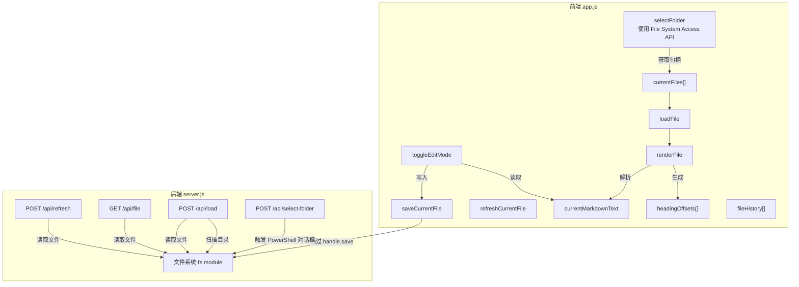
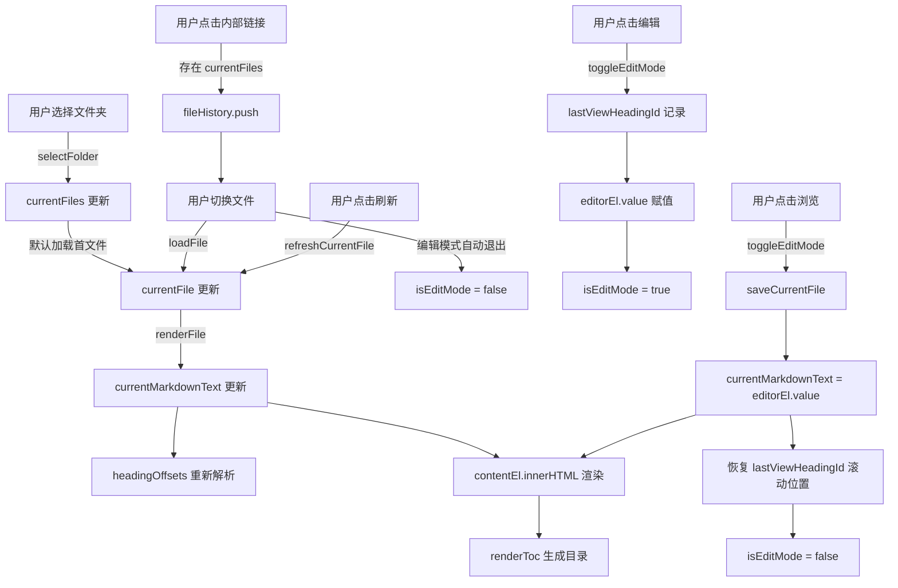

# 数据结构文档

> 本文档从代码仓库中提取，描述 md-view 项目的数据结构设计。

## 数据存储系统概览

### 数据库

本项目**不使用任何数据库**。所有数据通过文件系统直接读写。

| 存储类型 | 用途 | 版本要求 | 配置位置 |
|-----------|------|---------|---------|
| 文件系统 | Markdown 文件读写 | Node.js 内置 fs 模块 | `md-view/server.js` |

### 中间件

本项目**不使用任何中间件**（无 Redis、Kafka、Elasticsearch 等）。

| 中间件类型 | 用途 | 版本要求 | 配置位置 |
|-----------|------|---------|---------|
| 无 | 无 | - | - |

---

## 后端 API 接口数据结构

来源: `md-view/server.js`

### 端口配置

| 配置项 | 值 | 说明 |
|--------|-----|------|
| PORT | 3456 | 服务监听端口 |
| 环境变量 | `MD_VIEW_DAEMON` | 守护进程标识，值为 `1` 时表示守护进程模式 |

### POST /api/select-folder

**业务说明**: 打开系统文件夹选择对话框（仅 Windows），返回用户选择的目录路径。

**请求体**: 无

**响应体**:

| 字段 | 类型 | 必填 | 说明 |
|-------|------|------|------|
| `path` | string | 条件 | 用户选择的文件夹绝对路径（成功时返回） |
| `cancelled` | boolean | 条件 | 用户取消选择时为 `true` |
| `error` | string | 条件 | 错误信息（失败时返回） |

**示例 - 成功**:
```json
{ "path": "D:\\Work\\my-docs" }
```

**示例 - 取消**:
```json
{ "cancelled": true }
```

**示例 - 错误**:
```json
{ "error": "Folder dialog timed out" }
```

### POST /api/load

**业务说明**: 加载指定文件夹下的所有 Markdown 文件，并可选加载某个具体文件的内容。

**请求体**:

| 字段 | 类型 | 必填 | 说明 |
|-------|------|------|------|
| `folderPath` | string | 是 | 文件夹绝对路径 |
| `filePath` | string | 否 | 指定要加载的具体文件路径 |

**响应体**:

| 字段 | 类型 | 必填 | 说明 |
|-------|------|------|------|
| `folderPath` | string | 是 | 解析后的文件夹绝对路径 |
| `files` | array | 是 | Markdown 文件列表 |
| `files[].name` | string | 是 | 文件名 |
| `files[].fullPath` | string | 是 | 文件绝对路径 |
| `currentFile` | string/null | 是 | 当前加载的文件路径，未加载时为 `null` |
| `content` | string | 是 | Markdown 原始内容，未加载时为空字符串 |
| `html` | string | 是 | Markdown 渲染后的 HTML，未加载时为空字符串 |

**示例**:
```json
{
  "folderPath": "D:\\Work\\docs",
  "files": [
    { "name": "README.md", "fullPath": "D:\\Work\\docs\\README.md" },
    { "name": "guide.md", "fullPath": "D:\\Work\\docs\\guide.md" }
  ],
  "currentFile": "D:\\Work\\docs\\README.md",
  "content": "# Hello\n...",
  "html": "<h1>Hello</h1>..."
}
```

### GET /api/file

**业务说明**: 读取指定路径的文件内容并返回 Markdown 原文和渲染后的 HTML。

**请求参数**:

| 参数 | 类型 | 必填 | 说明 |
|-------|------|------|------|
| `path` | string | 是 | query 参数，文件绝对路径 |

**响应体**:

| 字段 | 类型 | 必填 | 说明 |
|-------|------|------|------|
| `content` | string | 是 | Markdown 原始内容 |
| `html` | string | 是 | Markdown 渲染后的 HTML |
| `path` | string | 是 | 文件绝对路径 |

### POST /api/refresh

**业务说明**: 重新读取指定文件的内容并返回最新 Markdown 原文和渲染后的 HTML。

**请求体**:

| 字段 | 类型 | 必填 | 说明 |
|-------|------|------|------|
| `filePath` | string | 是 | 文件绝对路径 |

**响应体**: 与 `GET /api/file` 相同。

---

## 前端数据结构

来源: `md-view/public/app.js`

### 全局状态变量

| 变量名 | 类型 | 初始值 | 用途 | 生命周期 |
|--------|------|--------|------|----------|
| `currentFiles` | `{ name: string, handle: FileSystemFileHandle }[]` | `[]` | 当前目录下所有 Markdown 文件列表 | 用户选择新文件夹时重置 |
| `currentFile` | `string \| null` | `null` | 当前选中的文件名（不含路径） | 加载新文件或清空目录时更新 |
| `currentMarkdownText` | `string` | `''` | 当前文件的原始 Markdown 文本 | 每次调用 `renderFile` 时更新 |
| `headingOffsets` | `{ [headingId: string]: number }` | `{}` | 标题 ID 到 Markdown 字符偏移的映射 | 每次调用 `renderFile` 时重新解析 |
| `isEditMode` | `boolean` | `false` | 是否处于编辑模式 | 通过 `toggleEditMode` 切换 |
| `fileHistory` | `string[]` | `[]` | 文件浏览历史栈 | 跳转到新文件时压栈，返回时出栈 |
| `lastViewHeadingId` | `string \| null` | `null` | 切换模式前视口最上方的 heading ID | 进入编辑模式时记录 |
| `isResizing` | `boolean` | `false` | Sidebar 拖动调整宽度状态标志 | 鼠标按下/抬起时切换 |
| `observer` | `IntersectionObserver \| null` | `null` | 监听内容区标题可见性，实现 TOC 滚动高亮 | `renderToc` 时 disconnect 并重新创建 |
| `currentFolderHandle` | `FileSystemDirectoryHandle \| null` | `null` | 当前已加载的文件夹句柄 | 选择新文件夹时更新 |

### DOM 元素引用

| 变量名 | 对应 DOM ID / Selector | 用途 |
|--------|------------------------|------|
| `btnRefresh` | `#btn-refresh` | 刷新当前文件按钮 |
| `folderLabel` | `#folder-label` | 显示当前文件夹名称 |
| `fileSelect` | `#file-select` | 文件下拉选择框 |
| `statusEl` | `#status` | 底部状态栏消息显示 |
| `tocEl` | `#toc` | 左侧目录容器 |
| `contentEl` | `#content` | 浏览模式下 Markdown 渲染内容区 |
| `btnToggleToc` | `#btn-toggle-toc` | 展开/收起目录按钮 |
| `sidebar` | `.sidebar` | 左侧边栏 |
| `btnEdit` | `#btn-edit` | 编辑/浏览模式切换按钮 |
| `editorEl` | `#editor` | 编辑模式下的 `<textarea>` |
| `btnBack` | `#btn-back` | 返回上一个文件按钮 |
| `resizeHandle` | `.resize-handle` | Sidebar 宽度拖动条 |

### FileEntry 结构

```typescript
interface FileEntry {
  name: string;                 // 文件名（如 "README.md"）
  handle: FileSystemFileHandle; // File System Access API 文件句柄
}
```

### headingOffsets 结构示例

```javascript
{
  "introduction": 0,      // 第 1 行 "# Introduction"
  "getting-started": 156, // 第 N 行 "## Getting Started"
  "faq": 2048
}
```

### fileHistory 行为

- **压栈时机**: 点击内部链接跳转到另一文件，且当前文件不是目标文件时。
- **出栈时机**: 点击「返回」按钮，调用 `fileHistory.pop()` 后加载上一个文件。
- **按钮状态**: `btnBack.disabled = fileHistory.length === 0`。

---

## 数据关系图



---

## 数据流描述

### 文件读取流程

```
用户点击「加载文件夹...」
  └─> selectFolder()
       └─> window.showDirectoryPicker() 获取目录句柄
            └─> 遍历目录条目，筛选 .md / .markdown 文件
                 └─> 存入 currentFiles[]（含 FileSystemFileHandle）
                      └─> 默认加载第一个文件
                           └─> renderFile(fileEntry)
                                ├─> handle.getFile() → File 对象
                                ├─> file.text() → 原始 Markdown 文本
                                ├─> currentMarkdownText = text
                                ├─> headingOffsets = parseHeadingOffsets(text)
                                ├─> marked.parse(text) → HTML
                                └─> contentEl.innerHTML = html
                                     └─> renderToc() 生成目录
```

### 渲染流程

- `marked.parse(currentMarkdownText)` 将 Markdown 转为 HTML，写入 `contentEl`。
- `parseHeadingOffsets()` 按行扫描 Markdown 原文，为每个 `#` 标题生成唯一 ID 并记录字符偏移。
- `renderToc()` 读取 `contentEl` 中的 `<h1~h6>` 元素，生成左侧目录链接；同时通过装饰器模式调用 `setupTocObserver()` 创建 `IntersectionObserver` 实现滚动高亮。
- `setupTocObserver()` 配置 `rootMargin: '-56px 0px -70% 0px'`（排除 toolbar 高度和底部状态栏），仅追踪最上方的可见标题。每次调用先 `disconnect()` 旧 observer 再重新 observe 所有标题。

### 编辑流程

```
用户点击「编辑」
  └─> toggleEditMode()
       ├─> getTopVisibleHeadingId() 记录当前视口顶部 heading → lastViewHeadingId
       ├─> editorEl.value = currentMarkdownText
       ├─> 隐藏 contentEl，显示 editorEl
       └─> 根据 headingOffsets[lastViewHeadingId] 定位光标并滚动
```

### 保存流程

```
用户点击「浏览」（从编辑模式切回）
  └─> toggleEditMode()
       ├─> saveCurrentFile()
       │    ├─> entry.handle.createWritable()
       │    ├─> writable.write(editorEl.value)
       │    ├─> writable.close()
       │    └─> currentMarkdownText = editorEl.value
       ├─> marked.parse(currentMarkdownText) 重新渲染
       ├─> renderToc() 重建目录
       └─> 恢复 lastViewHeadingId 对应的滚动位置
```

### 内部链接跳转

- `contentEl` 监听 `click` 事件，拦截相对路径的 Markdown 文件链接。
- 若目标文件存在于 `currentFiles`，则：
  1. 将当前文件名压入 `fileHistory` 栈；
  2. 调用 `loadFile(fileName)` 加载新文件；
  3. 若处于编辑模式，自动切回浏览模式。

### 状态变更触发关系



---

## 索引策略

本项目不涉及数据库索引。前端层面的索引策略如下：

| 结构 | 索引方式 | 用途 |
|------|---------|------|
| `currentFiles[]` | 数组按 `name` 字母排序 (`localeCompare`) | 文件列表下拉框显示 |
| `headingOffsets{}` | 对象键值映射 (headingId → charOffset) | 编辑模式下标题快速定位 |
| `fileHistory[]` | 栈结构 (push/pop) | 文件间导航历史 |

**索引设计原则**:
- 文件列表按字母自然排序，保证用户浏览体验
- 标题偏移量使用对象映射，实现 O(1) 查找
- 浏览历史使用栈结构，符合用户直觉

---

## 数据库命名规范

本项目**不使用数据库**，无表名/字段命名规范。

**实际使用的命名规范**（从代码中总结）:

| 规范项 | 实际使用 |
|--------|---------|
| 变量命名 | `camelCase`（如 `currentFiles`, `headingOffsets`） |
| 函数命名 | `camelCase`（如 `renderFile`, `toggleEditMode`） |
| DOM ID | `kebab-case`（如 `btn-refresh`, `file-select`） |
| CSS 类名 | `kebab-case`（如 `toc-item`, `content-wrapper`） |
| API 路径 | `kebab-case`（如 `/api/select-folder`） |
| 文件扩展名 | `.md`, `.markdown` |

---

## 数据库变更记录

本项目**不使用数据库**，无数据库变更记录。

---

## Redis 数据结构

本项目**不使用 Redis**。

---

## 消息队列数据结构

本项目**不使用消息队列**。

---

## 如何添加新的数据存储

### 如果需要添加数据库支持

1. 在 `md-view/package.json` 中添加数据库依赖（如 `mysql2`, `sequelize` 等）
2. 创建数据库配置文件
3. 定义 Model/Schema 文件
4. 创建数据库迁移文件
5. 在 `md-view/server.js` 中初始化数据库连接
6. 在 API 路由中使用 ORM 进行数据操作

### 当前扩展方式（基于文件系统）

当前项目通过文件系统扩展数据:
- 新增 `.md` / `.markdown` 文件即可被自动扫描和加载
- 无需任何配置或迁移

**参考现有代码**: `md-view/server.js` (第 116-130 行，文件扫描逻辑)

---

> 本文档分析了 md-view 项目的全部数据结构。该项目为轻量级 Markdown 查看器，不使用数据库或中间件，数据完全基于文件系统（File System Access API + Node.js fs 模块）进行读写。
